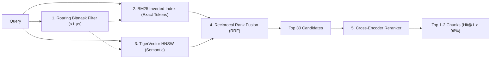

# grep -n '\[ORCHESTRA:SECTION_NAME\]' PLAN_SPEC.md  <-- Use this to jump to any section instantly
# STELLIUM: Agentic GraphRAG System Specification & Orchestration Plan
# Single Canonical Specification & Implementation Roadmap for Top 1 Finish
# TigerGraph Agentic GraphRAG Hackathon (Round 1 & Round 2)

[ORCHESTRA:INDEX]
- [ORCHESTRA:COMMON]              : System Purpose, Tech Stack, Quality Gates & Coding Standards
- [ORCHESTRA:REPO_GIT]            : Repository Origin, Branching Model & Commit Signature Protocol
- [ORCHESTRA:LLM_ROUTER]          : Multi-Provider Resilient LLM Router (Gemini, Mistral, Cloudflare)
- [ORCHESTRA:GUARDRAILS]          : Pragmatic 3-Layer Security Guardrails (Injection, GSQL, Leak Defenses)
- [ORCHESTRA:SCHEMA]              : TigerGraph Savanna Graph Schema, Embedding Space & GSQL Stored Queries
- [ORCHESTRA:LINKED_CHUNKS]       : Doubly Linked Chunk & Event Hierarchy (Low-Byte Predecessor/Successor)
- [ORCHESTRA:PIPELINES]           : 3-Way Comparative Benchmark Pipelines (RAG, GraphRAG, Agentic GraphRAG)
- [ORCHESTRA:COPROCESSOR]         : High-Speed Coprocessor (Roaring Bitmasks, BM25, RRF, Cross-Encoder)
- [ORCHESTRA:AGENT_HARNESS]       : LangGraph StateGraph, Tool Dispatch, Gap Critic & Adaptive Stopping
- [ORCHESTRA:EVAL_BENCHMARK]      : 150-Question Evaluation Suite, Tier-1 Instant Metrics & Tier-2 Ragas
- [ORCHESTRA:DASHBOARD_FRONTEND]  : Lunarbit GraphSurface Visualizer, FastAPI Bridge & Snapshot DTOs
- [ORCHESTRA:MASTER:001]          : Master Orchestrator Operational Playbook & Live Auditing
- [ORCHESTRA:AGENT:001]           : Stream 1: Ingestion, Table-Aware Chunking & Savanna Graph Ingestion
- [ORCHESTRA:AGENT:002]           : Stream 2: High-Speed Hybrid Coprocessor (Bitmasks, BM25, RRF)
- [ORCHESTRA:AGENT:003]           : Stream 3: LangGraph Agentic Engine & GSQL Reasoning Tools
- [ORCHESTRA:AGENT:004]           : Stream 4: Evaluation Runner, Metrics Engine & React Dashboard Integration
- [ORCHESTRA:SESSION_MEMORY]      : Persistent Chat History & Agent Memory in TigerGraph (Survives Refresh)
- [ORCHESTRA:AGENTIC_TRACE]       : Full Agentic Trace Schema Required by Judges
- [ORCHESTRA:ROUND2_PREP]         : Round 2 Bitemporal Reasoning Over Evolving & Conflicting Facts
- [ORCHESTRA:DELIVERABLES]        : Submission Artifacts Checklist (GitHub, Video, Diagrams, Dashboard, Writeup)
- [ORCHESTRA:HACKATHON_RULES]     : Binding Rulings from Organizer Q&A (Same Model, 0-Token, Anti-Hardcode)
[/ORCHESTRA:INDEX]

---

[ORCHESTRA:COMMON]
## 1. System Mission & Core Mandate
Stellium is an enterprise-grade Agentic GraphRAG system built for the TigerGraph Agentic GraphRAG Hackathon.
The system answers questions over a 2,951-document historical Olympic Wikipedia corpus (~5.47M tokens).
The fundamental research thesis is to prove where Agentic GraphRAG provides positive ROI over standard RAG and GraphRAG, and where simpler retrieval suffices.

## 2. Core Tech Stack
- Runtime: Python 3.12+ managed exclusively via `uv` (0.9.5+).
- Graph & Vector Engine: TigerGraph Savanna (GSQL compiled queries + TigerVector HNSW embedding space).
- Agent Harness: LangGraph (StateGraph) + `pyTigerGraph[mcp]`.
- Hybrid Search Coprocessor: BM25 (`rank-bm25`), Roaring Bitmaps (`pyroaring`), Reciprocal Rank Fusion (RRF), Cross-Encoder reranker (`sentence-transformers`).
- Backend API: FastAPI (async ASGI) + Pydantic v2.
- Frontend: React 18 + TypeScript + Vite + Tailwind CSS + Lunarbit `GraphSurface.tsx` (Canvas force simulation).
- Quality Tooling: `ruff` (linter and formatter), `mypy` (strict static typing), `pytest` (test runner).

## 3. Strict Quality Gates & Coding Standards
- Chained Verification Chain (must pass 100% green before any commit):
  `uv run pytest && uv run ruff check && uv run ruff format --check && uv run mypy --strict`
- Commenting Rule: Zero docstrings (`"""..."""`) inside Python application code.
  Strictly use single-line or multi-line `#` comments explaining logic, rationale, and contracts.
- Code Compactness: Lightweight, zero unnecessary wrapper abstractions, strict typing across all interfaces.

## 4. Project Directory Layout
```text
stellium/
├── PLAN_SPEC.md                     # Canonical specification (this file)
├── BOARD.md                         # Live coordination board
├── README.md                        # Public-facing project overview
├── pyproject.toml                   # uv / hatch project config with deps
├── uv.lock                          # Deterministic lock file (auto-generated)
├── .gitignore
├── .env.example                     # Template for required env vars (never commit .env)
├── .github/
│   └── workflows/
│       └── ci.yml                   # GitHub Actions: lint + type-check + test
├── hackathon-resources/             # Provided dataset (DO NOT MODIFY)
│   ├── corpus/corpus.jsonl          # 2,951 docs, ~5.47M tokens
│   ├── questions/eval_public.jsonl  # 100 questions with answers
│   ├── questions/eval_hidden.jsonl  # 50 questions without answers
│   └── README.md
├── samples/
│   └── frontend/                    # Lunarbit GraphSurface.tsx source files
├── src/
│   ├── __init__.py
│   ├── models/                      # Pydantic domain models (AgentState, DTOs, etc.)
│   ├── ingest/                      # Corpus parser, table-aware chunker, header injector
│   ├── graph/                       # TigerGraph Savanna client, DDL scripts, mock adapter
│   ├── coprocessor/                 # BM25, Roaring Bitmasks, RRF, Cross-Encoder reranker
│   ├── agent/                       # LangGraph StateGraph, tool dispatch, critic, stopping
│   ├── pipelines/                   # Pipeline 1 (RAG), Pipeline 2 (GraphRAG), Pipeline 3 (Agentic)
│   ├── llm/                         # Multi-provider LLM router with circuit breaker
│   ├── guardrails/                  # Input sanitizer, output leak guard
│   ├── evaluate.py                  # CLI evaluation runner (--pipeline, --dataset, --output)
│   └── api/
│       └── main.py                  # FastAPI app with /query/{rag|graphrag|agentic|compare}
├── frontend/                        # Vite + React + TypeScript dashboard (production build)
├── tests/
│   ├── __init__.py
│   ├── test_smoke.py                # Environment & import sanity
│   ├── test_ingest/                 # Chunker, header injection, linked pointer tests
│   ├── test_coprocessor/            # Bitmask, BM25, RRF, reranker tests
│   ├── test_agent/                  # LangGraph state transitions, tool dispatch tests
│   ├── test_pipelines/              # Pipeline 1/2/3 contract tests
│   └── test_eval/                   # Metric computation (EM, F1, MRR) tests
└── results/                         # Generated evaluation output (gitignored except final submissions)
```

## 5. Environment Variables (`.env.example` Template)
```dotenv
# TigerGraph Savanna Cluster
TG_HOST=https://<cluster>.i.tgcloud.io
TG_GRAPH_NAME=OlympicsGraph
TG_USERNAME=tigergraph
TG_PASSWORD=
TG_SECRET=

# LLM Provider Keys (Multi-Provider Fallback Chain)
GEMINI_API_KEY=
MISTRAL_API_KEY=
CLOUDFLARE_ACCOUNT_ID=
CLOUDFLARE_API_TOKEN=

# Embedding Model
OPENAI_API_KEY=
EMBEDDING_MODEL=text-embedding-3-small
EMBEDDING_DIMENSION=1536
```

## 6. Primary Judging Surface: Hosted Live Web Application
Judges evaluate the system primarily via a hosted web application (not CLI).
The live web app must support:
- Preset dropdown selector for all 100 public + 50 hidden questions.
- Free-form custom query input (adversarial and edge-case queries by judges).
- 3-column comparative view: RAG answer vs. GraphRAG answer vs. Agentic GraphRAG answer.
- Token cost and latency gauges per pipeline.
- Animated Lunarbit `GraphSurface.tsx` visualization of the agent's graph traversal path.
- Full agentic reasoning trace (steps, tools called, strategy shifts, stopping rationale).

## 7. Elastic Agent Pool Rule
Subagents (`agent-001` through `agent-004`) are NOT permanently locked to fixed roles.
`master-agent-001` dynamically assigns and re-assigns work based on current priority:
- During ingestion: all 4 agents can shard the 2,951 documents across parallel workers.
- During evaluation: all 4 agents can shard the 150 questions across parallel workers.
- During feature development: each agent owns a specific stream as defined in its `[ORCHESTRA:AGENT:XXX]` section.
Agents can be re-tasked at any point by updating `BOARD.md`.

## 8. GitHub Actions CI Workflow
```yaml
# .github/workflows/ci.yml
name: CI
on:
  push:
    branches: [main, 'agent/**']
  pull_request:
    branches: [main]
jobs:
  quality:
    runs-on: ubuntu-latest
    steps:
      - uses: actions/checkout@v4
      - uses: astral-sh/setup-uv@v4
        with:
          version: "0.9.5"
      - run: uv sync --extra dev
      - run: uv run ruff check
      - run: uv run ruff format --check
      - run: uv run mypy --strict src/
      - run: uv run pytest --tb=short -q
```
[/ORCHESTRA:COMMON]

---

[ORCHESTRA:REPO_GIT]
## 1. Repository Details
- Remote Origin: `https://github.com/simon-derock/stellium.git`
- Primary Branch: `main`
- Initialized: `git init -b main && git remote add origin https://github.com/simon-derock/stellium.git`

## 2. Branching & Worktree Model
- Pristine Trunk: `main` branch remains stable and integrated.
- Isolated Worktrees for Parallel Streams:
  `git worktree add ../wt-agent-001 -b agent/001/ingest-schema`
  `git worktree add ../wt-agent-002 -b agent/002/hybrid-engine`
  `git worktree add ../wt-agent-003 -b agent/003/langgraph-agent`
  `git worktree add ../wt-agent-004 -b agent/004/eval-dashboard`

## 3. Micro-Commit Protocol & Attribution Signature
Every commit must be atomic, tied to a green TDD/lint cycle, and appended with the authoring agent's identifier:
`<type>(<scope>): <concise message> [committed by <agent-id>]`

Valid Agent Identifiers:
- `master-agent-001` : Lead Architect & Master Coordinator
- `agent-001`        : Ingestion & Schema Worker
- `agent-002`        : Hybrid Search Coprocessor Worker
- `agent-003`        : LangGraph Agentic Engine Worker
- `agent-004`        : Evaluation & Dashboard Worker

Examples:
- `feat(ingest): add table-aware wikipedia parser [committed by agent-001]`
- `test(coproc): verify roaring bitmask year filtering [committed by agent-002]`
- `feat(agent): implement langgraph state machine with backtracking [committed by agent-003]`
- `chore(master): verify quality gates and merge agent-001 [committed by master-agent-001]`
[/ORCHESTRA:REPO_GIT]

---

[ORCHESTRA:LLM_ROUTER]
## 1. Resilient Multi-Provider LLM Architecture (Session-Level Model Lock)
Per binding hackathon ruling: "Same model everywhere, including planner and router."
Within a single pipeline execution for a single question, ALL LLM calls must use the identical model.

### Model Lock Protocol
```text
1. Before starting a pipeline run, lock a model (e.g., gemini-2.0-flash).
2. ALL LLM calls within that run (classifier, planner, critic, synthesis) use ONLY the locked model.
3. If the locked model returns 429 mid-run: RETRY with exponential backoff on the SAME model.
4. Only if the provider is completely unreachable after N retries: ABORT the run and re-queue
   the question with the next fallback provider for a FRESH complete re-run.
5. NEVER mix models within a single question's pipeline execution.
```

### Provider Tier Chain (Run-Level Selection)
```text
Tier 1 (Primary):  Google Gemini API (gemini-2.0-flash)
Tier 2 (Fallback): Mistral AI API (mistral-large / mistral-small)
Tier 3 (Fallback): Cloudflare Workers AI (@cf/meta/llama-3.3-70b-instruct)
```

### Deterministic Steps Are Model-Free
Steps that use 0 LLM tokens (GSQL queries, bitmask filters, regex classification) have no model
to constrain. The same-model rule only applies when the system DOES invoke an LLM.

### Telemetry
Every LLM call logs: `model_name`, `provider`, `prompt_tokens`, `completion_tokens`, `latency_ms`.
Every deterministic step logs: `tool_name`, `llm_tokens: 0`, `latency_ms`.
[/ORCHESTRA:LLM_ROUTER]

---

[ORCHESTRA:GUARDRAILS]
## 1. Judge-Safe Pragmatic 3-Layer Security Architecture
CRITICAL: Guardrails must NEVER block legitimate evaluation queries or judge testing.
The eval questions are natural-language Olympic sports questions. They contain no SQL, no injection patterns.
Over-blocking is worse than under-blocking for a hackathon demo. Design for zero false positives.

### Layer 0: Endpoint-Level Trust Tiers
Different API endpoints get different guardrail levels:
- `/api/v1/evaluate/batch` (batch eval submission): **NO input guardrails** — accepts raw eval JSONL,
  treats all questions as trusted evaluation input. Output guardrails still apply.
- `/api/v1/query/{rag|graphrag|agentic}` (interactive UI): Guardrail Layer 1 applies.
- `/api/v1/query/compare` (3-pipeline compare): Same as above.

### Layer 1: Structural Injection Filter (< 1ms, Context-Aware)
Only blocks queries that are structurally database commands, NOT isolated keywords.

Input length: Accept up to 2,000 characters (max eval question is 136 chars; judges may paste context).

Structural database command patterns (require full command syntax, not isolated words):
```python
BLOCKED_DB_PATTERNS = [
    r"DROP\s+(GRAPH|TABLE|VERTEX|EDGE|QUERY)\s+\w",  # Must have DROP + object type + name
    r"DELETE\s+FROM\s+\w",  # Must have DELETE FROM + table name
    r"CREATE\s+USER\s+\w",  # Must have CREATE USER + username
    r"TRUNCATE\s+(TABLE|GRAPH)\s+\w",  # Must have TRUNCATE + object + name
    r"ALTER\s+(VERTEX|EDGE)\s+\w+\s+(DROP|ADD)\s+",  # Structural DDL mutation
]
# NOT blocked: isolated words like "create", "delete", "alter" in natural questions
# e.g. "Did the IOC create a new record?" → safe, no object type follows

BLOCKED_JAILBREAK_PATTERNS = [
    r"ignore\s+(all\s+)?previous\s+instructions",
    r"system\s+prompt\s+(leak|dump|reveal)",
    r"you\s+are\s+now\s+in\s+developer\s+mode",
    r"jailbreak\s+mode",
    r"act\s+as\s+(dan|evil|unrestricted)",
]
```

Action on block: Return HTTP 400 with `{"error": "Query blocked by safety policy", "code": "SAFETY_001"}`.
Zero database or LLM invocations occur.

### Layer 2: Strictly Parameterized GSQL Queries (Injection-Proof by Design)
- Zero raw string concatenation ever in GSQL query calls.
- All GSQL execution passes typed parameter dicts: `params={"sport": sport, "year": year}`.
- Prevents GSQL injection regardless of what text reaches this layer.

### Layer 3: Output Sanitization & Leak Guard
Scans all outgoing LLM responses before returning to UI/API:
- Redacts API key patterns: `AIza[0-9A-Za-z\-_]{35}`, `sk-[0-9A-Za-z]{32,}`, `Bearer\s+[A-Za-z0-9\-\._~\+\/]+=*`
- Redacts `TG_PASSWORD`, `TG_SECRET`, env-var-like patterns in output text.
- Does NOT redact sports facts, athlete names, or event results — only credential patterns.

### Layer 4: Graceful Out-of-Corpus Handling
When a question asks about something not in the corpus (e.g., 2024 Olympics not in dataset):
- Return a structured response: `{"answer": "Not found in corpus", "evidence": [], "searched_docs": N}`
- Do NOT hallucinate. Do NOT return an LLM-invented answer without evidence.
- This is explicitly what judges test for — corpus grounding is 15% of their score.
[/ORCHESTRA:GUARDRAILS]

---

[ORCHESTRA:SCHEMA]
## 1. TigerGraph Savanna DDL Schema (OlympicsGraph)

```gsql
CREATE GRAPH OlympicsGraph()

# Embedding Space Definition (TigerVector HNSW)
CREATE EMBEDDING SPACE OlympicChunkSpace (
    DIMENSION = 1536,
    MODEL = 'text-embedding-3-small',
    INDEX = HNSW,
    DATATYPE = FLOAT,
    METRIC = COSINE
)

# Vertex Types
CREATE VERTEX Document (
    PRIMARY_ID doc_id STRING,
    title STRING,
    url STRING,
    wikidata_qid STRING,
    wikipedia_pageid INT,
    approx_tokens INT,
    filter_mask UINT
) WITH STATS="OUTDEGREE"

CREATE VERTEX Chunk (
    PRIMARY_ID chunk_id STRING,
    doc_id STRING,
    chunk_index INT,
    section_title STRING,
    text STRING,
    prev_chunk_id STRING,
    next_chunk_id STRING,
    filter_mask UINT
) WITH STATS="OUTDEGREE"

ALTER VERTEX Chunk
ADD EMBEDDING ATTRIBUTE embedding
IN EMBEDDING SPACE OlympicChunkSpace

CREATE VERTEX Event (
    PRIMARY_ID event_id STRING,
    name STRING,
    year INT,
    season STRING,
    sport STRING,
    gender STRING,
    competitor_count INT,
    nation_count INT,
    prev_event_id STRING,
    next_event_id STRING,
    filter_mask UINT
) WITH STATS="OUTDEGREE"

CREATE VERTEX Person (
    PRIMARY_ID person_id STRING,
    name STRING,
    nationality STRING
) WITH STATS="OUTDEGREE"

CREATE VERTEX Venue (
    PRIMARY_ID venue_id STRING,
    name STRING,
    city STRING,
    country STRING
) WITH STATS="OUTDEGREE"

# Edge Types
CREATE UNDIRECTED EDGE HAS_CHUNK (FROM Document, TO Chunk)
CREATE DIRECTED EDGE DOCUMENTED_IN (FROM Event, TO Document)
CREATE DIRECTED EDGE HELD_AT (FROM Event, TO Venue, start_date STRING, end_date STRING)
CREATE DIRECTED EDGE COMPETED_IN (FROM Person, TO Event, medal STRING, rank INT, score STRING)
CREATE DIRECTED EDGE PRECEDES (FROM Event, TO Event, time_diff INT)
CREATE DIRECTED EDGE SUCCEEDS (FROM Event, TO Event, time_diff INT)
CREATE DIRECTED EDGE MENTIONS (FROM Chunk, TO Person | TO Venue | TO Event)
```

## 2. Compiled GSQL Stored Queries

```gsql
# Query 1: Deterministic Aggregation
CREATE QUERY get_event_aggregates(STRING sport, INT target_year, INT min_competitors) 
  FOR GRAPH OlympicsGraph {
  SumAccum<INT> @@match_count = 0;
  ListAccum<STRING> @@event_names;
  ListAccum<STRING> @@gold_doc_ids;

  Events = {Event.*};
  Filtered = SELECT e FROM Events:e -(DOCUMENTED_IN:d)- Document:doc
             WHERE e.sport == sport AND e.year == target_year AND e.competitor_count > min_competitors
             ACCUM @@match_count += 1,
                   @@event_names += e.name,
                   @@gold_doc_ids += doc.wikidata_qid;

  PRINT @@match_count AS answer, @@event_names AS matching_events, @@gold_doc_ids AS gold_doc_ids;
}

# Query 2: Temporal Predecessor Winner Lookup
CREATE QUERY get_preceding_winner(STRING sport, STRING event_name, INT current_year)
  FOR GRAPH OlympicsGraph {
  ListAccum<STRING> @@winner_names;
  ListAccum<STRING> @@gold_doc_ids;

  Events = SELECT prior FROM Event:curr -(PRECEDES)-> Event:prior -(DOCUMENTED_IN:d)- Document:doc
           WHERE curr.sport == sport AND curr.year == current_year
           ACCUM @@gold_doc_ids += doc.wikidata_qid;

  Winners = SELECT p FROM Events:e -(COMPETED_IN:c)- Person:p
            WHERE c.medal == "Gold"
            ACCUM @@winner_names += p.name;

  PRINT @@winner_names AS winners, @@gold_doc_ids AS gold_doc_ids;
}
```
[/ORCHESTRA:SCHEMA]

---

[ORCHESTRA:LINKED_CHUNKS]
## 1. Low-Storage Doubly Linked Chunk & Event Representation
To avoid chunk boundary truncation and support chronological progression, chunks and events carry predecessor and successor pointers.

### Chunk Level (Compact Integer Indices)
- Within any document $D$, chunks are indexed $0 \le i < N$.
- Low-byte encoding: `uint16` chunk index.
  - Chunk 0: `prev_chunk_id = None`, `next_chunk_id = f"{doc_id}#1"`
  - Chunk $i$: `prev_chunk_id = f"{doc_id}#{i-1}"`, `next_chunk_id = f"{doc_id}#{i+1}"`
  - Chunk $N-1$: `prev_chunk_id = f"{doc_id}#{N-2}"`, `next_chunk_id = None`
  - Single chunk document: both are `None`.

### Event Level (Temporal Succession)
- Extracted directly from Wikipedia infobox fields `prev: YYYY` and `next: YYYY`.
- In TigerGraph, materialized as `prev_event_id` attribute and `PRECEDES` / `SUCCEEDS` directed edges.

### Behavioral Differentiation Across Pipelines
- Pipeline 1 (RAG): PRIMARY BENEFICIARY. Standard vector RAG retrieves disjoint top-$k$ chunks with no awareness of neighbors. By storing `prev_chunk_id` / `next_chunk_id` directly in the chunk metadata, the RAG pipeline can optionally fetch adjacent chunks when the top-1 chunk appears truncated (e.g., a medal table split mid-row). This is a lightweight O(1) pointer dereference, not a graph traversal.
- Pipeline 2 (GraphRAG): Does NOT need chunk-level pointers. GraphRAG natively uses TigerGraph `PRECEDES` / `SUCCEEDS` edges for event-level temporal succession and `HAS_CHUNK` edges for document-to-chunk expansion. The graph structure itself is the linked list.
- Pipeline 3 (Agentic GraphRAG): PRIMARY BENEFICIARY. The Evidence Critic can detect when a retrieved chunk is incomplete (e.g., a result table is cut off, or a temporal question requires the prior edition). It then calls `expand_chunk_window(chunk_id, direction="prev"|"next")` using the stored pointer to fetch the adjacent chunk in O(1), or `get_preceding_winner()` via GSQL for event-level temporal chains.
[/ORCHESTRA:LINKED_CHUNKS]

---

[ORCHESTRA:PIPELINES]
## 1. Pipeline 1: Baseline Vector RAG (Deliberately Simple)
The baseline must be vanilla to create maximum contrast with Agentic GraphRAG.
- Retrieval: TigerVector HNSW cosine similarity search ONLY. Top-k = 5. No BM25, no RRF, no reranker, no graph traversal.
- Generation: Single-turn LLM call: inject top-k chunks as context → generate answer.
- Tools Allowed: `vector_search` only.
- Expected Weaknesses: Fails on aggregation (can't count), temporal (conflates years), multi-hop (misses second entity).
- Metrics: `context_tokens`, `llm_input_tokens`, `llm_output_tokens`, `total_tokens`, `latency_ms`, `accuracy`.

## 2. Pipeline 2: Hybrid GraphRAG (Fixed Pipeline, Non-Agentic)
Uses graph structure but follows a FIXED retrieval sequence — no dynamic planning, no backtracking.
- Retrieval (Fixed Sequence):
  1. Entity linking: Extract named entities from query → fuzzy match to graph vertices.
  2. 1-2 hop neighborhood expansion: Traverse edges from seed vertices in TigerGraph.
  3. Subgraph context fusion: Merge graph triples + related chunk text.
- Generation: Single-turn LLM call: inject fused graph + text context → generate answer.
- Tools Allowed: `entity_linker`, `graph_expand_1hop`, `vector_search`.
- Expected Weaknesses: No backtracking if entity linking fails. No strategy adaptation. Fixed hop depth.
- Metrics: `subgraph_nodes`, `subgraph_edges`, `context_tokens`, `llm_input_tokens`, `llm_output_tokens`, `total_tokens`, `latency_ms`, `accuracy`.

## 3. Pipeline 3: Autonomous Agentic GraphRAG (Full Arsenal, Dynamic)
The agent plans its own investigation, selects retrieval methods dynamically, and adapts based on what it finds.
- Retrieval & Reasoning (Dynamic, Agent-Controlled):
  1. Query Classification: Determines structural intent (aggregation/lookup/multi_hop/superlative/temporal).
  2. Fast-Path Router: Simple factoid lookups with high-confidence entity matches bypass multi-step investigation.
  3. Dynamic Tool Dispatch: Agent selects from ALL available tools based on evidence gaps:
     - `vector_search` (TigerVector HNSW semantic retrieval)
     - `bm25_search` (exact token matching for names, codes, numbers)
     - `rrf_fusion` (Reciprocal Rank Fusion combining dense + sparse scores)
     - `cross_encoder_rerank` (precision reranking of fused candidates)
     - `entity_linker` (fuzzy entity resolution against graph vertices)
     - `graph_traverse` (multi-hop traversal via GSQL compiled queries)
     - `gsql_aggregate` (deterministic COUNT/SUM/MAX/MIN via GSQL — 0 LLM tokens)
     - `gsql_temporal` (PRECEDES/SUCCEEDS edge traversal — 0 LLM tokens)
     - `expand_chunk_window` (fetch adjacent chunks via prev/next pointers — 0 LLM tokens)
  4. Evidence Critic & Backtracking: After each retrieval step, evaluates completeness. If gaps found, shifts strategy.
  5. Grounded Synthesis: Final answer generation tied to `doc_id` citations.
- Tools Allowed: ALL tools. Agent decides which to use and in what order.
- Stopping Criteria: Confidence ≥ 0.95 OR max_steps reached OR evidence verified by GSQL.
- Metrics: Full agentic trace (per `[ORCHESTRA:AGENTIC_TRACE]` spec).
[/ORCHESTRA:PIPELINES]

---

[ORCHESTRA:COPROCESSOR]
## 1. High-Speed Retrieval Coprocessor Architecture
To deliver near $O(1)$ sub-millisecond retrieval without sacrificing precision, the coprocessor complements TigerGraph Savanna with local silicon-level accelerators:



### Components
1. **Roaring Bitmasks (`pyroaring`)**:
   - Fixed bit flags for Olympic Year (1988..2020), Season (Summer/Winter), and Sport.
   - Slices candidate document IDs from 2,951 down to relevant subset in $< 1\,\mu\text{s}$.
2. **BM25 Sparse Index (`rank-bm25`)**:
   - Sub-millisecond exact token matching for athlete names, numbers, codes, and venues.
3. **TigerVector Dense Search**:
   - HNSW semantic search returning top-$k$ nearest chunk embeddings.
4. **Reciprocal Rank Fusion (RRF)**:
   - Rank fusion: $RRF(d) = \sum_{m} \frac{1}{60 + \text{rank}_m(d)}$
5. **Cross-Encoder Reranker**:
   - Mini cross-encoder scoring Top-30 fused candidates down to Top-1 or Top-2.
[/ORCHESTRA:COPROCESSOR]

---

[ORCHESTRA:AGENT_HARNESS]
## 1. LangGraph State Machine Specification

```python
# Typed Agent State Definition
from typing import Any, Literal
from pydantic import BaseModel, Field


class EvidenceItem(BaseModel):
    doc_id: str
    chunk_id: str | None = None
    text: str
    relevance_score: float = 1.0


class ToolAuditCall(BaseModel):
    step: int
    tool_name: str
    input_args: dict[str, Any]
    output_summary: str
    tokens: int
    latency_ms: float


class AgentState(BaseModel):
    query: str
    qtype: Literal["aggregation", "lookup", "multi_hop", "superlative", "temporal"]
    sub_questions: list[str] = Field(default_factory=list)
    hypotheses: list[str] = Field(default_factory=list)
    evidence: list[EvidenceItem] = Field(default_factory=list)
    traversed_vertices: list[str] = Field(default_factory=list)
    tool_history: list[ToolAuditCall] = Field(default_factory=list)
    step_count: int = 0
    max_steps: int = 4
    strategy_history: list[str] = Field(default_factory=list)
    strategy_changed: bool = False
    strategy_change_rationale: str | None = None
    stopping_reason: str = "Initialized"
    confidence_score: float = 0.0
    final_answer: str | None = None
```

## 2. Graph Nodes & Transitions
- Node `classify_and_route`: Determines whether query is direct lookup (routes to `fast_path_node`) or complex (routes to `investigation_node`).
- Node `fast_path_node`: Single-turn hybrid retrieval + answer generation.
- Node `investigation_node`: Deconstructs query into relational and mathematical requirements.
- Node `dispatch_tools`: Calls compiled GSQL queries, multi-hop traversals, or vector search.
- Node `critic_gap_detector`: Evaluates evidence completeness. If confidence $> 0.95$ or budget exhausted, routes to `synthesize_answer`; otherwise updates strategy and loops back.
- Node `synthesize_answer`: Generates the grounded answer with citations to `gold_doc_ids`.
[/ORCHESTRA:AGENT_HARNESS]

---

[ORCHESTRA:EVAL_BENCHMARK]
## 1. Evaluation Protocol & Datasets
- Visible Dataset: `hackathon-resources/questions/eval_public.jsonl` (100 questions with answers and `gold_doc_ids`).
- Hidden Dataset: `hackathon-resources/questions/eval_hidden.jsonl` (50 unseen questions without answers).
- Execution CLI:
  `uv run python -m src.evaluate --dataset hackathon-resources/questions/eval_public.jsonl --pipeline all --output results/public_results.jsonl`
  `uv run python -m src.evaluate --dataset hackathon-resources/questions/eval_hidden.jsonl --pipeline all --output results/hidden_submission.jsonl`

## 2. Metrics Hierarchy
- Tier 1: Deterministic Metrics (Sub-millisecond, Zero LLM Calls)
  - Exact Match (EM)
  - Token F1-score
  - Gold Document Recall@k, Precision@k, MRR (Mean Reciprocal Rank)
  - Latency (ms) and Token Consumption (context, prompt, completion, total)
- Tier 2: Asynchronous RAGAS Evaluation
  - Faithfulness (Context Groundedness)
  - Answer Relevancy
- Comparative Metrics:
  - Token Efficiency Delta: $\Delta_{\text{tokens}} = \frac{\text{Tokens}_{\text{Agentic}}}{\text{Tokens}_{\text{RAG}}}$
  - Accuracy Delta: $\Delta_{\text{accuracy}} = \text{Accuracy}_{\text{Agentic}} - \text{Accuracy}_{\text{RAG}}$
  - Pareto Frontier: Accuracy vs. Token Cost curve.
[/ORCHESTRA:EVAL_BENCHMARK]

---

[ORCHESTRA:DASHBOARD_FRONTEND]
## 1. Lunarbit Integration (`samples/frontend/`)
The frontend directly incorporates the Lunarbit visualizer (`GraphSurface.tsx`, `graph.ts`, `styles.css`, `index.tsx`, `viewport.ts`).

## 2. API Contract: Snapshot DTO for Live Visualization
The FastAPI endpoint `/api/v1/query/agentic` returns the evaluation answer, metrics, and a compatible `Snapshot` object:

```python
class GraphNodeDTO(BaseModel):
    id: str
    type: str
    layer: str
    label: str
    weight: float
    source_count: int
    confidence: float
    privacy_state: str = "public"
    scope: str = "olympics"


class GraphEdgeDTO(BaseModel):
    id: str
    source: str
    target: str
    relationship_type: str
    confidence: float
    provenance_label: str


class MetricDTO(BaseModel):
    label: str
    value: str
    unit: str
    scope: str


class FindingDTO(BaseModel):
    id: str
    title: str
    detail: str
    severity: str


class SnapshotDTO(BaseModel):
    metrics: list[MetricDTO]
    graph_nodes: list[GraphNodeDTO]
    graph_edges: list[GraphEdgeDTO]
    findings: list[FindingDTO]
    disclosure: str
```
[/ORCHESTRA:DASHBOARD_FRONTEND]

---

[ORCHESTRA:MASTER:001]
## Master Orchestrator Responsibilities
- Owner: `master-agent-001`
- Tasks:
  1. Maintain canonical `PLAN_SPEC.md` and live `BOARD.md`.
  2. Coordinate work distribution across elastic subagents `agent-001` through `agent-004`.
  3. Enforce quality gates prior to merging any branch into `main`.
  4. Perform live audits on ingestion accuracy and benchmark outputs.
[/ORCHESTRA:MASTER:001]

---

[ORCHESTRA:AGENT:001]
## Stream 1: Ingestion, Table-Aware Chunking & Savanna Schema
- Assigned Worker: `agent-001` (or parallel worker in elastic pool)
- Branch: `agent/001/ingest-schema`
- Responsibilities:
  1. Parse `hackathon-resources/corpus/corpus.jsonl` (2,951 documents).
  2. Implement table-aware agentic chunking with deterministic header injection.
  3. Populate doubly linked chunk pointers (`prev_chunk_id`, `next_chunk_id`) and event predecessors (`prev_event_id`).
  4. Implement TigerGraph Savanna schema setup script and high-fidelity Mock TigerGraph adapter for offline TDD testing.
[/ORCHESTRA:AGENT:001]

---

[ORCHESTRA:AGENT:002]
## Stream 2: High-Speed Hybrid Coprocessor
- Assigned Worker: `agent-002` (or parallel worker in elastic pool)
- Branch: `agent/002/hybrid-engine`
- Responsibilities:
  1. Build Roaring Bitmask index over Year, Season, and Sport attributes.
  2. Implement BM25 sparse index over clean chunk tokens.
  3. Implement Reciprocal Rank Fusion (RRF) and Cross-Encoder reranker.
  4. Expose unified interface: `coprocessor.search(query, filter_mask, top_k=2)` delivering $<1\,\text{ms}$ retrieval.
[/ORCHESTRA:AGENT:002]

---

[ORCHESTRA:AGENT:003]
## Stream 3: LangGraph Agentic Engine & GSQL Reasoning Tools
- Assigned Worker: `agent-003` (or parallel worker in elastic pool)
- Branch: `agent/003/langgraph-agent`
- Responsibilities:
  1. Implement LangGraph `StateGraph` state machine with fast-path and deep-investigation branches.
  2. Build GSQL tools (`get_event_aggregates`, `get_preceding_winner`, `traverse_multihop_path`).
  3. Implement Evidence Critic and strategy backtracking logic.
  4. Ensure full audit trace generation matching the judges' submission schema.
[/ORCHESTRA:AGENT:003]

---

[ORCHESTRA:AGENT:004]
## Stream 4: Evaluation Benchmark Suite & React Dashboard
- Assigned Worker: `agent-004` (or parallel worker in elastic pool)
- Branch: `agent/004/eval-dashboard`
- Responsibilities:
  1. Build `evaluate.py` CLI runner for 100 public and 50 hidden questions.
  2. Implement Tier-1 deterministic metrics (EM, F1, MRR on `gold_doc_ids`) and Tier-2 Ragas integration.
  3. Build FastAPI endpoints `/api/v1/query/{rag|graphrag|agentic|compare}` and `/api/v1/snapshot`.
  4. Integrate Lunarbit `GraphSurface.tsx` into web app to visualize the agent's live graph traversal.
[/ORCHESTRA:AGENT:004]

---

[ORCHESTRA:SESSION_MEMORY]
## 1. Persistent Chat History & Agent Memory in TigerGraph
The live web application must preserve conversation history and agent investigation state across page refreshes and browser sessions. We use TigerGraph Savanna itself as the persistence layer (zero additional infrastructure).

### TigerGraph Session Vertices & Edges
```gsql
CREATE VERTEX Session (
    PRIMARY_ID session_id STRING,
    created_at DATETIME,
    last_active DATETIME
)

CREATE VERTEX ChatMessage (
    PRIMARY_ID msg_id STRING,
    role STRING,
    content STRING,
    pipeline STRING,
    timestamp DATETIME,
    token_count INT
)

CREATE VERTEX AgentMemory (
    PRIMARY_ID memory_id STRING,
    session_id STRING,
    query STRING,
    qtype STRING,
    final_answer STRING,
    agentic_trace STRING,
    confidence FLOAT,
    total_tokens INT,
    latency_ms FLOAT,
    created_at DATETIME
)

CREATE DIRECTED EDGE HAS_MESSAGE (FROM Session, TO ChatMessage, msg_order INT)
CREATE DIRECTED EDGE HAS_MEMORY (FROM Session, TO AgentMemory)
```

### Behavioral Contract
- On page load: Frontend calls `GET /api/v1/sessions/{session_id}/history` to hydrate the chat panel and prior results.
- On query: Backend persists the query, all 3 pipeline answers, and the full agentic trace as `ChatMessage` and `AgentMemory` vertices.
- Session ID: Generated client-side (UUID v4), stored in `localStorage`. New tab = new session.
- Agent Memory Recall: When the agent encounters a question semantically similar to a prior answered question in the same session, it can retrieve the cached investigation result from `AgentMemory` to avoid redundant LLM and graph traversal calls.
[/ORCHESTRA:SESSION_MEMORY]

---

[ORCHESTRA:AGENTIC_TRACE]
## 1. Full Agentic Trace Schema (Judges' Mandatory Requirements)
The hackathon evaluation explicitly requires the following trace fields for every Agentic GraphRAG answer. Our trace output must capture ALL of these:

| Trace Field | Type | Description | Status |
| :--- | :--- | :--- | :---: |
| Number of retrieval and reasoning steps | `int` | `step_count` in `AgentState` | ✅ |
| Retrieval methods selected | `list[str]` | `strategy_history` in `AgentState` | ✅ |
| Specialised agents invoked | `list[str]` | Derived from `tool_history[].tool_name` | ✅ |
| Tools called | `list[ToolAuditCall]` | Full `tool_history` with args and outputs | ✅ |
| Time per operation | `list[float]` | `tool_history[].latency_ms` | ✅ |
| Tokens per operation | `list[int]` | `tool_history[].tokens` | ✅ |
| Total tokens used | `int` | Sum of all `tool_history[].tokens` + synthesis tokens | ✅ |
| Number of chunks and citations | `int` + `list[str]` | `len(evidence)` and `[e.doc_id for e in evidence]` | ✅ |
| Whether the system changed strategy | `bool` | `strategy_changed` in `AgentState` | ✅ |
| When and why the system decided to stop | `str` | `stopping_reason` in `AgentState` | ✅ |

### Submission Output Contract for Hidden Questions
For each of the 50 hidden questions, the output JSONL record includes:
```json
{
  "qid": "eval-001",
  "question": "...",
  "qtype": "multi_hop",
  "rag_answer": "...",
  "rag_tokens": 1200,
  "graphrag_answer": "...",
  "graphrag_tokens": 980,
  "agentic_answer": "...",
  "agentic_tokens": 1450,
  "agentic_trace": {
    "step_count": 3,
    "retrieval_methods": ["bitmask_filter", "gsql_traversal", "vector_search"],
    "agents_invoked": ["Orchestrator", "GraphTraversalAgent", "EvidenceCritic"],
    "tools_called": [
      {"tool": "entity_linker", "args": {"query": "..."}, "result_summary": "...", "tokens": 120, "latency_ms": 45},
      {"tool": "traverse_multihop", "args": {"start": "...", "hops": 2}, "result_summary": "...", "tokens": 340, "latency_ms": 180}
    ],
    "chunks_retrieved": 4,
    "citations": ["Q1050909", "Q26233122"],
    "strategy_changed": true,
    "strategy_change_rationale": "Initial entity match failed; switched to fuzzy alias + vector fallback",
    "stopping_reason": "Evidence verified against 2 source documents with confidence 0.97",
    "total_tokens": 1450,
    "total_latency_ms": 820
  }
}
```
[/ORCHESTRA:AGENTIC_TRACE]

---

[ORCHESTRA:ROUND2_PREP]
## 1. Round 2: Reasoning Over Evolving, Conflicting & Uncertain Facts
Round 2 (Oct 1-7, Top 15 finalists only) introduces a harder dataset requiring temporal reasoning over facts that change, conflict, or carry uncertainty. Building this foundation in Round 1 earns Innovation (15%) points and gives us a head start.

### Bitemporal Graph Extension
Add temporal validity and provenance tracking to the schema:
```gsql
# Extended Event attributes for Round 2
ALTER VERTEX Event ADD ATTRIBUTE (
    valid_from DATETIME,
    valid_to DATETIME,
    superseded_by STRING,
    source_authority FLOAT
)

# Conflict Detection Edge
CREATE DIRECTED EDGE CONFLICTS_WITH (
    FROM Event, TO Event,
    conflict_type STRING,
    resolution STRING,
    resolved_by STRING
)
```

### Conflict Resolution Strategy
When the agent encounters conflicting facts:
1. Compare `source_authority` scores (higher = more authoritative).
2. Compare `valid_from` / `valid_to` timestamps (newer = supersedes older).
3. If unresolvable: report both versions with confidence intervals.
4. Log the conflict in the agentic trace as a strategy shift event.

### Round 2 Deliverables
- Updated GitHub repository with bitemporal schema and conflict detection.
- Architecture diagram showing temporal reasoning flow.
- 3-5 minute demo video demonstrating conflict resolution.
- Metrics dashboard with temporal accuracy breakdown.
- Short writeup: what we built, how it works, key results, limitations, what we'd add with more time.
[/ORCHESTRA:ROUND2_PREP]

---

[ORCHESTRA:DELIVERABLES]
## 1. Required Submission Artifacts Checklist

### Round 1 Deliverables (Deadline: Sep 30)
- [ ] Working Agentic GraphRAG system (hosted live web app).
- [ ] GitHub repository: `https://github.com/simon-derock/stellium.git` (public, clean, well-documented).
- [ ] Architecture diagram: Mermaid source in PLAN_SPEC.md + exported SVG/PNG in `docs/architecture.svg`.
- [ ] Demo video: Screen recording of the live web app answering queries across all 3 pipelines (upload to YouTube/Loom).
- [ ] Metrics dashboard: Interactive React dashboard comparing RAG vs GraphRAG vs Agentic GraphRAG (tokens, accuracy, completeness).
- [ ] Evaluation output: `results/public_results.jsonl` (100 questions) and `results/hidden_submission.jsonl` (50 questions).
- [ ] Optional: Social media post tagging @TigerGraph (counts in our favour).

### Round 2 Deliverables (Deadline: Oct 7, if we advance)
- [ ] Refined Agentic GraphRAG system with bitemporal conflict resolution.
- [ ] Updated GitHub repository with Round 2 extensions.
- [ ] Updated architecture diagram.
- [ ] 3-5 minute demo video.
- [ ] Metrics dashboard with temporal reasoning breakdown.
- [ ] Short writeup (in `docs/writeup.md`): what we built, how it works, key results, limitations, and what we'd add with more time.
- [ ] Live presentation to judges (if selected for final panel).

### Reference to Official `tigergraph/graphrag` Repository
The hackathon guidebook recommends cloning `https://github.com/tigergraph/graphrag.git` as a reference.
We build Stellium as an independent, purpose-built system but reference the official repo for:
- GSQL query patterns and hybrid search examples.
- pyTigerGraph client usage and MCP integration patterns.
- Schema design conventions for TigerGraph Savanna.
[/ORCHESTRA:DELIVERABLES]

---

[ORCHESTRA:HACKATHON_RULES]
## Binding Rulings from Organizer Q&A (Source: Official Hackathon Discord + Office Hours)
These rulings are HARD CONSTRAINTS that override any prior assumptions.

### Rule 1: Deterministic-First Orchestrator is Valid
- Ruling: "Deterministic-first is fine, as long as the agentic mode is genuinely agentic and nothing is hard-coded for the public 100. Report 0-token answers honestly."
- Our compliance: LangGraph StateGraph with dynamic tool dispatch. The agent DECIDES when to use GSQL vs LLM. No question-ID matching. No hard-coded answers. Parameterized GSQL queries generalize to any question.
- Anti-hardcoding guarantee: Judges will `grep` for `if qid ==`, hard-coded answer strings, and question-text conditionals. Our classifier uses generalizable regex + entity linking against graph vertices.

### Rule 2: All 3 Pipelines on All 150 Questions
- Ruling: "All three pipelines on all 150 (public + hidden)."
- Our compliance: 150 × 3 = 450 total pipeline executions. Output in `results/public_results.jsonl` (300 records) and `results/hidden_submission.jsonl` (150 records).

### Rule 3: Same Model Everywhere Per Pipeline Run
- Ruling: "Same model everywhere, including planner and router."
- Our compliance: Session-level model lock (see `[ORCHESTRA:LLM_ROUTER]`). Within a single pipeline execution, ALL LLM calls use the identical model. Fallback only happens between runs, never within a run.
- Deterministic steps (GSQL, bitmask, regex) have no model to constrain — they report `llm_tokens: 0`.

### Rule 4: Team Events as Comma-Separated Lists
- Ruling: "Comma-separated list is fine, scoring is on meaning not exact string."
- Our compliance: Table-aware parser splits concatenated athlete names. Answers formatted as sorted comma-separated lists. Evaluation uses Token F1 / Jaccard overlap.

### Rule 5: Shorter Names Accepted, Diacritics Normalized
- Ruling: "Shorter name is fine if unambiguous. Diacritics normalised."
- Our compliance: All text processing (ingestion, BM25, entity linking, answer formatting) runs through Unicode NFKD normalization: `unicodedata.normalize("NFKD", text).encode("ASCII", "ignore").decode("utf-8")`.

### Rule 6: GSQL + Python Counts as TigerGraph Usage; Use TigerGraph's Own Vector Search
- Ruling: "Yes, that counts. Use TigerGraph's own vector search, no external vector DB needed."
- Our compliance: TigerVector HNSW is our PRIMARY dense retrieval engine. BM25 (`rank-bm25`) is a SUPPLEMENTARY local scoring signal for exact token matching, NOT a replacement for TigerVector. No external vector DBs (Pinecone/Qdrant/etc).

### Rule 7: Token Counting — Only LLM Tokens; GSQL = 0
- Ruling: "Count only LLM tokens. Deterministic steps and GSQL = 0. Report tool calls and latency too."
- Our compliance: Every trace step logs `llm_tokens` (0 for deterministic) + `tool_name` + `latency_ms`. Total token count sums only LLM tokens.

### Accuracy Evaluation Methods (from Guidebook)
- For 100 public questions: Teams choose their method. Options: LLM-as-Judge (PASS/FAIL), BERTScore (semantic similarity), or manual comparison.
- For 50 hidden questions: Organizers evaluate against held-out ground truth on their end.
- Our approach: Tier-1 deterministic (EM + Token F1 + MRR) for instant feedback + LLM-as-Judge for semantic grading.
[/ORCHESTRA:HACKATHON_RULES]
