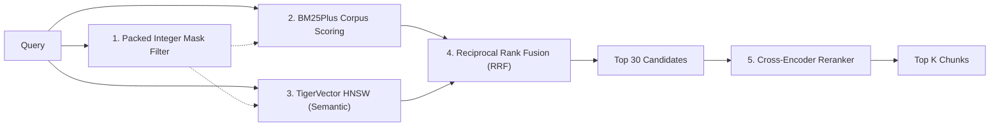

# grep -n '\[ORCHESTRA:SECTION_NAME\]' PLAN_SPEC.md  <-- Use this to jump to any section instantly
# STELLIUM: Agentic GraphRAG System Specification & Orchestration Plan
# Single Canonical Specification & Implementation Roadmap for Top 1 Finish
# TigerGraph Agentic GraphRAG Hackathon (Round 1 & Round 2)

[ORCHESTRA:INDEX]
- [ORCHESTRA:COMMON]              : System Purpose, Tech Stack, Quality Gates & Coding Standards
- [ORCHESTRA:REPO_GIT]            : Repository Origin, Branching Model & Commit Signature Protocol
- [ORCHESTRA:LLM_ROUTER]          : Session-Locked LLM Router (Cloudflare primary; providers configurable)
- [ORCHESTRA:GUARDRAILS]          : Pragmatic 3-Layer Security Guardrails (Injection, GSQL, Leak Defenses)
- [ORCHESTRA:SCHEMA]              : TigerGraph Savanna Graph Schema, Embedding Space & GSQL Stored Queries
- [ORCHESTRA:LINKED_CHUNKS]       : Doubly Linked Chunk & Event Hierarchy (Low-Byte Predecessor/Successor)
- [ORCHESTRA:PIPELINES]           : 3-Way Comparative Benchmark Pipelines (RAG, GraphRAG, Agentic GraphRAG)
- [ORCHESTRA:COPROCESSOR]         : Local Retrieval (Packed Integer Masks, Compact BM25Plus, RRF, Required Cross-Encoder)
- [ORCHESTRA:AGENT_HARNESS]       : Bounded Cyclic ReAct Loop, Tool Dispatch, Evidence Review & Adaptive Stopping
- [ORCHESTRA:EVAL_BENCHMARK]      : Public/Hidden Evaluation, Metrics & Reproducible Quality Measurement
- [ORCHESTRA:DASHBOARD_FRONTEND]  : Lunarbit GraphSurface Visualizer, FastAPI Bridge & Snapshot DTOs
- [ORCHESTRA:MASTER:001]          : Master Orchestrator Operational Playbook & Live Auditing
- [ORCHESTRA:AGENT:001]           : Stream 1: Ingestion, Table-Aware Chunking & Savanna Graph Ingestion
- [ORCHESTRA:AGENT:002]           : Stream 2: High-Speed Hybrid Coprocessor (Bitmasks, BM25, RRF)
- [ORCHESTRA:AGENT:003]           : Stream 3: ReAct Agent Loop & GSQL Reasoning Tools
- [ORCHESTRA:AGENT:004]           : Stream 4: Evaluation Runner, Metrics Engine & React Dashboard Integration
- [ORCHESTRA:SESSION_MEMORY]      : Persistent Chat History & Agent Memory in TigerGraph (Survives Refresh)
- [ORCHESTRA:AGENTIC_TRACE]       : Full Agentic Trace Schema Required by Judges
- [ORCHESTRA:ROUND2_PREP]         : Round 2 Bitemporal Reasoning Over Evolving & Conflicting Facts
- [ORCHESTRA:DELIVERABLES]        : Submission Artifacts Checklist (GitHub, Video, Diagrams, Dashboard, Writeup)
- [ORCHESTRA:HACKATHON_RULES]     : Binding Rulings from Organizer Q&A (Same Model, 0-Token, Anti-Hardcode)
[/ORCHESTRA:INDEX]

## Verified Baseline and Status Rules

This specification records both the desired system and implementation work. A requirement is not complete merely because it appears in an architecture description. Use these labels in task tracking: **Implemented** means verified in current code or runtime; **Partial** means a primitive exists but the stated user-facing behavior is incomplete; **Missing** means no implementation evidence exists. Performance and accuracy numbers require reproducible result artifacts before they can be presented as measured outcomes.

**Historical pre-change benchmark snapshot (2026-09-30):** TigerGraph Savanna 4.2.5 is live; all 6 vertex types, 7 edge types, six compiled queries, and the native 1024-dimensional cosine HNSW index passed live checks. All 22,016 Cohere `embed-v4.0` passage vectors were accepted in 45 batches. The dense-only audit reported hit@5 85%, hit@10 88%, hit@30 93%; mean gold-document recall@30 90.21%, MRR@30 0.7853, and 96.63 ms mean TigerVector request latency. The matched 100-question Cohere Command A benchmark scored RAG 43/100 EM, GraphRAG 53/100, Agentic 90/100. These figures predate the current mandatory hybrid/reranking and generated-GSQL paths; the 98% target remains unverified and unmet by the historical run. Persistent session history, query-specific graph snapshots, and the maintained premium React frontend remain incomplete; the API dashboard is a basic HTML surface and its snapshot endpoint still needs live query-derived data.

Compact BM25/reranker measurements (2026-09-30): replacing retained per-token Python objects with compact term postings reduced the full 22,016-chunk corpus/index RSS from 563 MiB to about 209 MiB, with a 3.81 s local build. A 100-question public gold-document audit compared 30 BM25 candidates before and after local int8 MiniLM reranking. With batch size 1, candidate-pool document hit rate was 96%, reranked top-five hit rate 94%, MRR rose from 0.682 to 0.842, mean rerank latency was 1.90 s (median 1.85 s, p95 2.53 s), and process peak RSS was 379 MiB. Batch size 8 scored 93% reranked hit rate and 0.835 MRR, with 2.43 s mean latency and 782 MiB peak RSS. Batch size 1 is now the default based on this result. A sparse-only candidate-size ablation found that top 10 versus top 30 candidates gave similar rounded hit rate/MRR at 73.6% lower mean rerank latency; this does not validate truncating the live dense-plus-sparse pool. These are host-specific retrieval-only measurements, not answer EM, completeness, or a deployment guarantee. Full methodology and results: `docs/benchmark-audits/local-reranker-public-20260930.md`.

Embedding migration update (2026-09-30): the Cohere `embed-v4.0` migration is complete and live. TigerGraph accepted 22,016 1024-dimensional chunk vectors in 45 batches; the resumed cluster passes TLS, authentication, schema, HNSW, and compiled-query checks. Cohere query embeddings were verified against the deployed Cohere vectors, then the 100-question dense audit was run. See the verified status above. The historical Jina audit is a separate model-space run and should not be compared as a controlled model ablation unless query ordering, corpus state, and evaluation code are aligned.

Generated GSQL live smoke (2026-09-30): `GraphClient.run_generated_gsql` executed a bounded interpreted event projection successfully on the configured Savanna graph, then executed an accumulator query for 2018 Biathlon events with more than 73 competitors and returned `match_count = 5`. The first request returned the workspace startup page and took 3.22 s; after startup, the aggregate request completed in 324 ms end-to-end. This verifies the interpreted-query route and a representative aggregate, not LLM query-generation quality or a matched answer benchmark.

Follow-up query correction (2026-09-29): trace review found lookup misses where question wording supplied possessive gender (`Women's` / `Men's`) but Event stores the category (`Women` / `Men`). Client normalization and case-insensitive lookup GSQL are covered by regression tests. The corrected `get_event_attribute` query has now been reinstalled on Savanna. Read-only checks returned the 2012 women's trampoline result with `Rosannagh MacLennan` and the 1996 men's rifle result with 30 nations (114 ms end-to-end for the latter). The Cohere Agentic benchmark now provides fresh end-to-end answers; RAG and GraphRAG answer benchmarks remain pending.

Agent protocol correction (2026-09-29): the ReAct harness previously accepted any nonempty response without a parsed action as a terminal answer, including thought-only or malformed text. It now rejects that response, feeds a protocol correction into the cyclic loop, and records `invalid_response_count` in the trace. Regression test and full local quality gate pass (181 passed, 3 skipped). This change has not been included in a new public benchmark; measure its accuracy and token/latency costs before claiming improvement.

Retrieval-rank metric integrity (2026-09-30): GraphRAG and Agentic previously deduplicated retrieved document IDs through unordered sets, so stored document MRR, recall@5, and precision@5 were not reliably tied to evidence order. Both pipelines now deduplicate while preserving first-seen order, including trace citations. Regression coverage and the full local quality gate pass (196 passed, 3 skipped). Existing answer EM/F1, token, and latency figures are unaffected; rerun public evaluation before reporting new GraphRAG/Agentic ranking metrics.

Answer synthesis protocol guard (2026-09-30): the bounded ReAct actions already rejected thought-only responses, but the final fallback synthesis accepted any text and could expose internal reasoning as the answer after the step limit. The fallback now accepts explicit Final Answer output or plain answer text and rejects nonterminal Thought/Action output as "Not found in corpus", recording the rejection in invalid_response_count. This is a reliability/format correction, not a measured accuracy gain; public rebenchmarking remains required.

Venue matching recovery (2026-09-29): the public trace for `pub-022` showed an empty venue/date graph result because the question's `Beijing Science and Technology University Gymnasium` spelling differed from the corpus's `Beijing Science and TechnologyUniversity Gymnasium`. `run_multihop` now retries only after an empty result, progressively shortening the venue fragment by trailing words (at most three broadened attempts) while preserving the date and Olympic-year constraints. The deployed compiled query returned the correct Women's 63 kg judo event and Ayumi Tanimoto in a read-only live check (126 ms end-to-end tool latency). The regression suite and full local gate pass (184 passed, 3 skipped). This verifies deterministic tool recovery, not a refreshed end-to-end agent benchmark or answer-accuracy change.

Athlete-name parsing correction (2026-09-29): trace `pub-067` showed TigerGraph returning `Rosannagh Mac, Lennan` while the source corpus stores `Rosannagh MacLennan`. The infobox splitter now selects camel-case boundaries only when the result can be segmented into names with at least two whitespace-separated tokens, and avoids boundaries inside camel-cased first tokens while allowing hyphenated names. A scan of the 2,951-document corpus found 39 medal fields that the old splitter divided at internal capitalization; the parser now preserves those intact where its boundary constraints require it. Regression checks cover concatenated teams, hyphenated names, and `MacLennan`. An Event-only upsert successfully refreshed all 2,210 Event vertices in five batches; read-only live checks confirmed `Rosannagh MacLennan` and the complete trampoline event title. `pub-067`'s direct GSQL multi-hop returned that same answer (121 ms end-to-end tool latency). This is a data/tool verification, not a newly measured Agentic EM result.

The primary quality objective is **at least 98% measured answer accuracy**, pursued without hard-coded answers or hidden-set tuning. Treat this as a target, not a result or guarantee. Report accuracy with completeness, evidence/citation quality, latency, token use, and question-category breakdowns.

---

[ORCHESTRA:COMMON]
## 1. System Mission & Core Mandate
Stellium is an enterprise-grade Agentic GraphRAG system built for the TigerGraph Agentic GraphRAG Hackathon.
The system answers questions over a 2,951-document historical Olympic Wikipedia corpus (~5.47M tokens).
The fundamental research thesis is to prove where Agentic GraphRAG provides positive ROI over standard RAG and GraphRAG, and where simpler retrieval suffices.

## 2. Core Tech Stack
- Runtime: Python 3.12+ managed exclusively via `uv` (0.9.5+).
- Graph & Vector Engine: TigerGraph Savanna (GSQL compiled queries + TigerVector HNSW embedding space).
- Agent Harness: bounded cyclic ReAct loop with LLM-selected tools and session-locked LLM calls.
- Hybrid Search Coprocessor: compact BM25Plus inverted postings, packed integer category masks, Reciprocal Rank Fusion (RRF), required int8 ONNX MiniLM cross-encoder reranker (`onnxruntime`).
- Backend API: FastAPI (async ASGI) + Pydantic v2.
- Frontend target: premium React/TypeScript dashboard based on Lunarbit samples under `samples/frontend/`. Current app is a single HTML file served by FastAPI.
- Quality Tooling: `ruff` (linter and formatter), `mypy` (strict static typing), `pytest` (test runner).

## 3. Strict Quality Gates & Coding Standards
- Chained Verification Chain (must pass 100% green before any commit):
  `uv run pytest && uv run ruff check && uv run ruff format --check && uv run mypy --strict`
- Commenting Rule: Zero docstrings (`"""..."""`) inside Python application code.
  Strictly use single-line or multi-line `#` comments explaining logic, rationale, and contracts.
- Code Compactness: Lightweight, zero unnecessary wrapper abstractions, strict typing across all interfaces.

## 4. Project Directory Layout
```text
stellium/
├── PLAN_SPEC.md                     # Canonical specification (this file)
├── BOARD.md                         # Live coordination board
├── README.md                        # Public-facing project overview
├── pyproject.toml                   # uv / hatch project config with deps
├── uv.lock                          # Deterministic lock file (auto-generated)
├── .gitignore
├── .env.example                     # Template for required env vars (never commit .env)
├── .github/
│   └── workflows/
│       └── ci.yml                   # GitHub Actions: lint + type-check + test
├── hackathon-resources/             # Provided dataset (DO NOT MODIFY)
│   ├── corpus/corpus.jsonl          # 2,951 docs, ~5.47M tokens
│   ├── questions/eval_public.jsonl  # 100 questions with answers
│   ├── questions/eval_hidden.jsonl  # 50 questions without answers
│   └── README.md
├── samples/
│   └── frontend/                    # Lunarbit GraphSurface.tsx source files
├── src/
│   ├── __init__.py
│   ├── models/__init__.py           # Pydantic domain models (AgentState, DTOs, etc.)
│   ├── ingest/                      # Corpus parser, table-aware chunker, header injector
│   ├── graph/                       # TigerGraph Savanna client, DDL scripts, mock adapter
│   ├── coprocessor/                 # Compact BM25Plus postings, packed masks, RRF, local reranker
│   ├── pipelines/                   # Pipeline 1 (RAG), Pipeline 2 (GraphRAG), Pipeline 3 (Agentic)
│   ├── llm/                         # Multi-provider LLM router with circuit breaker
│   ├── guardrails/                  # Input sanitizer, output leak guard
│   ├── evaluate.py                  # CLI evaluation runner (--pipeline, --dataset, --output)
│   └── api/
│       └── main.py                  # FastAPI app with /query/{rag|graphrag|agentic|compare}
├── src/api/static/index.html        # Current single-file dashboard
├── samples/frontend/                # Lunarbit graph visualization source and style reference
├── tests/
│   ├── __init__.py
│   ├── test_smoke.py                # Environment & import sanity
│   ├── test_ingest/                 # Chunker, header injection, linked pointer tests
│   ├── test_coprocessor/            # Bitmask, BM25, RRF, reranker tests
│   ├── test_pipelines/              # Pipeline 1/2/3 contract tests
│   └── test_eval/                   # Metric computation (EM, F1, MRR) tests
└── results/                         # Generated evaluation output (gitignored except final submissions)
```

## 5. Environment Variables (`.env.example` Template)
```dotenv
# TigerGraph Savanna Cluster
TG_HOST=https://<cluster>.i.tgcloud.io
TG_GRAPH_NAME=OlympicsGraph
TG_USERNAME=tigergraph
TG_PASSWORD=
TG_SECRET=

# LLM Provider Keys (Multi-Provider Fallback Chain)
GEMINI_API_KEY=
MISTRAL_API_KEY=
CLOUDFLARE_ACCOUNT_ID=
CLOUDFLARE_API_TOKEN=

# Embeddings (Cohere selected when configured; Jina remains the fallback)
COHERE=
COHERE_BACKUP=
COHERE_EMBEDDING_MODEL=embed-v4.0
COHERE_EMBEDDING_DIMENSION=1024
COHERE_EMBEDDING_WORKERS=1
JINA_API_KEY=
JINA_EMBEDDING_MODEL=jina-embeddings-v5-text-small
EMBEDDING_DIMENSION=1024
```

## 6. Target Judging Surface: Hosted Live Web Application
The hackathon requires a working system and metrics dashboard. A hosted experience is our target presentation surface; it is not yet complete. The finished app should support:
- Preset dropdown selector for public questions only; the hidden set is for the required submission run, not public demo presets.
- Free-form custom query input (adversarial and edge-case queries by judges).
- 3-column comparative view: RAG answer vs. GraphRAG answer vs. Agentic GraphRAG answer.
- Token cost and latency gauges per pipeline.
- Animated Lunarbit `GraphSurface.tsx` visualization of the agent's graph traversal path.
- Full agentic reasoning trace (steps, tools called, strategy shifts, stopping rationale).

## 7. Elastic Agent Pool Rule
Subagents (`agent-001` through `agent-004`) are NOT permanently locked to fixed roles.
`master-agent-001` dynamically assigns and re-assigns work based on current priority:
- During ingestion: all 4 agents can shard the 2,951 documents across parallel workers.
- During evaluation: all 4 agents can shard the 150 questions across parallel workers.
- During feature development: each agent owns a specific stream as defined in its `[ORCHESTRA:AGENT:XXX]` section.
Agents can be re-tasked at any point by updating `BOARD.md`.

## 8. GitHub Actions CI Workflow
```yaml
# .github/workflows/ci.yml
name: CI
on:
  push:
    branches: [main, 'agent/**']
  pull_request:
    branches: [main]
jobs:
  quality:
    runs-on: ubuntu-latest
    steps:
      - uses: actions/checkout@v4
      - uses: astral-sh/setup-uv@v4
        with:
          version: "0.9.5"
      - run: uv sync --extra dev
      - run: uv run ruff check
      - run: uv run ruff format --check
      - run: uv run mypy --strict src/
      - run: uv run pytest --tb=short -q
```
[/ORCHESTRA:COMMON]

---

[ORCHESTRA:REPO_GIT]
## 1. Repository Details
- Remote Origin: `https://github.com/simon-derock/stellium.git`
- Primary Branch: `main`
- Initialized: `git init -b main && git remote add origin https://github.com/simon-derock/stellium.git`

## 2. Branching & Worktree Model
- Pristine Trunk: `main` branch remains stable and integrated.
- Isolated Worktrees for Parallel Streams:
  `git worktree add ../wt-agent-001 -b agent/001/ingest-schema`
  `git worktree add ../wt-agent-002 -b agent/002/hybrid-engine`
  `git worktree add ../wt-agent-003 -b agent/003/langgraph-agent`
  `git worktree add ../wt-agent-004 -b agent/004/eval-dashboard`

## 3. Micro-Commit Protocol
- One logical change per commit, gated by the same checks CI runs (pytest, ruff check, ruff format --check, mypy on src and tests, vulture, bandit), then pushed.
- Conventional subject `<type>(<scope>): <summary>` plus at most three body lines covering what changed and why. No signature trailers.
[/ORCHESTRA:REPO_GIT]

---

[ORCHESTRA:LLM_ROUTER]
## 1. Resilient Multi-Provider LLM Architecture (Session-Level Model Lock)
Per binding hackathon ruling: "Same model everywhere, including planner and router."
Within a single pipeline execution for a single question, ALL LLM calls must use the identical model.

### Model Lock Protocol
```text
1. Before starting a pipeline run, lock the selected provider/model (Cloudflare is the default).
2. ALL LLM calls within that run use ONLY the locked provider/model.
3. If the locked model returns 429 mid-run: RETRY with exponential backoff on the SAME model.
4. Current behavior raises after retry exhaustion. Automatic fresh-run fallback/re-queue is not implemented yet.
5. NEVER mix models within a single question's pipeline execution.
```

### Configured Providers (Run-Level Selection)
```text
Default: Cloudflare Workers AI (@cf/meta/llama-3.1-8b-instruct-fast)
Also selectable: Google Gemini and Mistral (configured model constants in src/llm/)
```

### Deterministic Steps Are Model-Free
Steps that use 0 LLM tokens (GSQL queries and local filtering) have no model to constrain. The ReAct loop selects tools; there is no regex-based question classifier.

### Telemetry
Every LLM call logs: `model_name`, `provider`, `prompt_tokens`, `completion_tokens`, `latency_ms`.
Every deterministic step logs: `tool_name`, `llm_tokens: 0`, `latency_ms`.
[/ORCHESTRA:LLM_ROUTER]

---

[ORCHESTRA:GUARDRAILS]
## 1. Judge-Safe Pragmatic 3-Layer Security Architecture
CRITICAL: Guardrails must NEVER block legitimate evaluation queries or judge testing.
The eval questions are natural-language Olympic sports questions. They contain no SQL, no injection patterns.
Over-blocking is worse than under-blocking for a hackathon demo. Design for zero false positives.

### Layer 0: Endpoint-Level Trust Tiers
Different API endpoints get different guardrail levels:
- `/api/v1/evaluate/batch` (batch eval submission): **NO input guardrails** — accepts raw eval JSONL,
  treats all questions as trusted evaluation input. Output guardrails still apply.
- `/api/v1/query/{rag|graphrag|agentic}` (interactive UI): Guardrail Layer 1 applies.
- `/api/v1/query/compare` (3-pipeline compare): Same as above.

### Layer 1: Structural Injection Filter (< 1ms, Context-Aware)
Only blocks queries that are structurally database commands, NOT isolated keywords.

Input length: Accept up to 2,000 characters (max eval question is 136 chars; judges may paste context).

Structural database command patterns (require full command syntax, not isolated words):
```python
BLOCKED_DB_PATTERNS = [
    r"DROP\s+(GRAPH|TABLE|VERTEX|EDGE|QUERY)\s+\w",  # Must have DROP + object type + name
    r"DELETE\s+FROM\s+\w",  # Must have DELETE FROM + table name
    r"CREATE\s+USER\s+\w",  # Must have CREATE USER + username
    r"TRUNCATE\s+(TABLE|GRAPH)\s+\w",  # Must have TRUNCATE + object + name
    r"ALTER\s+(VERTEX|EDGE)\s+\w+\s+(DROP|ADD)\s+",  # Structural DDL mutation
]
# NOT blocked: isolated words like "create", "delete", "alter" in natural questions
# e.g. "Did the IOC create a new record?" → safe, no object type follows

BLOCKED_JAILBREAK_PATTERNS = [
    r"ignore\s+(all\s+)?previous\s+instructions",
    r"system\s+prompt\s+(leak|dump|reveal)",
    r"you\s+are\s+now\s+in\s+developer\s+mode",
    r"jailbreak\s+mode",
    r"act\s+as\s+(dan|evil|unrestricted)",
]
```

Action on block: Return HTTP 400 with `{"error": "Query blocked by safety policy", "code": "SAFETY_001"}`.
Zero database or LLM invocations occur.

### Layer 2: Strictly Parameterized GSQL Queries (Injection-Proof by Design)
- Zero raw string concatenation ever in GSQL query calls.
- All GSQL execution passes typed parameter dicts: `params={"sport": sport, "year": year}`.
- Prevents GSQL injection regardless of what text reaches this layer.

### Layer 3: Output Sanitization & Leak Guard
Scans all outgoing LLM responses before returning to UI/API:
- Redacts API key patterns: `AIza[0-9A-Za-z\-_]{35}`, `sk-[0-9A-Za-z]{32,}`, `Bearer\s+[A-Za-z0-9\-\._~\+\/]+=*`
- Redacts `TG_PASSWORD`, `TG_SECRET`, env-var-like patterns in output text.
- Does NOT redact sports facts, athlete names, or event results — only credential patterns.

### Layer 4: Graceful Out-of-Corpus Handling
When a question asks about something not in the corpus (e.g., 2024 Olympics not in dataset):
- Return a structured response: `{"answer": "Not found in corpus", "evidence": [], "searched_docs": N}`
- Do NOT hallucinate. Do NOT return an LLM-invented answer without evidence.
- This is explicitly what judges test for — corpus grounding is 15% of their score.
[/ORCHESTRA:GUARDRAILS]

---

[ORCHESTRA:SCHEMA]
## 1. Live TigerGraph Schema (OlympicsGraph, Savanna 4.2.5)
`src/graph/__init__.py` holds the authoritative DDL; the live graph was reconciled against it on 2026-10-01 (`scripts/reconcile_graph_attributes.py` reports zero differences).

- Vertices: `Document` (doc_id = Wikidata QID, title, url, filter_mask), `Chunk` (chunk_id, doc_id, chunk_index, text with title/metadata header, raw_text, prev/next chunk ids, 1024-d `embedding` with a cosine HNSW index), `Event` (one per event article: name = canonical title, year, season, sport, gender, venue, competitor_count, nation_count, gold/silver/bronze athlete and NOC, bitemporal validity fields), `Venue`, `Session`, `ChatMessage`.
- Edges: `HAS_CHUNK` (Document→Chunk), `DOCUMENTED_IN` (Event→Document), `HELD_AT` (Event→Venue, start_date), `PRECEDES` (Event→its previous edition), `SUCCEEDS`, `HAS_MESSAGE`, `CONFLICTS_WITH`.
- Embeddings: Cohere `embed-v4.0`, 1024 dimensions, `search_document` for passages and `search_query` for questions. No `Person`, `COMPETED_IN`, or `MENTIONS` types exist; medallists are Event attributes.
- Year and season come from the canonical title; 26 events whose infobox lacked or misstated the Games were corrected on 2026-10-01.

## 2. Graph Access
- Compiled queries: `get_event_aggregates`, `get_preceding_event`, `get_event_by_venue_date`, `get_event_attribute`, `vector_search_chunks`, and `get_superlative_event`. The superlative query's ACCUM lists do not preserve ORDER BY order, so rankings read stored counts for the linked pool instead.
- `EventCatalog` (`src/linking`) loads all Event vertices and HELD_AT dates once (~0.7 s) for in-memory entity linking; values returned to callers are always read back from TigerGraph.
- Guarded generated GSQL (`INTERPRET QUERY`, allowlisted, read-only) remains available to the agent as a fallback. The live server also accepts `INTERPRET OPENCYPHER QUERY`.
[/ORCHESTRA:SCHEMA]

---

[ORCHESTRA:LINKED_CHUNKS]
## 1. Low-Storage Doubly Linked Chunk & Event Representation
To avoid chunk boundary truncation and support chronological progression, chunks and events carry predecessor and successor pointers.

### Chunk Level (Compact Integer Indices)
- Within any document $D$, chunks are indexed $0 \le i < N$.
- Low-byte encoding: `uint16` chunk index.
  - Chunk 0: `prev_chunk_id = None`, `next_chunk_id = f"{doc_id}#1"`
  - Chunk $i$: `prev_chunk_id = f"{doc_id}#{i-1}"`, `next_chunk_id = f"{doc_id}#{i+1}"`
  - Chunk $N-1$: `prev_chunk_id = f"{doc_id}#{N-2}"`, `next_chunk_id = None`
  - Single chunk document: both are `None`.

### Event Level (Temporal Succession)
- Extracted directly from Wikipedia infobox fields `prev: YYYY` and `next: YYYY`.
- In TigerGraph, materialized as `prev_event_id` attribute and `PRECEDES` / `SUCCEEDS` directed edges.

### Behavioral Differentiation Across Pipelines
See `[ORCHESTRA:PIPELINES]`.
[/ORCHESTRA:LINKED_CHUNKS]

---

[ORCHESTRA:PIPELINES]
All three pipelines use the same LLM for every call (host rule), report LLM tokens only (graph and retrieval steps count 0), and share one answer contract: the bare value, the full canonical title for "which event", or "Not found in corpus".

## 1. Pipeline 1: RAG
TigerGraph vector search (30) + BM25Plus (30) → RRF → int8 MiniLM cross-encoder → five passages, one per article → one LLM call. No graph structure. Expected to fail set questions (counts and rankings need 10–40 documents, five passages hold about a third).

## 2. Pipeline 2: GraphRAG (fixed, acyclic, two LLM calls)
1. LLM extraction: the question becomes one JSON lookup (operation, sport, year, season, gender, event, venue, date, attribute, comparison, threshold, order).
2. One typed `GraphToolkit` operation: entity linking, then the TigerGraph read.
3. Supporting text: the opening section of each cited article; questions with no graph operation fall back to RAG's hybrid passages.
4. LLM synthesis. An answer neither the graph value nor a passage supports is replaced by the verified graph value (`answer_source` records which).
No loop, no retry, no strategy change.

## 3. Pipeline 3: Agentic GraphRAG (bounded, adaptive)
An `OrchestratorAgent` LLM plans one step at a time from the question, the evidence so far, and what is missing, choosing among specialist tools: `count_events`, `rank_events` (AggregationAgent); `event_attribute`, `previous_edition`, `event_at_venue_date` (GraphTraversalAgent, after EntityLinkingAgent); `find_events` (EntityLinkingAgent); `hybrid_search` (DocumentRetrievalAgent); `vector_search` (SimilaritySearchAgent); `gsql_query` (QueryGenerationAgent); `finish`.
- Every graph value is checked against the cited article by the EvidenceEvaluationAgent.
- Stops as soon as one verified value answers the question; ambiguous candidates go back to the planner, and unresolved ties are reported in full rather than guessed.
- Answers no observation supports are rejected; a failed, empty, or ambiguous step followed by another tool is recorded as a strategy change.
- Initial passages before the first decision are an opt-in ablation (`STELLIUM_AGENT_INITIAL_HYBRID=1`).
[/ORCHESTRA:PIPELINES]

---

[ORCHESTRA:COPROCESSOR]
## 1. Local Retrieval Coprocessor Architecture
The local coprocessor supplements TigerGraph Savanna with sparse retrieval, compact metadata masks, rank fusion, and mandatory local reranking on non-empty candidate lists. The complete retrieval pipeline is not O(1); complexity and latency claims must be qualified by implementation and benchmark scope.


```mermaid
flowchart LR
    Q[Query] --> Bitmask["1. Packed Integer Mask Filter"]
    Q --> BM25["2. BM25Plus Corpus Scoring"]
    Q --> TGVector["3. TigerVector HNSW (Semantic)"]
    
    Bitmask -.-> BM25
    Bitmask -.-> TGVector
    
    BM25 --> RRF["4. Reciprocal Rank Fusion (RRF)"]
    TGVector --> RRF
    
    RRF --> Top30["Top 30 Candidates"]
    Top30 --> Rerank["5. Cross-Encoder Reranker"]
    Rerank --> TopK["Top K Chunks"]
```

### Components
1. **Packed Integer Masks**:
   - Current implementation stores a `uint32` mask on chunks and checks it while scanning BM25 scores.
   - Masks encode year and season only. Sport names remain corpus-derived text and are handled by retrieval rather than a static taxonomy.
   - One fixed-width integer AND is constant-time, but finding all matching chunks still depends on the candidate scan or index.
2. **BM25 Sparse Index (`rank-bm25`)**:
   - Current `rank-bm25` path scores all indexed chunks and sorts positive candidates; do not claim constant-time retrieval.
3. **TigerVector Dense Search**:
   - HNSW semantic search returning top-$k$ nearest chunk embeddings.
4. **Reciprocal Rank Fusion (RRF)**:
   - Rank fusion: $RRF(d) = \sum_{m} \frac{1}{60 + \text{rank}_m(d)}$
5. **Cross-Encoder Reranker**:
   - Mini cross-encoder scoring Top-30 fused candidates down to Top-1 or Top-2.
[/ORCHESTRA:COPROCESSOR]

---

[ORCHESTRA:AGENT_HARNESS]
## 1. Bounded Planning Loop
`src/pipelines/agentic.py`: up to five planning calls, a per-run cache that refuses identical repeated tool calls, grounding checks on every final answer, a backend-unavailable stop, and one value-only synthesis call if the budget runs out. The trace records step count, tools and arguments, specialists invoked, per-call LLM tokens and latency (wall and provider), zero-token tool latency, citations, strategy changes with rationale, and the stopping reason.
[/ORCHESTRA:AGENT_HARNESS]

---

[ORCHESTRA:EVAL_BENCHMARK]
## 1. Evaluation Protocol & Datasets
- Visible Dataset: `hackathon-resources/questions/eval_public.jsonl` (100 questions with answers and `gold_doc_ids`).
- Hidden Dataset: `hackathon-resources/questions/eval_hidden.jsonl` (50 unseen questions without answers).
- Execution CLI:
  `uv run python -m src.evaluate --dataset hackathon-resources/questions/eval_public.jsonl --pipeline all --output results/public_results.jsonl`
  `uv run python -m src.evaluate --dataset hackathon-resources/questions/eval_hidden.jsonl --pipeline agentic --output results/hidden_submission.jsonl`
- Completed question results are flushed to JSONL as the run proceeds. `--resume` validates the dataset/question identity and pipeline fields, restores completed records, and evaluates only missing questions. This supports recovery from transient provider or network failures without discarding completed measurements.

## 2. Metrics Hierarchy
- Implemented local answer/retrieval metrics (computed without extra LLM calls; latency depends on dataset size):
  - Exact Match (EM)
  - Token F1-score
  - Gold Document Recall@k, Precision@k, MRR (Mean Reciprocal Rank)
  - Wall-clock latency and provider-reported prompt/completion/total LLM tokens
- Sparse document-retrieval audit on the 100 public questions / 22,016 chunks: after deduplicating document IDs and correcting the metric definitions, punctuation-normalized production BM25Plus has gold-document hit@5/10/30 of 88%/95%/96%, mean gold-document recall@5/30 of 62.8%/84.8%, and document MRR@30 of 0.6824. Legacy whitespace tokenization scores 81%/90%/95% hit@5/10/30, 55.9%/83.3% mean document recall@5/30, and 0.5733 document MRR@30. Earlier `Recall@k` labels measured hit rate and are superseded. These are gold-document coverage metrics, not answer EM or answer-bearing chunk recall. Superlative mean gold-document recall@30 is 45.9%, supporting use of structured graph candidate retrieval and aggregation for those questions. Reproduce with `scripts/evaluate_sparse_retrieval.py`; methodology, hashes, category breakdowns, misses, and limitations are recorded in `docs/benchmark-audits/sparse-retrieval-20260929.md`.
- Live TigerVector retrieval is restored: the full-corpus ingestion accepted 22,016 vectors, and the 2026-09-29 audit reports 95% gold-document hit@30, 93.43% mean document recall@30, and 0.3166 document MRR@30. The zero-result audit from 2026-09-28 was caused by the adapter parsing the TigerGraph response shape incorrectly; it is superseded. The current audit, command, dataset fingerprint, and per-category figures are documented in `docs/benchmark-audits/dense-retrieval-20260929.md`.
- `context_tokens` is currently estimated from text length; it is not a tokenizer-measured context count.
- Missing measurement work: completeness, citation precision/recall, groundedness, p50/p95/p99 latency, neuron/accounting breakdowns, and confidence calibration.
- Missing: answer completeness, groundedness/faithfulness, and a reviewed semantic grading protocol. RAGAS is a possible optional evaluator, not currently integrated or required by the supplied guidebook.
- Accuracy objective: pursue 98%+ on the public evaluation while protecting generalization; publish the measured score and category breakdown, never a target as if achieved.
- Historical public runs reported RAG EM 5%, GraphRAG EM 34%, and Agentic EM 80%, plus a contaminated 84% Agentic-only run. The exact public exemplars were removed from the system prompt. The current post-temporal-fix public baseline is RAG 42/100, GraphRAG 32/100, Agentic 84/100. Its configuration, data fingerprint, traces, category metrics, and limitations are documented in `docs/benchmark-audits/public-benchmark-post-temporal-20260929.md`; the raw per-question artifact is `results/public_post_temporal_20260929.jsonl`. `hybrid_search` was not selected in this run. The 98% goal remains unmet.
- A 2026-09-28 correction passes the Olympic year as an Event filter for venue/date queries and strips it from the edge-date fragment, because source infobox date edges commonly omit the year. The query was reinstalled and a live Riocentro lookup returned the expected event and athlete. The old v4 score of 84/100 is contaminated by prompt leakage and must not be described as an accuracy improvement.
- The 2026-09-29 public run includes a structured action-semantics guard that prevents a sample event's competitor count from replacing the correct bounded aggregate count; `pub-001` trace records the preserved GSQL count. Its regression test and the full quality gate pass. Do not attribute the entire benchmark score change to this individual fix; compare per-question traces and rerun after further material changes.
- GSQL temporal retrieval now follows the directed `PRECEDES` edge and compares `gender` case-insensitively. A deployed live probe returns Chen Ding for lowercase and title-case parameters; a 22-question public subset run improved from 2/22 to 20/22 exact match. Two remaining misses expose title-fragment word-order mismatch (`500 metres speed skating` vs `Speed skating … Women's 500 metres`, and `96 kg Greco-Roman` vs `Greco-Roman 96 kg`). Resolve this with general event entity linking, not question-specific keyword rules. The full three-pipeline public benchmark still needs a post-fix rerun.
- Evaluator results are checkpointed per question; `--resume` validates the dataset and requested pipelines before continuing incomplete runs. Local tests exercise recovery from a partial checkpoint.
- Embedding generation fails visibly on missing credentials, provider exhaustion, malformed result count, wrong dimensions, zero vectors, or non-finite values; query embeddings cannot fall back to a different model with coincidentally matching dimensions. Passage cache entries are bound to model, task, dimension, and source-text hash; legacy/unverifiable cache rows are regenerated. Full-corpus ingestion and accepted-count validation completed for 22,016 vectors; live dense retrieval is verified by the 2026-09-29 audit.
- Comparative Metrics:
  - Token Efficiency Delta: $\Delta_{\text{tokens}} = \frac{\text{Tokens}_{\text{Agentic}}}{\text{Tokens}_{\text{RAG}}}$
  - Accuracy Delta: $\Delta_{\text{accuracy}} = \text{Accuracy}_{\text{Agentic}} - \text{Accuracy}_{\text{RAG}}$
  - Pareto Frontier: Accuracy vs. Token Cost curve.
[/ORCHESTRA:EVAL_BENCHMARK]

---

[ORCHESTRA:DASHBOARD_FRONTEND]
## 1. Lunarbit-Based Frontend Target (`samples/frontend/`)
The Lunarbit files are source samples for the future Stellium frontend; they are not currently integrated into a maintained React application. The current dashboard is `src/api/static/index.html`.

## 2. API Contract: Snapshot DTO for Future Live Visualization
`POST /api/v1/query/compare` returns all three `PipelineResult` objects, including the Agentic trace. `GET /api/v1/graph/snapshot` currently returns empty graph/metric lists with a disclosure; query-derived graph serialization and measured dashboard metrics remain missing.

```python
class GraphNodeDTO(BaseModel):
    id: str
    type: str
    layer: str
    label: str
    weight: float
    source_count: int
    confidence: float
    privacy_state: str = "public"
    scope: str = "olympics"


class GraphEdgeDTO(BaseModel):
    id: str
    source: str
    target: str
    relationship_type: str
    confidence: float
    provenance_label: str


class MetricDTO(BaseModel):
    label: str
    value: str
    unit: str
    scope: str


class FindingDTO(BaseModel):
    id: str
    title: str
    detail: str
    severity: str


class SnapshotDTO(BaseModel):
    metrics: list[MetricDTO]
    graph_nodes: list[GraphNodeDTO]
    graph_edges: list[GraphEdgeDTO]
    findings: list[FindingDTO]
    disclosure: str
```
[/ORCHESTRA:DASHBOARD_FRONTEND]

---

[ORCHESTRA:MASTER:001]
## Master Orchestrator Responsibilities
- Owner: `master-agent-001`
- Tasks:
  1. Maintain canonical `PLAN_SPEC.md` and live `BOARD.md`.
  2. Coordinate work distribution across elastic subagents `agent-001` through `agent-004`.
  3. Enforce quality gates prior to merging any branch into `main`.
  4. Perform live audits on ingestion accuracy and benchmark outputs.
[/ORCHESTRA:MASTER:001]

---

[ORCHESTRA:AGENT:001]
## Stream 1: Ingestion, Table-Aware Chunking & Savanna Schema
- Assigned Worker: `agent-001` (or parallel worker in elastic pool)
- Branch: `agent/001/ingest-schema`
- Responsibilities:
  1. Parse `hackathon-resources/corpus/corpus.jsonl` (2,951 documents).
  2. Implement table-aware agentic chunking with deterministic header injection.
  3. Populate doubly linked chunk pointers (`prev_chunk_id`, `next_chunk_id`) and event predecessors (`prev_event_id`).
  4. Implement TigerGraph Savanna schema setup script and high-fidelity Mock TigerGraph adapter for offline TDD testing.
[/ORCHESTRA:AGENT:001]

---

[ORCHESTRA:AGENT:002]
## Stream 2: High-Speed Hybrid Coprocessor
Current code has BM25Plus scoring, packed year/season integer masks, RRF, and a required local int8 ONNX cross-encoder for all three pipelines. No fixed sport-name bit map is used; sport matching remains corpus-derived. Remaining work: matched end-to-end quality/latency benchmark and retrieval ablations; do not claim gains from feature presence alone.
[/ORCHESTRA:AGENT:002]

---

[ORCHESTRA:AGENT:003]
## Stream 3: ReAct Agent Loop & GSQL Reasoning Tools
Current code has bounded cyclic ReAct, mandatory initial hybrid retrieval, and guarded LLM-generated GSQL. Additional deterministic compiled-query handlers remain in the executor for compatibility. Remaining work: evidence-quality critic, specialist contracts, calibrated stopping, and complete trace/citation validation.
[/ORCHESTRA:AGENT:003]

---

[ORCHESTRA:AGENT:004]
## Stream 4: Evaluation Benchmark Suite & React Dashboard
Current baseline includes the CLI, local answer/retrieval metrics, compare API, and a single-file HTML UI. Remaining work: full benchmark artifacts, completeness/evidence evaluation, actual graph snapshots and measured dashboard metrics, and the Lunarbit-based premium frontend.
[/ORCHESTRA:AGENT:004]

---

[ORCHESTRA:SESSION_MEMORY]
## 1. Persistent Chat History & Agent Memory in TigerGraph
**Status: Missing.** The current history endpoint returns empty arrays. Target design uses TigerGraph Savanna as the durable source of truth for chat messages and investigation memories; no Postgres/Supabase dependency is planned. A bounded process-local cache may speed reads but is disposable. JSONL is for local development, exports, and diagnostics only, not production persistence.

### TigerGraph Session Vertices & Edges
```gsql
CREATE VERTEX Session (
    PRIMARY_ID session_id STRING,
    created_at DATETIME,
    last_active DATETIME
)

CREATE VERTEX ChatMessage (
    PRIMARY_ID msg_id STRING,
    role STRING,
    content STRING,
    pipeline STRING,
    timestamp DATETIME,
    token_count INT
)

CREATE VERTEX AgentMemory (
    PRIMARY_ID memory_id STRING,
    session_id STRING,
    query STRING,
    qtype STRING,
    final_answer STRING,
    agentic_trace STRING,
    confidence FLOAT,
    total_tokens INT,
    latency_ms FLOAT,
    created_at DATETIME
)

CREATE DIRECTED EDGE HAS_MESSAGE (FROM Session, TO ChatMessage, msg_order INT)
CREATE DIRECTED EDGE HAS_MEMORY (FROM Session, TO AgentMemory)
```

### Behavioral Contract
- Persist messages and traces through parameterized installed GSQL queries with stable, idempotent message/run IDs.
- Keep session retrieval scoped by session ID; a UUID identifies a session but is not user authentication.
- Include only bounded recent turns plus a compact summary in prompts; do not append unbounded history.
- Benchmark questions must run with isolated memory or memory disabled so prior questions cannot affect results.
- On page load: Frontend calls `GET /api/v1/sessions/{session_id}/history` to hydrate the chat panel and prior results.
- On query: Backend persists the query, all 3 pipeline answers, and the full agentic trace as `ChatMessage` and `AgentMemory` vertices.
- Session ID: Generated client-side (UUID v4), stored in `localStorage`. New tab = new session.
- Agent Memory Recall: When the agent encounters a question semantically similar to a prior answered question in the same session, it can retrieve the cached investigation result from `AgentMemory` to avoid redundant LLM and graph traversal calls.
[/ORCHESTRA:SESSION_MEMORY]

---

[ORCHESTRA:AGENTIC_TRACE]
## 1. Full Agentic Trace Schema (Judges' Mandatory Requirements)
The hackathon evaluation explicitly requires the following trace fields for every Agentic GraphRAG answer. Our trace output must capture ALL of these:

| Trace Field | Type | Description | Status |
| :--- | :--- | :--- | :---: |
| Number of retrieval and reasoning steps | `int` | `step_count` in `AgentState` | ✅ |
| Retrieval methods selected | `list[str]` | `strategy_history` in `AgentState` | ✅ |
| Specialised agents invoked | `list[str]` | Current trace reports only `ReActOrchestrator`; tools are not distinct specialist agents | Partial |
| Tools called | `list[ToolAuditCall]` | Full `tool_history` with args and outputs | ✅ |
| Time per operation | `list[float]` | `tool_history[].latency_ms` | ✅ |
| Tokens per operation | `list[int]` | `tool_history[].llm_tokens` is zero for deterministic tools; `llm_calls` separately records model token counts | ✅ |
| Total tokens used | `int` | Sum of all `tool_history[].tokens` + synthesis tokens | ✅ |
| Number of chunks and citations | `int` + `list[str]` | Current values come from chunk evidence; structured GSQL citations need end-to-end validation | Partial |
| Whether the system changed strategy | `bool` | Current code infers change from broad tool categories; refine and validate | Partial |
| When and why the system decided to stop | `str` | `stopping_reason` is emitted; confidence is not calibrated | Partial |

### Submission Output Contract for Hidden Questions
Example record shape for the specified Agentic-only hidden run (values below are illustrative, not measured results):
```json
{
  "qid": "eval-001",
  "question": "...",
  "qtype": "multi_hop",
  "agentic_answer": "...",
  "agentic_tokens": 1450,
  "agentic_trace": {
    "step_count": 3,
    "retrieval_methods": ["bitmask_filter", "gsql_traversal", "vector_search"],
    "agents_invoked": ["ReActOrchestrator"],
    "tools_called": [
      {"tool_name": "gsql_multihop", "input_args": {"venue_name_fragment": "..."}, "output_summary": "...", "llm_tokens": 0, "latency_ms": 45}
    ],
    "chunks_retrieved": 4,
    "citations": ["Q1050909", "Q26233122"],
    "strategy_changed": true,
    "strategy_change_rationale": "Initial entity match failed; switched to fuzzy alias + vector fallback",
"stopping_reason": "Evidence sufficiency criterion met",
    "total_tokens": 1450,
    "total_latency_ms": 820
  }
}
```
[/ORCHESTRA:AGENTIC_TRACE]

---

[ORCHESTRA:ROUND2_PREP]
## 1. Round 2: Reasoning Over Evolving, Conflicting & Uncertain Facts
Round 2 (1–10 October 2026, top 15 finalists only) introduces a harder dataset requiring temporal reasoning over facts that change, conflict, or carry uncertainty. Building this foundation in Round 1 earns Innovation (15%) points and gives us a head start.

### Bitemporal Graph Extension
Add temporal validity and provenance tracking to the schema:
```gsql
# Extended Event attributes for Round 2
ALTER VERTEX Event ADD ATTRIBUTE (
    valid_from DATETIME,
    valid_to DATETIME,
    superseded_by STRING,
    source_authority FLOAT
)

# Conflict Detection Edge
CREATE DIRECTED EDGE CONFLICTS_WITH (
    FROM Event, TO Event,
    conflict_type STRING,
    resolution STRING,
    resolved_by STRING
)
```

### Conflict Resolution Strategy
When the agent encounters conflicting facts:
1. Compare `source_authority` scores (higher = more authoritative).
2. Compare `valid_from` / `valid_to` timestamps (newer = supersedes older).
3. If unresolvable: report both versions with confidence intervals.
4. Log the conflict in the agentic trace as a strategy shift event.

### Round 2 Deliverables
- Updated GitHub repository with bitemporal schema and conflict detection.
- Architecture diagram showing temporal reasoning flow.
- 3-5 minute demo video demonstrating conflict resolution.
- Metrics dashboard with temporal accuracy breakdown.
- Short writeup: what we built, how it works, key results, limitations, what we'd add with more time.
[/ORCHESTRA:ROUND2_PREP]

---

[ORCHESTRA:DELIVERABLES]
## 1. Required Submission Artifacts Checklist

### Round 1 Deliverables (Deadline: 3 October 2026, IST)
- [ ] Working Agentic GraphRAG system (hosted live web app).
- [ ] GitHub repository: `https://github.com/simon-derock/stellium.git` (public, clean, well-documented).
- [ ] Architecture diagram: Mermaid source in PLAN_SPEC.md + exported SVG/PNG in `docs/architecture.svg`.
- [ ] Demo video: Screen recording of the live web app answering queries across all 3 pipelines (upload to YouTube/Loom).
- [ ] Metrics dashboard: Interactive React dashboard comparing RAG vs GraphRAG vs Agentic GraphRAG (tokens, accuracy, completeness).
- [ ] Evaluation output: `results/public_results.jsonl` (100 questions) and `results/hidden_submission.jsonl` (50 questions).
- [ ] Optional: Social media post tagging @TigerGraph (counts in our favour).

### Round 2 Deliverables (window 1–10 October 2026, if we advance)
- [ ] Refined Agentic GraphRAG system with bitemporal conflict resolution.
- [ ] Updated GitHub repository with Round 2 extensions.
- [ ] Updated architecture diagram.
- [ ] 3-5 minute demo video.
- [ ] Metrics dashboard with temporal reasoning breakdown.
- [ ] Short writeup (in `docs/writeup.md`): what we built, how it works, key results, limitations, and what we'd add with more time.
- [ ] Live presentation to judges (if selected for final panel).

### Reference to Official `tigergraph/graphrag` Repository
The hackathon guidebook recommends cloning `https://github.com/tigergraph/graphrag.git` as a reference.
We build Stellium as an independent, purpose-built system but reference the official repo for:
- GSQL query patterns and hybrid search examples.
- pyTigerGraph client usage and MCP integration patterns.
- Schema design conventions for TigerGraph Savanna.
[/ORCHESTRA:DELIVERABLES]

---

[ORCHESTRA:HACKATHON_RULES]
## Binding Rulings from Organizer Q&A (Source: Official Hackathon Discord + Office Hours)
These rulings are HARD CONSTRAINTS that override any prior assumptions.

### Rule 1: Dynamic Agentic Behavior and No Answer Hardcoding
- Ruling: "Deterministic-first is fine, as long as the agentic mode is genuinely agentic and nothing is hard-coded for the public 100. Report 0-token answers honestly."
- Current implementation uses a cyclic ReAct LLM loop with dynamic tool selection and parameterized GSQL. Keep it free of question-ID answers, heuristic query classifiers, and static sport/entity lists.
- The current coprocessor encodes year and season in packed integer masks and does not encode sport names in a static bit map. Keep sport/entity matching corpus-derived and re-audit any taxonomy optimization against the no-static-list rule.

### Rule 2: Benchmark Runs Cover All Three Pipelines on All 150 Questions
- Organizer clarification: run RAG, GraphRAG, and Agentic GraphRAG on the 100 public and 50 hidden questions.
- The hidden-set export (`scripts/export_submission.py`) is committed as JSON and CSV with answers, LLM tokens, latency, citations, and the full agentic trace.
- Current artifacts are missing; do not claim benchmark completion until the output files and run metadata exist and are audited.

### Rule 3: Same Model Everywhere Per Pipeline Run
- Guidebook requirement: use an LLM provider of choice. Project policy locks one provider/model for the duration of a pipeline run.
- Current implementation: session-level lock and same-provider retry are implemented. Automatic fresh-run fallback after retry exhaustion is not implemented.
- Deterministic steps (GSQL and local filtering) report zero LLM tokens.

### Rule 4: Team Events as Comma-Separated Lists
- Guidebook scoring allows meaning-based answer evaluation. Comma-separated team/event answers are a supported output form; validate completeness and ordering on the public set.
- Current local metrics include normalized exact match and token F1; Jaccard is not currently computed.

### Rule 5: Name and Diacritic Normalization
- The project normalizes text for answer scoring and BM25/entity matching paths. Do not claim all answer generation or all entity linking uses this path until verified; a separate entity-linker component is still missing.

### Rule 6: GSQL + Python Counts as TigerGraph Usage; Use TigerGraph's Own Vector Search
- Ruling: "Yes, that counts. Use TigerGraph's own vector search, no external vector DB needed."
- Current implementation uses TigerVector HNSW for dense search and local BM25Plus as a complementary sparse ranker. No external vector database is used.

### Rule 7: Token Counting — Only LLM Tokens; GSQL = 0
- Ruling: "Count only LLM tokens. Deterministic steps and GSQL = 0. Report tool calls and latency too."
- Current trace records deterministic tool calls with zero LLM tokens and operation latency; model calls record token counts separately. Keep total-token accounting limited to LLM tokens.

### Accuracy Evaluation Methods (from Guidebook)
- For 100 public questions: Teams choose their method. Options: LLM-as-Judge (PASS/FAIL), BERTScore (semantic similarity), or manual comparison.
- For 50 hidden questions: Organizers evaluate against held-out ground truth on their end.
- Our approach: Tier-1 deterministic (EM + Token F1 + MRR) for instant feedback + LLM-as-Judge for semantic grading.
[/ORCHESTRA:HACKATHON_RULES]
