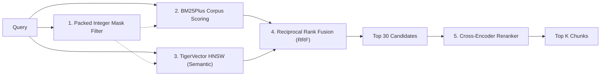

# grep -n '\[ORCHESTRA:SECTION_NAME\]' PLAN_SPEC.md  <-- Use this to jump to any section instantly
# STELLIUM: Agentic GraphRAG System Specification & Orchestration Plan
# Single Canonical Specification & Implementation Roadmap for Top 1 Finish
# TigerGraph Agentic GraphRAG Hackathon (Round 1 & Round 2)

[ORCHESTRA:INDEX]
- [ORCHESTRA:COMMON]              : System Purpose, Tech Stack, Quality Gates & Coding Standards
- [ORCHESTRA:REPO_GIT]            : Repository Origin, Branching Model & Commit Signature Protocol
- [ORCHESTRA:LLM_ROUTER]          : Session-Locked LLM Router (Cloudflare primary; providers configurable)
- [ORCHESTRA:GUARDRAILS]          : Pragmatic 3-Layer Security Guardrails (Injection, GSQL, Leak Defenses)
- [ORCHESTRA:SCHEMA]              : TigerGraph Savanna Graph Schema, Embedding Space & GSQL Stored Queries
- [ORCHESTRA:LINKED_CHUNKS]       : Doubly Linked Chunk & Event Hierarchy (Low-Byte Predecessor/Successor)
- [ORCHESTRA:PIPELINES]           : 3-Way Comparative Benchmark Pipelines (RAG, GraphRAG, Agentic GraphRAG)
- [ORCHESTRA:COPROCESSOR]         : Local Retrieval (Packed Integer Masks, BM25Plus, RRF, Optional Cross-Encoder)
- [ORCHESTRA:AGENT_HARNESS]       : Bounded Cyclic ReAct Loop, Tool Dispatch, Evidence Review & Adaptive Stopping
- [ORCHESTRA:EVAL_BENCHMARK]      : Public/Hidden Evaluation, Metrics & Reproducible Quality Measurement
- [ORCHESTRA:DASHBOARD_FRONTEND]  : Lunarbit GraphSurface Visualizer, FastAPI Bridge & Snapshot DTOs
- [ORCHESTRA:MASTER:001]          : Master Orchestrator Operational Playbook & Live Auditing
- [ORCHESTRA:AGENT:001]           : Stream 1: Ingestion, Table-Aware Chunking & Savanna Graph Ingestion
- [ORCHESTRA:AGENT:002]           : Stream 2: High-Speed Hybrid Coprocessor (Bitmasks, BM25, RRF)
- [ORCHESTRA:AGENT:003]           : Stream 3: ReAct Agent Loop & GSQL Reasoning Tools
- [ORCHESTRA:AGENT:004]           : Stream 4: Evaluation Runner, Metrics Engine & React Dashboard Integration
- [ORCHESTRA:SESSION_MEMORY]      : Persistent Chat History & Agent Memory in TigerGraph (Survives Refresh)
- [ORCHESTRA:AGENTIC_TRACE]       : Full Agentic Trace Schema Required by Judges
- [ORCHESTRA:ROUND2_PREP]         : Round 2 Bitemporal Reasoning Over Evolving & Conflicting Facts
- [ORCHESTRA:DELIVERABLES]        : Submission Artifacts Checklist (GitHub, Video, Diagrams, Dashboard, Writeup)
- [ORCHESTRA:HACKATHON_RULES]     : Binding Rulings from Organizer Q&A (Same Model, 0-Token, Anti-Hardcode)
[/ORCHESTRA:INDEX]

## Verified Baseline and Status Rules

This specification records both the desired system and implementation work. A requirement is not complete merely because it appears in an architecture description. Use these labels in task tracking: **Implemented** means verified in current code or runtime; **Partial** means a primitive exists but the stated user-facing behavior is incomplete; **Missing** means no implementation evidence exists. Performance and accuracy numbers require reproducible result artifacts before they can be presented as measured outcomes.

Verified starting point (2026-09-28): the agent is a bounded cyclic ReAct loop in `src/pipelines/agentic.py`; the TigerGraph schema declares a 1024-dimensional Jina vector index; local sparse retrieval uses `rank-bm25` and packed integer masks; the API serves a single HTML dashboard and Lunarbit source samples are under `samples/frontend/`. Persistent session history, query-specific graph snapshots, the maintained premium frontend, and complete public benchmark artifacts are not yet implemented. The snapshot endpoint intentionally returns empty data until live query-derived data is wired in. A live dense-retrieval audit on 2026-09-28 embedded all 100 public questions with Jina v5 (1024 dimensions, `retrieval.query`) but TigerVector returned zero chunks for every question at top-30; direct response fields `TopChunks` and `@@distances` were both empty. The live graph still contains 22,016 Chunk vertices, and an interpreted read of one Chunk vertex showed no `embedding` value. The vector schema/index declaration is present, but populated/searchable vectors are not verified. The latest completed live three-pipeline public run before the multi-hop date-query correction scored RAG 5/100 EM, GraphRAG 34/100 EM, and Agentic 80/100 EM (Agentic token F1 0.807); its Agentic result is contaminated by prompt leakage. These historical figures are not a clean baseline or the 98% objective.

The primary quality objective is **at least 98% measured answer accuracy**, pursued without hard-coded answers or hidden-set tuning. Treat this as a target, not a result or guarantee. Report accuracy with completeness, evidence/citation quality, latency, token use, and question-category breakdowns.

---

[ORCHESTRA:COMMON]
## 1. System Mission & Core Mandate
Stellium is an enterprise-grade Agentic GraphRAG system built for the TigerGraph Agentic GraphRAG Hackathon.
The system answers questions over a 2,951-document historical Olympic Wikipedia corpus (~5.47M tokens).
The fundamental research thesis is to prove where Agentic GraphRAG provides positive ROI over standard RAG and GraphRAG, and where simpler retrieval suffices.

## 2. Core Tech Stack
- Runtime: Python 3.12+ managed exclusively via `uv` (0.9.5+).
- Graph & Vector Engine: TigerGraph Savanna (GSQL compiled queries + TigerVector HNSW embedding space).
- Agent Harness: bounded cyclic ReAct loop with LLM-selected tools and session-locked LLM calls.
- Hybrid Search Coprocessor: BM25Plus (`rank-bm25`), packed integer category masks, Reciprocal Rank Fusion (RRF), optional Cross-Encoder reranker (`sentence-transformers`).
- Backend API: FastAPI (async ASGI) + Pydantic v2.
- Frontend target: premium React/TypeScript dashboard based on Lunarbit samples under `samples/frontend/`. Current app is a single HTML file served by FastAPI.
- Quality Tooling: `ruff` (linter and formatter), `mypy` (strict static typing), `pytest` (test runner).

## 3. Strict Quality Gates & Coding Standards
- Chained Verification Chain (must pass 100% green before any commit):
  `uv run pytest && uv run ruff check && uv run ruff format --check && uv run mypy --strict`
- Commenting Rule: Zero docstrings (`"""..."""`) inside Python application code.
  Strictly use single-line or multi-line `#` comments explaining logic, rationale, and contracts.
- Code Compactness: Lightweight, zero unnecessary wrapper abstractions, strict typing across all interfaces.

## 4. Project Directory Layout
```text
stellium/
├── PLAN_SPEC.md                     # Canonical specification (this file)
├── BOARD.md                         # Live coordination board
├── README.md                        # Public-facing project overview
├── pyproject.toml                   # uv / hatch project config with deps
├── uv.lock                          # Deterministic lock file (auto-generated)
├── .gitignore
├── .env.example                     # Template for required env vars (never commit .env)
├── .github/
│   └── workflows/
│       └── ci.yml                   # GitHub Actions: lint + type-check + test
├── hackathon-resources/             # Provided dataset (DO NOT MODIFY)
│   ├── corpus/corpus.jsonl          # 2,951 docs, ~5.47M tokens
│   ├── questions/eval_public.jsonl  # 100 questions with answers
│   ├── questions/eval_hidden.jsonl  # 50 questions without answers
│   └── README.md
├── samples/
│   └── frontend/                    # Lunarbit GraphSurface.tsx source files
├── src/
│   ├── __init__.py
│   ├── models/__init__.py           # Pydantic domain models (AgentState, DTOs, etc.)
│   ├── ingest/                      # Corpus parser, table-aware chunker, header injector
│   ├── graph/                       # TigerGraph Savanna client, DDL scripts, mock adapter
│   ├── coprocessor/                 # BM25Plus, packed integer masks, RRF, optional reranker
│   ├── pipelines/                   # Pipeline 1 (RAG), Pipeline 2 (GraphRAG), Pipeline 3 (Agentic)
│   ├── llm/                         # Multi-provider LLM router with circuit breaker
│   ├── guardrails/                  # Input sanitizer, output leak guard
│   ├── evaluate.py                  # CLI evaluation runner (--pipeline, --dataset, --output)
│   └── api/
│       └── main.py                  # FastAPI app with /query/{rag|graphrag|agentic|compare}
├── src/api/static/index.html        # Current single-file dashboard
├── samples/frontend/                # Lunarbit graph visualization source and style reference
├── tests/
│   ├── __init__.py
│   ├── test_smoke.py                # Environment & import sanity
│   ├── test_ingest/                 # Chunker, header injection, linked pointer tests
│   ├── test_coprocessor/            # Bitmask, BM25, RRF, reranker tests
│   ├── test_pipelines/              # Pipeline 1/2/3 contract tests
│   └── test_eval/                   # Metric computation (EM, F1, MRR) tests
└── results/                         # Generated evaluation output (gitignored except final submissions)
```

## 5. Environment Variables (`.env.example` Template)
```dotenv
# TigerGraph Savanna Cluster
TG_HOST=https://<cluster>.i.tgcloud.io
TG_GRAPH_NAME=OlympicsGraph
TG_USERNAME=tigergraph
TG_PASSWORD=
TG_SECRET=

# LLM Provider Keys (Multi-Provider Fallback Chain)
GEMINI_API_KEY=
MISTRAL_API_KEY=
CLOUDFLARE_ACCOUNT_ID=
CLOUDFLARE_API_TOKEN=

# Embedding Model (Jina v5 text-small; must match TigerGraph's vector dimension)
JINA_API_KEY=
JINA_EMBEDDING_MODEL=jina-embeddings-v5-text-small
EMBEDDING_DIMENSION=1024
```

## 6. Target Judging Surface: Hosted Live Web Application
The hackathon requires a working system and metrics dashboard. A hosted experience is our target presentation surface; it is not yet complete. The finished app should support:
- Preset dropdown selector for public questions only; the hidden set is for the required submission run, not public demo presets.
- Free-form custom query input (adversarial and edge-case queries by judges).
- 3-column comparative view: RAG answer vs. GraphRAG answer vs. Agentic GraphRAG answer.
- Token cost and latency gauges per pipeline.
- Animated Lunarbit `GraphSurface.tsx` visualization of the agent's graph traversal path.
- Full agentic reasoning trace (steps, tools called, strategy shifts, stopping rationale).

## 7. Elastic Agent Pool Rule
Subagents (`agent-001` through `agent-004`) are NOT permanently locked to fixed roles.
`master-agent-001` dynamically assigns and re-assigns work based on current priority:
- During ingestion: all 4 agents can shard the 2,951 documents across parallel workers.
- During evaluation: all 4 agents can shard the 150 questions across parallel workers.
- During feature development: each agent owns a specific stream as defined in its `[ORCHESTRA:AGENT:XXX]` section.
Agents can be re-tasked at any point by updating `BOARD.md`.

## 8. GitHub Actions CI Workflow
```yaml
# .github/workflows/ci.yml
name: CI
on:
  push:
    branches: [main, 'agent/**']
  pull_request:
    branches: [main]
jobs:
  quality:
    runs-on: ubuntu-latest
    steps:
      - uses: actions/checkout@v4
      - uses: astral-sh/setup-uv@v4
        with:
          version: "0.9.5"
      - run: uv sync --extra dev
      - run: uv run ruff check
      - run: uv run ruff format --check
      - run: uv run mypy --strict src/
      - run: uv run pytest --tb=short -q
```
[/ORCHESTRA:COMMON]

---

[ORCHESTRA:REPO_GIT]
## 1. Repository Details
- Remote Origin: `https://github.com/simon-derock/stellium.git`
- Primary Branch: `main`
- Initialized: `git init -b main && git remote add origin https://github.com/simon-derock/stellium.git`

## 2. Branching & Worktree Model
- Pristine Trunk: `main` branch remains stable and integrated.
- Isolated Worktrees for Parallel Streams:
  `git worktree add ../wt-agent-001 -b agent/001/ingest-schema`
  `git worktree add ../wt-agent-002 -b agent/002/hybrid-engine`
  `git worktree add ../wt-agent-003 -b agent/003/langgraph-agent`
  `git worktree add ../wt-agent-004 -b agent/004/eval-dashboard`

## 3. Micro-Commit Protocol & Attribution Signature
Every commit must be atomic, tied to a green TDD/lint cycle, and appended with the authoring agent's identifier:
`<type>(<scope>): <concise message> [committed by <agent-id>]`

Valid Agent Identifiers:
- `master-agent-001` : Lead Architect & Master Coordinator
- `agent-001`        : Ingestion & Schema Worker
- `agent-002`        : Hybrid Search Coprocessor Worker
- `agent-003`        : ReAct Agent Loop & GSQL Tools Worker
- `agent-004`        : Evaluation & Dashboard Worker

Examples:
- `feat(ingest): add table-aware wikipedia parser [committed by agent-001]`
- `test(coproc): verify roaring bitmask year filtering [committed by agent-002]`
- `feat(agent): implement langgraph state machine with backtracking [committed by agent-003]`
- `chore(master): verify quality gates and merge agent-001 [committed by master-agent-001]`
[/ORCHESTRA:REPO_GIT]

---

[ORCHESTRA:LLM_ROUTER]
## 1. Resilient Multi-Provider LLM Architecture (Session-Level Model Lock)
Per binding hackathon ruling: "Same model everywhere, including planner and router."
Within a single pipeline execution for a single question, ALL LLM calls must use the identical model.

### Model Lock Protocol
```text
1. Before starting a pipeline run, lock the selected provider/model (Cloudflare is the default).
2. ALL LLM calls within that run use ONLY the locked provider/model.
3. If the locked model returns 429 mid-run: RETRY with exponential backoff on the SAME model.
4. Current behavior raises after retry exhaustion. Automatic fresh-run fallback/re-queue is not implemented yet.
5. NEVER mix models within a single question's pipeline execution.
```

### Configured Providers (Run-Level Selection)
```text
Default: Cloudflare Workers AI (@cf/meta/llama-3.1-8b-instruct-fast)
Also selectable: Google Gemini and Mistral (configured model constants in src/llm/)
```

### Deterministic Steps Are Model-Free
Steps that use 0 LLM tokens (GSQL queries and local filtering) have no model to constrain. The ReAct loop selects tools; there is no regex-based question classifier.

### Telemetry
Every LLM call logs: `model_name`, `provider`, `prompt_tokens`, `completion_tokens`, `latency_ms`.
Every deterministic step logs: `tool_name`, `llm_tokens: 0`, `latency_ms`.
[/ORCHESTRA:LLM_ROUTER]

---

[ORCHESTRA:GUARDRAILS]
## 1. Judge-Safe Pragmatic 3-Layer Security Architecture
CRITICAL: Guardrails must NEVER block legitimate evaluation queries or judge testing.
The eval questions are natural-language Olympic sports questions. They contain no SQL, no injection patterns.
Over-blocking is worse than under-blocking for a hackathon demo. Design for zero false positives.

### Layer 0: Endpoint-Level Trust Tiers
Different API endpoints get different guardrail levels:
- `/api/v1/evaluate/batch` (batch eval submission): **NO input guardrails** — accepts raw eval JSONL,
  treats all questions as trusted evaluation input. Output guardrails still apply.
- `/api/v1/query/{rag|graphrag|agentic}` (interactive UI): Guardrail Layer 1 applies.
- `/api/v1/query/compare` (3-pipeline compare): Same as above.

### Layer 1: Structural Injection Filter (< 1ms, Context-Aware)
Only blocks queries that are structurally database commands, NOT isolated keywords.

Input length: Accept up to 2,000 characters (max eval question is 136 chars; judges may paste context).

Structural database command patterns (require full command syntax, not isolated words):
```python
BLOCKED_DB_PATTERNS = [
    r"DROP\s+(GRAPH|TABLE|VERTEX|EDGE|QUERY)\s+\w",  # Must have DROP + object type + name
    r"DELETE\s+FROM\s+\w",  # Must have DELETE FROM + table name
    r"CREATE\s+USER\s+\w",  # Must have CREATE USER + username
    r"TRUNCATE\s+(TABLE|GRAPH)\s+\w",  # Must have TRUNCATE + object + name
    r"ALTER\s+(VERTEX|EDGE)\s+\w+\s+(DROP|ADD)\s+",  # Structural DDL mutation
]
# NOT blocked: isolated words like "create", "delete", "alter" in natural questions
# e.g. "Did the IOC create a new record?" → safe, no object type follows

BLOCKED_JAILBREAK_PATTERNS = [
    r"ignore\s+(all\s+)?previous\s+instructions",
    r"system\s+prompt\s+(leak|dump|reveal)",
    r"you\s+are\s+now\s+in\s+developer\s+mode",
    r"jailbreak\s+mode",
    r"act\s+as\s+(dan|evil|unrestricted)",
]
```

Action on block: Return HTTP 400 with `{"error": "Query blocked by safety policy", "code": "SAFETY_001"}`.
Zero database or LLM invocations occur.

### Layer 2: Strictly Parameterized GSQL Queries (Injection-Proof by Design)
- Zero raw string concatenation ever in GSQL query calls.
- All GSQL execution passes typed parameter dicts: `params={"sport": sport, "year": year}`.
- Prevents GSQL injection regardless of what text reaches this layer.

### Layer 3: Output Sanitization & Leak Guard
Scans all outgoing LLM responses before returning to UI/API:
- Redacts API key patterns: `AIza[0-9A-Za-z\-_]{35}`, `sk-[0-9A-Za-z]{32,}`, `Bearer\s+[A-Za-z0-9\-\._~\+\/]+=*`
- Redacts `TG_PASSWORD`, `TG_SECRET`, env-var-like patterns in output text.
- Does NOT redact sports facts, athlete names, or event results — only credential patterns.

### Layer 4: Graceful Out-of-Corpus Handling
When a question asks about something not in the corpus (e.g., 2024 Olympics not in dataset):
- Return a structured response: `{"answer": "Not found in corpus", "evidence": [], "searched_docs": N}`
- Do NOT hallucinate. Do NOT return an LLM-invented answer without evidence.
- This is explicitly what judges test for — corpus grounding is 15% of their score.
[/ORCHESTRA:GUARDRAILS]

---

[ORCHESTRA:SCHEMA]
## 1. TigerGraph Savanna DDL Schema (OlympicsGraph)

```gsql
CREATE GRAPH OlympicsGraph()

# Embedding Space Definition (TigerVector HNSW)
CREATE EMBEDDING SPACE OlympicChunkSpace (
  DIMENSION = 1024,
  MODEL = 'jina-embeddings-v5-text-small',
    INDEX = HNSW,
    DATATYPE = FLOAT,
    METRIC = COSINE
)

# Vertex Types
CREATE VERTEX Document (
    PRIMARY_ID doc_id STRING,
    title STRING,
    url STRING,
    wikidata_qid STRING,
    wikipedia_pageid INT,
    approx_tokens INT,
    filter_mask UINT
) WITH STATS="OUTDEGREE"

CREATE VERTEX Chunk (
    PRIMARY_ID chunk_id STRING,
    doc_id STRING,
    chunk_index INT,
    section_title STRING,
    text STRING,
    prev_chunk_id STRING,
    next_chunk_id STRING,
    filter_mask UINT
) WITH STATS="OUTDEGREE"

ALTER VERTEX Chunk
ADD EMBEDDING ATTRIBUTE embedding
IN EMBEDDING SPACE OlympicChunkSpace

CREATE VERTEX Event (
    PRIMARY_ID event_id STRING,
    name STRING,
    year INT,
    season STRING,
    sport STRING,
    gender STRING,
    competitor_count INT,
    nation_count INT,
    prev_event_id STRING,
    next_event_id STRING,
    filter_mask UINT
) WITH STATS="OUTDEGREE"

CREATE VERTEX Person (
    PRIMARY_ID person_id STRING,
    name STRING,
    nationality STRING
) WITH STATS="OUTDEGREE"

CREATE VERTEX Venue (
    PRIMARY_ID venue_id STRING,
    name STRING,
    city STRING,
    country STRING
) WITH STATS="OUTDEGREE"

# Edge Types
CREATE UNDIRECTED EDGE HAS_CHUNK (FROM Document, TO Chunk)
CREATE DIRECTED EDGE DOCUMENTED_IN (FROM Event, TO Document)
CREATE DIRECTED EDGE HELD_AT (FROM Event, TO Venue, start_date STRING, end_date STRING)
CREATE DIRECTED EDGE COMPETED_IN (FROM Person, TO Event, medal STRING, rank INT, score STRING)
CREATE DIRECTED EDGE PRECEDES (FROM Event, TO Event, time_diff INT)
CREATE DIRECTED EDGE SUCCEEDS (FROM Event, TO Event, time_diff INT)
CREATE DIRECTED EDGE MENTIONS (FROM Chunk, TO Person | TO Venue | TO Event)
```

## 2. Compiled GSQL Stored Queries

```gsql
# Query 1: Deterministic Aggregation
CREATE QUERY get_event_aggregates(STRING sport, INT target_year, INT min_competitors) 
  FOR GRAPH OlympicsGraph {
  SumAccum<INT> @@match_count = 0;
  ListAccum<STRING> @@event_names;
  ListAccum<STRING> @@gold_doc_ids;

  Events = {Event.*};
  Filtered = SELECT e FROM Events:e -(DOCUMENTED_IN:d)- Document:doc
             WHERE e.sport == sport AND e.year == target_year AND e.competitor_count > min_competitors
             ACCUM @@match_count += 1,
                   @@event_names += e.name,
                   @@gold_doc_ids += doc.wikidata_qid;

  PRINT @@match_count AS answer, @@event_names AS matching_events, @@gold_doc_ids AS gold_doc_ids;
}

# Query 2: Temporal Predecessor Winner Lookup
CREATE QUERY get_preceding_winner(STRING sport, STRING event_name, INT current_year)
  FOR GRAPH OlympicsGraph {
  ListAccum<STRING> @@winner_names;
  ListAccum<STRING> @@gold_doc_ids;

  Events = SELECT prior FROM Event:curr -(PRECEDES)-> Event:prior -(DOCUMENTED_IN:d)- Document:doc
           WHERE curr.sport == sport AND curr.year == current_year
           ACCUM @@gold_doc_ids += doc.wikidata_qid;

  Winners = SELECT p FROM Events:e -(COMPETED_IN:c)- Person:p
            WHERE c.medal == "Gold"
            ACCUM @@winner_names += p.name;

  PRINT @@winner_names AS winners, @@gold_doc_ids AS gold_doc_ids;
}
```
[/ORCHESTRA:SCHEMA]

---

[ORCHESTRA:LINKED_CHUNKS]
## 1. Low-Storage Doubly Linked Chunk & Event Representation
To avoid chunk boundary truncation and support chronological progression, chunks and events carry predecessor and successor pointers.

### Chunk Level (Compact Integer Indices)
- Within any document $D$, chunks are indexed $0 \le i < N$.
- Low-byte encoding: `uint16` chunk index.
  - Chunk 0: `prev_chunk_id = None`, `next_chunk_id = f"{doc_id}#1"`
  - Chunk $i$: `prev_chunk_id = f"{doc_id}#{i-1}"`, `next_chunk_id = f"{doc_id}#{i+1}"`
  - Chunk $N-1$: `prev_chunk_id = f"{doc_id}#{N-2}"`, `next_chunk_id = None`
  - Single chunk document: both are `None`.

### Event Level (Temporal Succession)
- Extracted directly from Wikipedia infobox fields `prev: YYYY` and `next: YYYY`.
- In TigerGraph, materialized as `prev_event_id` attribute and `PRECEDES` / `SUCCEEDS` directed edges.

### Behavioral Differentiation Across Pipelines
- Pipeline 1 (RAG): the baseline currently retrieves vector top-5 and does not expand adjacent chunks. The coprocessor stores chunk pointers and offers an expected O(1) in-memory neighbor lookup; wiring that behavior into a pipeline remains future work.
- Pipeline 2 (GraphRAG): currently performs fixed graph lookups/multihop queries plus dense retrieval; it does not currently use chunk-level neighbor expansion or the temporal predecessor tool.
- Pipeline 3 (Agentic GraphRAG): can use the temporal GSQL tool. Chunk-neighbor expansion is not yet exposed to the ReAct loop, and the evidence critic remains a roadmap item.
[/ORCHESTRA:LINKED_CHUNKS]

---

[ORCHESTRA:PIPELINES]
## 1. Pipeline 1: Baseline Vector RAG (Deliberately Simple)
The baseline must be vanilla to create maximum contrast with Agentic GraphRAG.
- Retrieval: TigerVector HNSW cosine similarity search ONLY. Top-k = 5. No BM25, no RRF, no reranker, no graph traversal.
- Generation: Single-turn LLM call: inject top-k chunks as context → generate answer.
- Tools Allowed: `vector_search` only.
- Expected Weaknesses: Fails on aggregation (can't count), temporal (conflates years), multi-hop (misses second entity).
- Metrics: context length (currently estimated from characters), provider-reported LLM input/output tokens, `total_llm_tokens`, wall-clock latency, and scored answer metrics.

## 2. Pipeline 2: GraphRAG (Fixed Pipeline, Non-Agentic)
Uses graph structure and text retrieval in a fixed sequence — no dynamic planning or backtracking.
- Retrieval (Fixed Sequence):
  1. Ask the configured LLM to extract year, sport, and venue fields.
  2. Run the corresponding compiled graph lookup/multihop query when fields are available.
  3. Run TigerVector search at fixed top-3 and combine returned graph facts and chunk text.
- Generation: Single-turn LLM call: inject fused graph + text context → generate answer.
- Current code does not implement a distinct fuzzy entity-linker or generic 1-hop traversal agent.
- Expected Weaknesses: No backtracking if extraction/retrieval fails. No strategy adaptation. Fixed retrieval order.
- Metrics: graph/subgraph counts when exposed, estimated context length, provider-reported input/output tokens, `total_llm_tokens`, wall-clock latency, and scored answer metrics.

## 3. Pipeline 3: Autonomous Agentic GraphRAG (Full Arsenal, Dynamic)
The agent plans its own investigation, selects retrieval methods dynamically, and adapts based on what it finds.
- Retrieval & Reasoning (Dynamic, Agent-Controlled):
  1. The ReAct LLM reads the question and selects an action; there is no separate regex query classifier.
  2. Dynamic Tool Dispatch: The agent chooses from implemented tools and observes returned evidence:
     - `vector_search` (TigerVector HNSW semantic retrieval)
     - `hybrid_search` (BM25Plus + RRF + optional cross-encoder inside the coprocessor)
     - `gsql_aggregate` (deterministic event aggregation via compiled GSQL)
     - `gsql_temporal` (PRECEDES/SUCCEEDS edge traversal — 0 LLM tokens)
     - `gsql_superlative`, `gsql_multihop`, and `gsql_lookup` (compiled structured queries)
     - `finish` (agent-supplied answer and citations)
  3. Bounded Cycle: The loop appends observations and asks the LLM for its next action until a finish, deterministic fast stop, direct answer, or iteration limit.
  4. Evidence review and distinct specialist agent components are incomplete; they remain roadmap work.
- Chunk-neighbor expansion exists in the local coprocessor but is not exposed as a ReAct tool.
- Stopping confidence values are assigned by current code paths and are not calibrated probabilities.
- Stopping Criteria: Current hard stops are finish/direct-answer actions, selected deterministic GSQL results, or maximum iterations; calibrated evidence-based stopping remains a goal.
- Metrics: Full agentic trace (per `[ORCHESTRA:AGENTIC_TRACE]` spec).
[/ORCHESTRA:PIPELINES]

---

[ORCHESTRA:COPROCESSOR]
## 1. Local Retrieval Coprocessor Architecture
The local coprocessor supplements TigerGraph Savanna with sparse retrieval, compact metadata masks, rank fusion, and optional reranking. The complete retrieval pipeline is not O(1); complexity and latency claims must be qualified by implementation and benchmark scope.


```mermaid
flowchart LR
    Q[Query] --> Bitmask["1. Packed Integer Mask Filter"]
    Q --> BM25["2. BM25Plus Corpus Scoring"]
    Q --> TGVector["3. TigerVector HNSW (Semantic)"]
    
    Bitmask -.-> BM25
    Bitmask -.-> TGVector
    
    BM25 --> RRF["4. Reciprocal Rank Fusion (RRF)"]
    TGVector --> RRF
    
    RRF --> Top30["Top 30 Candidates"]
    Top30 --> Rerank["5. Cross-Encoder Reranker"]
    Rerank --> TopK["Top K Chunks"]
```

### Components
1. **Packed Integer Masks**:
   - Current implementation stores a `uint32` mask on chunks and checks it while scanning BM25 scores.
   - Masks encode year and season only. Sport names remain corpus-derived text and are handled by retrieval rather than a static taxonomy.
   - One fixed-width integer AND is constant-time, but finding all matching chunks still depends on the candidate scan or index.
2. **BM25 Sparse Index (`rank-bm25`)**:
   - Current `rank-bm25` path scores all indexed chunks and sorts positive candidates; do not claim constant-time retrieval.
3. **TigerVector Dense Search**:
   - HNSW semantic search returning top-$k$ nearest chunk embeddings.
4. **Reciprocal Rank Fusion (RRF)**:
   - Rank fusion: $RRF(d) = \sum_{m} \frac{1}{60 + \text{rank}_m(d)}$
5. **Cross-Encoder Reranker**:
   - Mini cross-encoder scoring Top-30 fused candidates down to Top-1 or Top-2.
[/ORCHESTRA:COPROCESSOR]

---

[ORCHESTRA:AGENT_HARNESS]
## 1. Bounded Cyclic ReAct Loop
**Current implementation: bounded cyclic ReAct, not LangGraph.** `AgentState`, `EvidenceItem`, and `ToolAuditCall` are defined in `src/models/__init__.py`. The loop in `src/pipelines/agentic.py` sends the question and prior tool observations to the LLM, validates/parses the next action, executes it, records telemetry, and repeats until an explicit finish, a deterministic fast stop, a direct answer, or the maximum iteration count.

**Current gaps:** there is no separately implemented evidence-critic node or specialist-agent set; the next ReAct decision serves as the current evidence review. Exact repeated tool actions with canonicalized arguments reuse a cached observation, but semantic no-new-evidence detection is not implemented. Confidence values are code-assigned and not calibrated. Chunk-window expansion is available in the coprocessor but not exposed as an agent action.

**Target improvements:** keep the loop flexible and bounded; add typed tool argument validation, a deduplicated evidence ledger, semantic no-new-evidence detection, specialist capabilities with explicit contracts, evidence-supported stopping, and calibration based on measured validation outcomes. Do not introduce heuristic question-text routing or hard-coded answer paths.
[/ORCHESTRA:AGENT_HARNESS]

---

[ORCHESTRA:EVAL_BENCHMARK]
## 1. Evaluation Protocol & Datasets
- Visible Dataset: `hackathon-resources/questions/eval_public.jsonl` (100 questions with answers and `gold_doc_ids`).
- Hidden Dataset: `hackathon-resources/questions/eval_hidden.jsonl` (50 unseen questions without answers).
- Execution CLI:
  `uv run python -m src.evaluate --dataset hackathon-resources/questions/eval_public.jsonl --pipeline all --output results/public_results.jsonl`
  `uv run python -m src.evaluate --dataset hackathon-resources/questions/eval_hidden.jsonl --pipeline agentic --output results/hidden_submission.jsonl`
- Completed question results are flushed to JSONL as the run proceeds. `--resume` validates the dataset/question identity and pipeline fields, restores completed records, and evaluates only missing questions. This supports recovery from transient provider or network failures without discarding completed measurements.

## 2. Metrics Hierarchy
- Implemented local answer/retrieval metrics (computed without extra LLM calls; latency depends on dataset size):
  - Exact Match (EM)
  - Token F1-score
  - Gold Document Recall@k, Precision@k, MRR (Mean Reciprocal Rank)
  - Wall-clock latency and provider-reported prompt/completion/total LLM tokens
- BM25 tokenization ablation on the 100 public questions / 22,016 chunks: punctuation-normalized tokens improved sparse chunk Recall@5 from 81% to 87%, Recall@10 from 90% to 95%, Recall@30 from 95% to 96%, and MRR@30 from 0.571 to 0.681 versus the prior whitespace split. This is retrieval coverage, not answer EM; `scripts/evaluate_sparse_retrieval.py` records dataset and corpus hashes and reproduces the comparison.
- Live TigerVector dense audit on 100 public questions: zero returned chunks and zero hit/recall/MRR at 5, 10, and 30 for every question. The audit report includes the dataset hash and query model/dimension/task in `results/dense_retrieval_20260928_report.json` (local ignored artifact); reproducible runner: `scripts/evaluate_dense_retrieval.py`. This establishes that the current deployed dense path is unavailable, not that Jina embeddings are semantically poor. A sampled live Chunk vertex had no vector value despite the schema declaration. Root cause between missing vector upserts, index population, and query/index wiring remains to be isolated.
- `context_tokens` is currently estimated from text length; it is not a tokenizer-measured context count.
- Missing measurement work: completeness, citation precision/recall, groundedness, p50/p95/p99 latency, neuron/accounting breakdowns, and confidence calibration.
- Missing: answer completeness, groundedness/faithfulness, and a reviewed semantic grading protocol. RAGAS is a possible optional evaluator, not currently integrated or required by the supplied guidebook.
- Accuracy objective: pursue 98%+ on the public evaluation while protecting generalization; publish the measured score and category breakdown, never a target as if achieved.
- Historical public runs reported RAG EM 5%, GraphRAG EM 34%, and Agentic EM 80% (three-pipeline run), plus a later Agentic-only 84/100 EM, F1 0.852, and 2.34s mean latency. An audit found that the Agentic system prompt included the exact public questions and gold answers for `pub-001` and `pub-002`; therefore all historical Agentic scores are contaminated and cannot serve as a clean accuracy baseline. The two non-Agentic arms did not use that prompt, but require a reproducible rerun before publication. The copied exemplars have been removed and a regression test checks public question text against the prompt. No current clean end-to-end score is available.
- A 2026-09-28 correction passes the Olympic year as an Event filter for venue/date queries and strips it from the edge-date fragment, because source infobox date edges commonly omit the year. The query was reinstalled and a live Riocentro lookup returned the expected event and athlete. The old v4 score of 84/100 is contaminated by prompt leakage and must not be described as an accuracy improvement.
- The current code rejects aggregate actions containing an event-specific attribute request and routes valid aggregates back through ReAct for question-to-result verification. These safeguards are not yet benchmarked because the current Cloudflare account returned HTTP 429 / error 4006 for exhausted daily neuron allocation. The client now surfaces this quota error without wasting transient-retry attempts.
- Post-v4 accuracy work now applies case-insensitive matching to live GSQL sport/title/venue/date filters, tells the agent to preserve the source date order (for example, `August 14` versus `14 August`), and returns every venue/date candidate to ReAct rather than silently truncating at five. Unit gates pass, and direct Savanna checks return the expected unique answers for `pub-022` and `pub-081`; `pub-028` and `pub-095` have multiple valid venue/date matches and need candidate-aware selection. These changes have not yet been scored in a completed full benchmark because the Cloudflare account's daily neuron quota is currently exhausted.
- Evaluator results are checkpointed per question; `--resume` validates the dataset and requested pipelines before continuing incomplete runs. Local tests exercise recovery from a partial checkpoint.
- Embedding generation now fails visibly on missing credentials, provider exhaustion, malformed result count, wrong dimensions, or non-finite values; query embeddings cannot fall back to a different model with coincidentally matching dimensions. Batch upsert now checks TigerGraph's accepted-record count instead of treating a returned partial/zero count as success. Live vector availability still needs to be restored and verified before answer benchmarks can be trusted.
- Comparative Metrics:
  - Token Efficiency Delta: $\Delta_{\text{tokens}} = \frac{\text{Tokens}_{\text{Agentic}}}{\text{Tokens}_{\text{RAG}}}$
  - Accuracy Delta: $\Delta_{\text{accuracy}} = \text{Accuracy}_{\text{Agentic}} - \text{Accuracy}_{\text{RAG}}$
  - Pareto Frontier: Accuracy vs. Token Cost curve.
[/ORCHESTRA:EVAL_BENCHMARK]

---

[ORCHESTRA:DASHBOARD_FRONTEND]
## 1. Lunarbit-Based Frontend Target (`samples/frontend/`)
The Lunarbit files are source samples for the future Stellium frontend; they are not currently integrated into a maintained React application. The current dashboard is `src/api/static/index.html`.

## 2. API Contract: Snapshot DTO for Future Live Visualization
`POST /api/v1/query/compare` returns all three `PipelineResult` objects, including the Agentic trace. `GET /api/v1/graph/snapshot` currently returns empty graph/metric lists with a disclosure; query-derived graph serialization and measured dashboard metrics remain missing.

```python
class GraphNodeDTO(BaseModel):
    id: str
    type: str
    layer: str
    label: str
    weight: float
    source_count: int
    confidence: float
    privacy_state: str = "public"
    scope: str = "olympics"


class GraphEdgeDTO(BaseModel):
    id: str
    source: str
    target: str
    relationship_type: str
    confidence: float
    provenance_label: str


class MetricDTO(BaseModel):
    label: str
    value: str
    unit: str
    scope: str


class FindingDTO(BaseModel):
    id: str
    title: str
    detail: str
    severity: str


class SnapshotDTO(BaseModel):
    metrics: list[MetricDTO]
    graph_nodes: list[GraphNodeDTO]
    graph_edges: list[GraphEdgeDTO]
    findings: list[FindingDTO]
    disclosure: str
```
[/ORCHESTRA:DASHBOARD_FRONTEND]

---

[ORCHESTRA:MASTER:001]
## Master Orchestrator Responsibilities
- Owner: `master-agent-001`
- Tasks:
  1. Maintain canonical `PLAN_SPEC.md` and live `BOARD.md`.
  2. Coordinate work distribution across elastic subagents `agent-001` through `agent-004`.
  3. Enforce quality gates prior to merging any branch into `main`.
  4. Perform live audits on ingestion accuracy and benchmark outputs.
[/ORCHESTRA:MASTER:001]

---

[ORCHESTRA:AGENT:001]
## Stream 1: Ingestion, Table-Aware Chunking & Savanna Schema
- Assigned Worker: `agent-001` (or parallel worker in elastic pool)
- Branch: `agent/001/ingest-schema`
- Responsibilities:
  1. Parse `hackathon-resources/corpus/corpus.jsonl` (2,951 documents).
  2. Implement table-aware agentic chunking with deterministic header injection.
  3. Populate doubly linked chunk pointers (`prev_chunk_id`, `next_chunk_id`) and event predecessors (`prev_event_id`).
  4. Implement TigerGraph Savanna schema setup script and high-fidelity Mock TigerGraph adapter for offline TDD testing.
[/ORCHESTRA:AGENT:001]

---

[ORCHESTRA:AGENT:002]
## Stream 2: High-Speed Hybrid Coprocessor
Current baseline has BM25Plus scoring, packed year/season integer masks, RRF, and an optional cross-encoder. The current implementation has no fixed sport-name bit map; sport matching remains corpus-derived. Remaining work: benchmark the 22,016-chunk corpus end-to-end and report latency/recall without unsupported sub-millisecond claims.
[/ORCHESTRA:AGENT:002]

---

[ORCHESTRA:AGENT:003]
## Stream 3: ReAct Agent Loop & GSQL Reasoning Tools
Current baseline is the bounded cyclic ReAct loop and compiled GSQL tool set. Remaining work: evidence-quality critic, real specialist components, robust loop/repetition controls, calibrated stopping, and complete trace/citation validation.
[/ORCHESTRA:AGENT:003]

---

[ORCHESTRA:AGENT:004]
## Stream 4: Evaluation Benchmark Suite & React Dashboard
Current baseline includes the CLI, local answer/retrieval metrics, compare API, and a single-file HTML UI. Remaining work: full benchmark artifacts, completeness/evidence evaluation, actual graph snapshots and measured dashboard metrics, and the Lunarbit-based premium frontend.
[/ORCHESTRA:AGENT:004]

---

[ORCHESTRA:SESSION_MEMORY]
## 1. Persistent Chat History & Agent Memory in TigerGraph
**Status: Missing.** The current history endpoint returns empty arrays. Target design uses TigerGraph Savanna as the durable source of truth for chat messages and investigation memories; no Postgres/Supabase dependency is planned. A bounded process-local cache may speed reads but is disposable. JSONL is for local development, exports, and diagnostics only, not production persistence.

### TigerGraph Session Vertices & Edges
```gsql
CREATE VERTEX Session (
    PRIMARY_ID session_id STRING,
    created_at DATETIME,
    last_active DATETIME
)

CREATE VERTEX ChatMessage (
    PRIMARY_ID msg_id STRING,
    role STRING,
    content STRING,
    pipeline STRING,
    timestamp DATETIME,
    token_count INT
)

CREATE VERTEX AgentMemory (
    PRIMARY_ID memory_id STRING,
    session_id STRING,
    query STRING,
    qtype STRING,
    final_answer STRING,
    agentic_trace STRING,
    confidence FLOAT,
    total_tokens INT,
    latency_ms FLOAT,
    created_at DATETIME
)

CREATE DIRECTED EDGE HAS_MESSAGE (FROM Session, TO ChatMessage, msg_order INT)
CREATE DIRECTED EDGE HAS_MEMORY (FROM Session, TO AgentMemory)
```

### Behavioral Contract
- Persist messages and traces through parameterized installed GSQL queries with stable, idempotent message/run IDs.
- Keep session retrieval scoped by session ID; a UUID identifies a session but is not user authentication.
- Include only bounded recent turns plus a compact summary in prompts; do not append unbounded history.
- Benchmark questions must run with isolated memory or memory disabled so prior questions cannot affect results.
- On page load: Frontend calls `GET /api/v1/sessions/{session_id}/history` to hydrate the chat panel and prior results.
- On query: Backend persists the query, all 3 pipeline answers, and the full agentic trace as `ChatMessage` and `AgentMemory` vertices.
- Session ID: Generated client-side (UUID v4), stored in `localStorage`. New tab = new session.
- Agent Memory Recall: When the agent encounters a question semantically similar to a prior answered question in the same session, it can retrieve the cached investigation result from `AgentMemory` to avoid redundant LLM and graph traversal calls.
[/ORCHESTRA:SESSION_MEMORY]

---

[ORCHESTRA:AGENTIC_TRACE]
## 1. Full Agentic Trace Schema (Judges' Mandatory Requirements)
The hackathon evaluation explicitly requires the following trace fields for every Agentic GraphRAG answer. Our trace output must capture ALL of these:

| Trace Field | Type | Description | Status |
| :--- | :--- | :--- | :---: |
| Number of retrieval and reasoning steps | `int` | `step_count` in `AgentState` | ✅ |
| Retrieval methods selected | `list[str]` | `strategy_history` in `AgentState` | ✅ |
| Specialised agents invoked | `list[str]` | Current trace reports only `ReActOrchestrator`; tools are not distinct specialist agents | Partial |
| Tools called | `list[ToolAuditCall]` | Full `tool_history` with args and outputs | ✅ |
| Time per operation | `list[float]` | `tool_history[].latency_ms` | ✅ |
| Tokens per operation | `list[int]` | `tool_history[].llm_tokens` is zero for deterministic tools; `llm_calls` separately records model token counts | ✅ |
| Total tokens used | `int` | Sum of all `tool_history[].tokens` + synthesis tokens | ✅ |
| Number of chunks and citations | `int` + `list[str]` | Current values come from chunk evidence; structured GSQL citations need end-to-end validation | Partial |
| Whether the system changed strategy | `bool` | Current code infers change from broad tool categories; refine and validate | Partial |
| When and why the system decided to stop | `str` | `stopping_reason` is emitted; confidence is not calibrated | Partial |

### Submission Output Contract for Hidden Questions
Example record shape for the specified Agentic-only hidden run (values below are illustrative, not measured results):
```json
{
  "qid": "eval-001",
  "question": "...",
  "qtype": "multi_hop",
  "agentic_answer": "...",
  "agentic_tokens": 1450,
  "agentic_trace": {
    "step_count": 3,
    "retrieval_methods": ["bitmask_filter", "gsql_traversal", "vector_search"],
    "agents_invoked": ["ReActOrchestrator"],
    "tools_called": [
      {"tool_name": "gsql_multihop", "input_args": {"venue_name_fragment": "..."}, "output_summary": "...", "llm_tokens": 0, "latency_ms": 45}
    ],
    "chunks_retrieved": 4,
    "citations": ["Q1050909", "Q26233122"],
    "strategy_changed": true,
    "strategy_change_rationale": "Initial entity match failed; switched to fuzzy alias + vector fallback",
"stopping_reason": "Evidence sufficiency criterion met",
    "total_tokens": 1450,
    "total_latency_ms": 820
  }
}
```
[/ORCHESTRA:AGENTIC_TRACE]

---

[ORCHESTRA:ROUND2_PREP]
## 1. Round 2: Reasoning Over Evolving, Conflicting & Uncertain Facts
Round 2 (Oct 1-7, Top 15 finalists only) introduces a harder dataset requiring temporal reasoning over facts that change, conflict, or carry uncertainty. Building this foundation in Round 1 earns Innovation (15%) points and gives us a head start.

### Bitemporal Graph Extension
Add temporal validity and provenance tracking to the schema:
```gsql
# Extended Event attributes for Round 2
ALTER VERTEX Event ADD ATTRIBUTE (
    valid_from DATETIME,
    valid_to DATETIME,
    superseded_by STRING,
    source_authority FLOAT
)

# Conflict Detection Edge
CREATE DIRECTED EDGE CONFLICTS_WITH (
    FROM Event, TO Event,
    conflict_type STRING,
    resolution STRING,
    resolved_by STRING
)
```

### Conflict Resolution Strategy
When the agent encounters conflicting facts:
1. Compare `source_authority` scores (higher = more authoritative).
2. Compare `valid_from` / `valid_to` timestamps (newer = supersedes older).
3. If unresolvable: report both versions with confidence intervals.
4. Log the conflict in the agentic trace as a strategy shift event.

### Round 2 Deliverables
- Updated GitHub repository with bitemporal schema and conflict detection.
- Architecture diagram showing temporal reasoning flow.
- 3-5 minute demo video demonstrating conflict resolution.
- Metrics dashboard with temporal accuracy breakdown.
- Short writeup: what we built, how it works, key results, limitations, what we'd add with more time.
[/ORCHESTRA:ROUND2_PREP]

---

[ORCHESTRA:DELIVERABLES]
## 1. Required Submission Artifacts Checklist

### Round 1 Deliverables (Deadline: Sep 30)
- [ ] Working Agentic GraphRAG system (hosted live web app).
- [ ] GitHub repository: `https://github.com/simon-derock/stellium.git` (public, clean, well-documented).
- [ ] Architecture diagram: Mermaid source in PLAN_SPEC.md + exported SVG/PNG in `docs/architecture.svg`.
- [ ] Demo video: Screen recording of the live web app answering queries across all 3 pipelines (upload to YouTube/Loom).
- [ ] Metrics dashboard: Interactive React dashboard comparing RAG vs GraphRAG vs Agentic GraphRAG (tokens, accuracy, completeness).
- [ ] Evaluation output: `results/public_results.jsonl` (100 questions) and `results/hidden_submission.jsonl` (50 questions).
- [ ] Optional: Social media post tagging @TigerGraph (counts in our favour).

### Round 2 Deliverables (Deadline: Oct 7, if we advance)
- [ ] Refined Agentic GraphRAG system with bitemporal conflict resolution.
- [ ] Updated GitHub repository with Round 2 extensions.
- [ ] Updated architecture diagram.
- [ ] 3-5 minute demo video.
- [ ] Metrics dashboard with temporal reasoning breakdown.
- [ ] Short writeup (in `docs/writeup.md`): what we built, how it works, key results, limitations, and what we'd add with more time.
- [ ] Live presentation to judges (if selected for final panel).

### Reference to Official `tigergraph/graphrag` Repository
The hackathon guidebook recommends cloning `https://github.com/tigergraph/graphrag.git` as a reference.
We build Stellium as an independent, purpose-built system but reference the official repo for:
- GSQL query patterns and hybrid search examples.
- pyTigerGraph client usage and MCP integration patterns.
- Schema design conventions for TigerGraph Savanna.
[/ORCHESTRA:DELIVERABLES]

---

[ORCHESTRA:HACKATHON_RULES]
## Binding Rulings from Organizer Q&A (Source: Official Hackathon Discord + Office Hours)
These rulings are HARD CONSTRAINTS that override any prior assumptions.

### Rule 1: Dynamic Agentic Behavior and No Answer Hardcoding
- Ruling: "Deterministic-first is fine, as long as the agentic mode is genuinely agentic and nothing is hard-coded for the public 100. Report 0-token answers honestly."
- Current implementation uses a cyclic ReAct LLM loop with dynamic tool selection and parameterized GSQL. Keep it free of question-ID answers, heuristic query classifiers, and static sport/entity lists.
- The current coprocessor encodes year and season in packed integer masks and does not encode sport names in a static bit map. Keep sport/entity matching corpus-derived and re-audit any taxonomy optimization against the no-static-list rule.

### Rule 2: Benchmark Runs Follow the Supplied Hackathon Instructions
- Public: run all three pipelines on all 100 visible questions.
- Hidden: use the specified Agentic-only command for all 50 questions and preserve raw answers, token counts, and complete agentic traces. Change this only if a newer, verifiable organizer instruction overrides the supplied command.
- Current artifacts are missing; do not claim benchmark completion until the output files and run metadata exist and are audited.

### Rule 3: Same Model Everywhere Per Pipeline Run
- Guidebook requirement: use an LLM provider of choice. Project policy locks one provider/model for the duration of a pipeline run.
- Current implementation: session-level lock and same-provider retry are implemented. Automatic fresh-run fallback after retry exhaustion is not implemented.
- Deterministic steps (GSQL and local filtering) report zero LLM tokens.

### Rule 4: Team Events as Comma-Separated Lists
- Guidebook scoring allows meaning-based answer evaluation. Comma-separated team/event answers are a supported output form; validate completeness and ordering on the public set.
- Current local metrics include normalized exact match and token F1; Jaccard is not currently computed.

### Rule 5: Name and Diacritic Normalization
- The project normalizes text for answer scoring and BM25/entity matching paths. Do not claim all answer generation or all entity linking uses this path until verified; a separate entity-linker component is still missing.

### Rule 6: GSQL + Python Counts as TigerGraph Usage; Use TigerGraph's Own Vector Search
- Ruling: "Yes, that counts. Use TigerGraph's own vector search, no external vector DB needed."
- Current implementation uses TigerVector HNSW for dense search and local BM25Plus as a complementary sparse ranker. No external vector database is used.

### Rule 7: Token Counting — Only LLM Tokens; GSQL = 0
- Ruling: "Count only LLM tokens. Deterministic steps and GSQL = 0. Report tool calls and latency too."
- Current trace records deterministic tool calls with zero LLM tokens and operation latency; model calls record token counts separately. Keep total-token accounting limited to LLM tokens.

### Accuracy Evaluation Methods (from Guidebook)
- For 100 public questions: Teams choose their method. Options: LLM-as-Judge (PASS/FAIL), BERTScore (semantic similarity), or manual comparison.
- For 50 hidden questions: Organizers evaluate against held-out ground truth on their end.
- Our approach: Tier-1 deterministic (EM + Token F1 + MRR) for instant feedback + LLM-as-Judge for semantic grading.
[/ORCHESTRA:HACKATHON_RULES]
