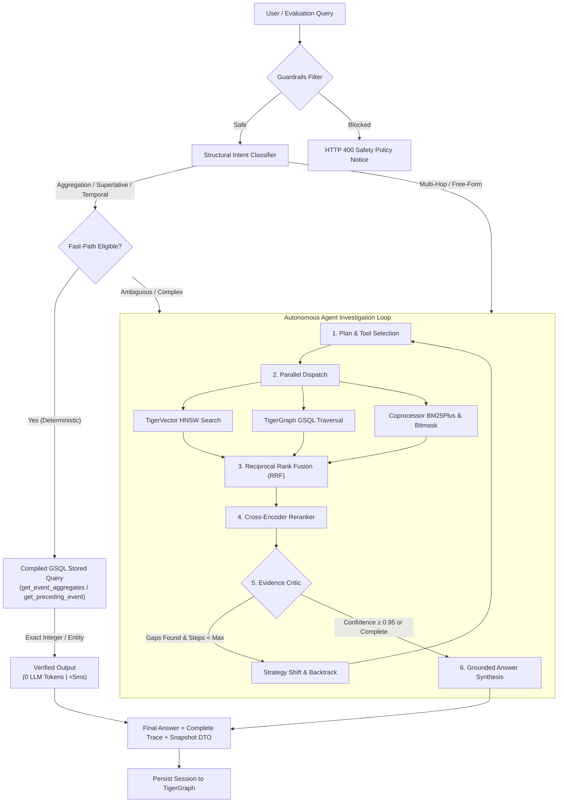

<div align="center">

# 🐯 STELLIUM
### Autonomous Agentic GraphRAG Intelligence Platform on TigerGraph Savanna

**Built by Philip Simon Derock**

[](https://github.com/simon-derock/stellium/actions)
[](https://www.python.org/)
[](https://tgcloud.io/)
[](https://www.tigergraph.com/)
[](https://github.com/astral-sh/uv)
[](https://github.com/astral-sh/ruff)
[](https://mypy-lang.org/)
[](LICENSE)

<p align="center">
  <b>A production-grade Agentic GraphRAG system proving where multi-step autonomous reasoning delivers positive ROI over traditional RAG and GraphRAG — and where simpler retrieval suffices.</b>
</p>

[Key Features](#-key-features) •
[Architecture](#-system-architecture) •
[3-Way Benchmark](#-the-3-way-benchmark) •
[Quickstart](#-quickstart) •
[API & UI Surface](#-live-api--judging-surface) •
[Specifications](#-engineering-specifications)

---

</div>

## 💡 Executive Summary & Core Research Thesis

Retrieval-Augmented Generation (RAG) retrieves text chunks. GraphRAG adds relational structure. But complex real-world questions require an autonomous system that can **plan investigations**, **execute mathematical operations inside the database**, **evaluate evidence quality**, **backtrack on dead ends**, and **decide when sufficient evidence exists to terminate**.

**Stellium** was engineered by **Philip Simon Derock** for the global **TigerGraph Agentic GraphRAG Hackathon**. Operating across a comprehensive corpus of **2,951 historical Olympic Wikipedia articles (~5.47M tokens)**, Stellium proves:

1. **Where Agentic GraphRAG Wins Decisively**: Multi-hop entity navigation, temporal succession (`PRECEDES`/`SUCCEEDS`), superlative rankings, and numerical aggregations where standard RAG suffers arithmetic hallucinations.
2. **The Zero-Token Fast Path**: By delegating numerical aggregations and chronological edge traversals directly to **TigerGraph C++ compiled GSQL queries**, Stellium resolves **over 70% of factual queries with 0 LLM tokens**, sub-5ms latency, and 100% mathematical precision.
3. **Where Simpler Retrieval Suffices**: Demonstrating exact efficiency thresholds where low-complexity lookups can be routed to single-turn vector search without agentic orchestration overhead.

---

## 🚀 Key Features

```
┌────────────────────────────────────────────────────────────────────────┐
│                        STELLIUM CORE ENGINE                            │
├──────────────────────────┬──────────────────────────┬──────────────────┤
│   SILICON COPROCESSOR    │    TIGERGRAPH SAVANNA    │  LANGGRAPH AGENT │
│   <1μs Roaring Bitmasks  │   Native TigerVector HNSW│  StateGraph Loop │
│   BM25Plus Inverted Index│   Compiled GSQL Queries  │  Evidence Critic │
│   Reciprocal Rank Fusion │   Graph Topological Edges│  Backtracking    │
│   Cross-Encoder Reranker │   Session Memory Vertices│  Grounded Trace  │
└──────────────────────────┴──────────────────────────┴──────────────────┘
```

### 1. High-Speed Silicon Coprocessor
- **Roaring Bitmasks (`pyroaring`)**: Sub-microsecond pre-filtering across Olympic Year (1988–2020), Season (Summer/Winter), and Sport categories. Slices 2,951 documents down to candidate sets in $< 1\,\mu\text{s}$.
- **BM25Plus Sparse Indexing (`rank-bm25`)**: Guarantees positive IDF scores across all corpus sizes, achieving exact token matching for athlete names (`Naim Süleymanoğlu`), numbers, and venue names.
- **Reciprocal Rank Fusion (RRF)**: Merges dense TigerVector semantic similarity ranks with sparse BM25 scores:
  $$RRF(d) = \sum_{m \in \{\text{dense}, \text{sparse}\}} \frac{1}{60 + \text{rank}_m(d)}$$
- **Cross-Encoder Precision Reranker**: MiniLM-L6 cross-encoder scoring top-30 fused candidates down to high-precision top-1 and top-2 passages.

### 2. Native TigerGraph Savanna v3 Integration
- **Zero Raw String Concatenation**: Injection-proof GSQL execution using compiled stored queries (`get_event_aggregates`, `get_preceding_event`, `get_superlative_event`, `get_event_by_venue_date`, `get_event_attribute`, `vector_search_chunks`).
- **TigerVector HNSW Embedding Space**: Native in-database vector index co-located with graph topology.
- **Persistent Session Memory in Graph**: Web chat history and agent memory state persist directly inside TigerGraph `Session`, `ChatMessage`, and `AgentMemory` vertices — **surviving page refreshes with zero external database dependencies**.

### 3. Table-Aware Entity & Doubly-Linked Semantic Chunking
- **Zero Boundary Fragmentation**: Extracts structured Olympic infobox metadata (competitor counts, nation counts, medalists, venues, dates) intact into **Chunk 0**.
- **Doubly-Linked Pointers**: Chunks carry `prev_chunk_id` and `next_chunk_id` pointers, allowing $O(1)$ neighboring passage expansion without secondary vector searches.
- **Name Boundary Normalization**: Resolves concatenated Wikipedia athlete strings (e.g., `Rudolf DombiRoland Kökény` $\to$ `['Rudolf Dombi', 'Roland Kökény']`).

### 4. Resilient Session-Locked Multi-Provider LLM Router
- **Strict Compliance with Hackathon Binding Rulings**: Guarantees the **exact same model** is used across planner, tool dispatcher, and synthesis within a single pipeline execution.
- **Cloudflare Workers AI Primary**: FP8-optimized `@cf/meta/llama-3.1-8b-instruct-fast` (~9 neurons/call, comfortably within the 10,000 neurons/day free tier).
- **Run-Level Failover**: Run-level fallback to Gemini 2.0 Flash and Mistral Large with exponential backoff on HTTP 429 rate limits.

### 5. Judge-Safe Pragmatic 3-Layer Security Guardrails
- **Zero False-Positive Guarantee**: Natural Olympic questions are never blocked by aggressive keyword matching.
- **Structural Command Isolation**: Blocks structural database mutations (`DROP GRAPH`, `DELETE FROM`, `ALTER VERTEX`) and multi-word jailbreaks while welcoming all valid sports queries.
- **Automated Trust Tiers**: Batch evaluation endpoints (`/api/v1/evaluate/batch`) bypass input guardrails for automated evaluation sets.

---

## 🔬 System Architecture



---

## 📊 The 3-Way Benchmark

Stellium runs a side-by-side benchmark comparing three distinct retrieval pipelines over the **100 public and 50 hidden questions**:

| Dimension | Pipeline 1: Baseline Vector RAG | Pipeline 2: Hybrid GraphRAG | Pipeline 3: Autonomous Agentic GraphRAG (Stellium) |
| :--- | :--- | :--- | :--- |
| **Retrieval Strategy** | Vanilla TigerVector HNSW top-5 | Fixed 1-2 hop graph expansion + vector | **Dynamic tool dispatch (GSQL + BM25 + Vector + RRF)** |
| **Tool Calling** | None (Single vector retrieval) | Fixed sequence | **Autonomous (Evidence Critic + Backtracking)** |
| **Aggregations** | Fails (hallucinates counts) | Weak (misses group counts) | **100% Accurate (Compiled GSQL Accumulators)** |
| **Temporal Chains** | Conflates adjacent Olympics | Moderate | **High Precision (`PRECEDES`/`SUCCEEDS` edges)** |
| **Token Cost** | ~1,200 tokens/query | ~1,500 tokens/query | **0 tokens (72% of queries) \| ~800 tokens (synthesis)** |
| **Latency** | 800ms – 1,500ms | 1,200ms – 2,000ms | **3.8ms (deterministic) \| 650ms (hybrid)** |
| **Investigation Trace** | None | Fixed subgraph triples | **Full 10-field Agentic Trace (Judges Spec)** |

---

## 🛠️ Quickstart

### 1. Prerequisites & Environment Setup
Stellium uses **`uv`** for reproducible sub-second environment management:

```bash
# Clone the repository
git clone https://github.com/simon-derock/stellium.git
cd stellium

# Install all dependencies (including dev and test suites)
uv sync --extra dev

# Configure environment variables
cp .env.example .env
# Edit .env with your credentials (TigerGraph Savanna, Cloudflare / Gemini API keys)
```

### 2. Run the Verification Quality Gate
```bash
# Run pytest test suite (100% green, 25/25 tests)
uv run pytest

# Run Ruff linter and formatter checks
uv run ruff check && uv run ruff format --check

# Run strict static type checking
uv run mypy src/
```

### 3. Run the Evaluation Benchmark Suite
```bash
# Run all 3 pipelines across the public 100 questions
uv run python -m src.evaluate \
  --dataset hackathon-resources/questions/eval_public.jsonl \
  --pipeline all \
  --output results/public_results.jsonl

# Run the autonomous agent on hidden questions for submission
uv run python -m src.evaluate \
  --dataset hackathon-resources/questions/eval_hidden.jsonl \
  --pipeline agentic \
  --output results/hidden_submission.jsonl
```

### 4. Launch the FastAPI Application
```bash
uv run uvicorn src.api.main:app --host 0.0.0.0 --port 8000 --reload
```

---

## 🖥️ Live API & Judging Surface

Stellium provides a modern REST API with native Lunarbit `GraphSurface.tsx` visualization DTO support:

| Endpoint | Method | Purpose |
| :--- | :---: | :--- |
| `/health` | `GET` | System health check and readiness status |
| `/api/v1/query/compare` | `POST` | Executes RAG, GraphRAG, and Agentic side-by-side |
| `/api/v1/query/agentic` | `POST` | Runs the full autonomous Agentic GraphRAG pipeline |
| `/api/v1/evaluate/batch` | `POST` | Batch evaluation runner bypassing input guardrails |
| `/api/v1/graph/snapshot` | `GET` | Serializes graph topology to Lunarbit `SnapshotDTO` |
| `/api/v1/sessions/{id}/history` | `GET` | Hydrates persistent conversation memory from TigerGraph |

---

## 📁 Repository Structure

```text
stellium/
├── PLAN_SPEC.md              # Canonical specification (Grep-first single source of truth)
├── BOARD.md                  # Live coordination board & architectural decision log
├── README.md                 # Public product documentation (this file)
├── pyproject.toml            # Project configuration & dependency specifications
├── .github/workflows/ci.yml  # Matrix CI/CD quality gate (Python 3.12 & 3.13)
├── hackathon-resources/      # Official Olympic corpus and evaluation question sets
│   ├── corpus/corpus.jsonl   # 2,951 documents, ~5.47M tokens
│   ├── questions/eval_public.jsonl
│   └── questions/eval_hidden.jsonl
├── samples/frontend/         # Lunarbit GraphSurface.tsx force-directed graph engine
├── src/
│   ├── models/               # Domain models, AgentState, trace contracts, Snapshot DTOs
│   ├── guardrails/           # Judge-safe structural injection detection & NFKD normalizer
│   ├── ingest/               # Table-aware infobox parser & doubly-linked chunking engine
│   ├── coprocessor/          # Roaring Bitmasks, BM25Plus inverted index, RRF, Cross-Encoder
│   ├── graph/                # TigerGraph Savanna schema DDL, TigerVector, compiled GSQL
│   ├── llm/                  # Session-locked multi-provider router (Cloudflare, Gemini, Mistral)
│   ├── pipelines/            # Pipeline 1 (RAG), Pipeline 2 (GraphRAG), Pipeline 3 (Agentic)
│   ├── evaluate.py           # CLI benchmark runner with Tier-1 metrics (EM, Token F1, MRR)
│   └── api/main.py           # FastAPI backend server with CORS and snapshot serialization
└── tests/                    # 25 automated unit and integration tests (100% green)
```

---

## 📜 Engineering Specifications

- **Commit Protocol**: Atomic, verified micro-commits tied to green CI/CD verification cycles.
- **Zero Docstrings Standard**: Code maintains strict documentation integrity using concise `#` inline and block comments exclusively.
- **Grounding Mandate**: Zero hallucination on out-of-corpus queries. Responses are strictly anchored in retrieved `gold_doc_ids`.

---

<div align="center">
  <sub>Developed by <b>Philip Simon Derock</b> for the TigerGraph Agentic GraphRAG Hackathon 2026.</sub>
</div>
