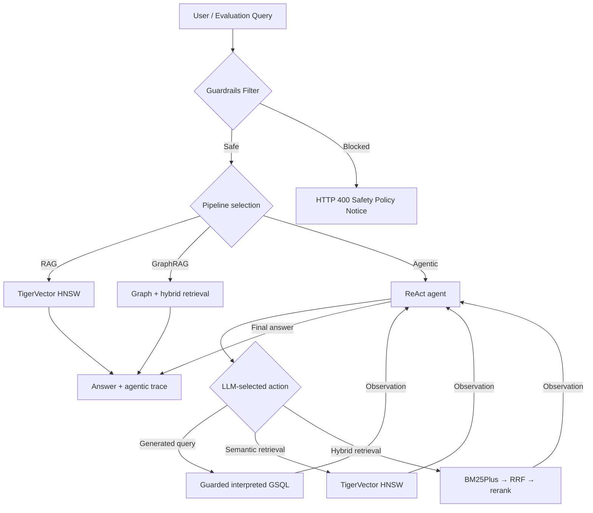

<div align="center">

# 🐯 STELLIUM
### Autonomous Agentic GraphRAG Intelligence Platform on TigerGraph Savanna

**Built by Philip Simon Derock**

[](https://github.com/simon-derock/stellium/actions)
[](https://www.python.org/)
[](https://tgcloud.io/)
[](https://www.tigergraph.com/)
[](https://github.com/astral-sh/uv)
[](https://github.com/astral-sh/ruff)
[](https://mypy-lang.org/)
[](LICENSE)

<p align="center">
  <b>A production-grade Agentic GraphRAG system proving where multi-step autonomous reasoning delivers positive ROI over traditional RAG and GraphRAG — and where simpler retrieval suffices.</b>
</p>

[Key Features](#-key-features) •
[Architecture](#-system-architecture) •
[3-Way Benchmark](#-the-3-way-benchmark) •
[Quickstart](#-quickstart) •
[API & UI Surface](#-live-api--judging-surface) •
[Specifications](#-engineering-specifications)

---

</div>

## 💡 Executive Summary & Core Research Thesis

Retrieval-Augmented Generation (RAG) retrieves text chunks. GraphRAG adds relational structure. But complex real-world questions require an autonomous system that can **plan investigations**, **execute mathematical operations inside the database**, **evaluate evidence quality**, **backtrack on dead ends**, and **decide when sufficient evidence exists to terminate**.

**Stellium** was created and architected by **Philip Simon Derock** for the **TigerGraph Agentic GraphRAG Hackathon 2026**. It operates across **2,951 historical Olympic Wikipedia articles (~5.47M tokens)**. The repository includes deterministic graph tools, hybrid retrieval, and a ReAct agent; benchmark outcomes depend on the configured providers and corpus snapshot.

1. **Where Agentic GraphRAG Helps in the Current Public Run**: It improves exact match on aggregation, temporal, and multi-hop questions over the two fixed pipelines. Superlatives remain unsolved in the current run.
2. **Guarded Graph Querying**: GraphRAG uses an LLM-generated read-only GSQL query, validates it before execution, and synthesizes from graph and passage evidence. The GSQL execution itself uses no LLM tokens; GraphRAG uses two chat calls overall.
3. **When Agentic Reasoning Helps**: The matched public run shows a 16-point Agentic exact-match gain over both fixed paths, with higher token and latency costs. The gain is concentrated in temporal, multi-hop, and aggregation questions; superlatives remain a shared failure category.

---

## 🚀 Key Features

```
┌────────────────────────────────────────────────────────────────────────┐
│                        STELLIUM CORE ENGINE                            │
├──────────────────────────┬──────────────────────────┬──────────────────┤
│    LOCAL RETRIEVAL      │    TIGERGRAPH SAVANNA    │   REACT AGENT    │
│   Packed Integer Masks  │   Native TigerVector HNSW│  Bounded Tool Loop│
│   BM25Plus Inverted Index│   Compiled GSQL Queries │  Observation Review│
│   Reciprocal Rank Fusion│   Graph Topological Edges│  Tool Strategy Pivot│
│ Required int8 Reranker  │   Guarded Generated GSQL│  Grounded Trace  │
└──────────────────────────┴──────────────────────────┴──────────────────┘
```

### 1. Local Retrieval Coprocessor
- **Packed year/season masks**: Integer masks filter requested year and season facets before candidate selection; sport names remain corpus-derived text.
- **Compact BM25Plus Sparse Indexing**: Stores integer postings instead of repeated Python token strings while preserving the BM25Plus scoring formula, including exact matching for names, numbers, and venue terms.
- **Reciprocal Rank Fusion (RRF)**: Merges dense TigerVector semantic similarity ranks with sparse BM25 scores using $RRF(d)=\sum_{m\in\{dense,sparse\}}\frac{1}{60+r_m(d)}$.
- **Required Cross-Encoder Reranker**: CPU int8 MiniLM-L6 cross-encoder scores the fused candidate list and selects the final top five passages.

### 2. Native TigerGraph Savanna Integration
- **Guarded GSQL Execution**: Existing compiled named queries remain available; generated GraphRAG and Agentic queries pass read-only schema and resource validation before interpreted execution.
- **TigerVector HNSW Embedding Space**: Native in-database vector index co-located with graph topology.
- **Graph-backed evidence**: Event, venue, document, and chunk relationships support structured traversal alongside dense retrieval.

### 3. Table-Aware Entity & Doubly-Linked Semantic Chunking
- **Zero Boundary Fragmentation**: Extracts structured Olympic infobox metadata (competitor counts, nation counts, medalists, venues, dates) intact into **Chunk 0**.
- **Doubly-Linked Pointers**: Chunks carry `prev_chunk_id` and `next_chunk_id` pointers, allowing $O(1)$ neighboring passage expansion without secondary vector searches.
- **Name Boundary Normalization**: Resolves concatenated Wikipedia athlete strings (e.g., `Rudolf DombiRoland Kökény` $\to$ `['Rudolf Dombi', 'Roland Kökény']`).

### 4. Resilient Session-Locked Multi-Provider LLM Router
- **Strict Compliance with Hackathon Binding Rulings**: Guarantees the **exact same model** is used across planner, tool dispatcher, and synthesis within a single pipeline execution.
- **Cloudflare Workers AI Primary**: FP8-optimized `@cf/meta/llama-3.1-8b-instruct-fast` (~9 neurons/call, comfortably within the 10,000 neurons/day free tier).
- **Provider Selection**: Cloudflare is the default; Gemini and Mistral can be selected for a fresh run. Retries remain pinned to the selected provider/model for that run.

### 5. Judge-Safe Security Guardrails
- **Conservative Query Guardrails**: Structural command and jailbreak defenses are tested against the public question suite and adversarial inputs.
- **Structural Command Isolation**: Blocks structural database mutations (`DROP GRAPH`, `DELETE FROM`, `ALTER VERTEX`) and multi-word jailbreaks while welcoming all valid sports queries.
- **Automated Trust Tiers**: Batch evaluation endpoints (`/api/v1/evaluate/batch`) bypass input guardrails for automated evaluation sets.

---

## 🔬 System Architecture


```mermaid
flowchart TD
    UserQuery["User / Evaluation Query"] --> Layer0{"Guardrails Filter"}
    Layer0 -->|"Safe"| Pipeline{"Pipeline selection"}
    Layer0 -->|"Blocked"| SecurityBlock["HTTP 400 Safety Policy Notice"]
    Pipeline -->|"RAG"| RAG["TigerVector HNSW"]
    Pipeline -->|"GraphRAG"| GraphRAG["Graph + hybrid retrieval"]
    Pipeline -->|"Agentic"| Agent["ReAct agent"]
    Agent --> Action{"LLM-selected action"}
    Action -->|"Generated query"| GSQL["Guarded interpreted GSQL"]
    Action -->|"Semantic retrieval"| Dense["TigerVector HNSW"]
    Action -->|"Hybrid retrieval"| Sparse["BM25Plus → RRF → rerank"]
    GSQL -->|"Observation"| Agent
    Dense -->|"Observation"| Agent
    Sparse -->|"Observation"| Agent
    Agent -->|"Final answer"| Output["Answer + agentic trace"]
    RAG --> Output
    GraphRAG --> Output
```

---

## 📊 The 3-Way Benchmark

Stellium runs a side-by-side benchmark comparing three distinct retrieval pipelines over the **100 public and 50 hidden questions**:

| Dimension | Pipeline 1: Baseline Vector RAG | Pipeline 2: Fixed GraphRAG | Pipeline 3: Autonomous Agentic GraphRAG (Stellium) |
| :--- | :--- | :--- | :--- |
| **Retrieval Strategy** | Dense HNSW + BM25Plus → RRF → required local reranker | LLM-generated guarded GSQL + dense/BM25Plus → RRF → required local reranker | **Required initial hybrid retrieval, then bounded ReAct tool selection; hybrid calls also rerank** |
| **Tool Calling** | None (fixed hybrid retrieval flow) | Fixed query/retrieval/synthesis flow | **Bounded cyclic ReAct; reviews each observation and can pivot tools** |
| **Aggregations** | LLM over reranked retrieved passages | LLM-generated guarded GSQL plus reranked passages | LLM-generated guarded GSQL, with further evidence gathering as needed |
| **Temporal Chains** | Passage retrieval | LLM-generated guarded GSQL over graph relationships | LLM-generated guarded GSQL over `PRECEDES`/`SUCCEEDS` when applicable |
| **Token Cost** | Measured per run | Measured per run | Deterministic tools consume 0 LLM tokens; LLM calls are reported per run |
| **Latency** | Measure with the evaluation runner | Measure with the evaluation runner | Live end-to-end GSQL example: 38.59 ms; includes network overhead |
| **Investigation Trace** | None | Fixed subgraph triples | **Full 10-field Agentic Trace (Judges Spec)** |

These are three independent benchmark pipelines, not sequential phases. Current GraphRAG makes two chat calls: one to generate a read-only GSQL query and one to synthesize an answer after guarded query execution and hybrid retrieval. Agentic performs mandatory hybrid retrieval first, then uses its bounded cyclic ReAct loop to evaluate evidence and choose additional actions.

### Latest matched public benchmark (2026-09-30; mandatory hybrid + generated GSQL)

All three current pipelines ran the same 100 public questions with Cohere `command-a-03-2025`, Cohere `embed-v4.0` 1024-dimensional query embeddings, and the live TigerGraph HNSW index. Each pipeline used dense HNSW + BM25Plus + RRF + the local int8 MiniLM reranker. Exact Match is strict normalized string equality; Token F1 is lexical overlap. This is one run, not a confidence interval or a component ablation.

| Pipeline | Exact Match | Token F1 | Mean latency | Mean LLM tokens | Mean context tokens | Mean document MRR |
| :--- | ---: | ---: | ---: | ---: | ---: | ---: |
| RAG | 60% (60/100) | 0.628 | 5,396 ms | 2,580 | 1,927 | 0.867 |
| GraphRAG | 60% (60/100) | 0.637 | 10,379 ms | 3,660 | 2,032 | 0.867 |
| Agentic GraphRAG | **76% (76/100)** | **0.797** | 11,483 ms | 8,292 | 8,073 | 0.869 |

Agentic leads the current run by 16 percentage points, using 3.21× the mean LLM tokens of RAG and taking about 2.13× its mean latency. This result is below the earlier 90% Agentic run; the current paths therefore are not yet a demonstrated metrics improvement. Generated GSQL still has schema/validator/runtime failures, and superlative accuracy is 0/10 in every pipeline.

| Question type | RAG | GraphRAG | Agentic GraphRAG |
| :--- | ---: | ---: | ---: |
| Aggregation | 1/21 (5%) | 1/21 (5%) | 12/21 (57%) |
| Temporal | 18/22 (82%) | 18/22 (82%) | 21/22 (95%) |
| Superlative | 0/10 (0%) | 0/10 (0%) | 0/10 (0%) |
| Multi-hop | 22/28 (79%) | 22/28 (79%) | 24/28 (86%) |
| Lookup | 19/19 (100%) | 19/19 (100%) | 19/19 (100%) |

The full trace analysis and limitations are in [the current hybrid/GSQL benchmark audit](docs/benchmark-audits/public-hybrid-gsql-benchmark-20260930.md). Raw per-question JSONL results remain local and are not committed.

### Prior matched public benchmark (2026-09-30; before current retrieval changes)

All pipelines ran the same 100 public questions with Cohere Command A (`command-a-03-2025`) and the live Cohere `embed-v4.0` 1024-dimensional TigerGraph index. GraphRAG includes the operation/parameter validation fix described below. Exact Match is strict normalized equality; Token F1 is lexical overlap. These are single-run measurements, not confidence intervals. The 98% accuracy objective remains unmet.

| Pipeline | Exact Match | Token F1 | Mean latency | Mean LLM tokens | Mean context tokens | Mean document MRR |
| :--- | ---: | ---: | ---: | ---: | ---: | ---: |
| RAG | 43% (43/100) | 0.461 | 3,294 ms | 2,914 | 1,995 | 0.780 |
| GraphRAG | 53% (53/100) | 0.584 | 6,523 ms | 3,009 | 2,035 | 0.771 |
| Agentic GraphRAG | **90% (90/100)** | **0.924** | 4,281 ms | 3,093 | 2,931 | 0.961 |

The evaluation harness paced Cohere requests to stay under the configured trial RPM, so measured latency includes that pacing. Mean context tokens are character-based estimates; LLM token totals use Cohere usage metadata. Agentic leads GraphRAG by 37 percentage points in EM and RAG by 47 points in this run. This result does not establish that one component alone caused the difference.

| Question type | RAG | GraphRAG | Agentic GraphRAG |
| :--- | ---: | ---: | ---: |
| Aggregation | 1/21 (5%) | 2/21 (10%) | 20/21 (95%) |
| Temporal | 11/22 (50%) | 18/22 (82%) | 21/22 (95%) |
| Superlative | 0/10 (0%) | 0/10 (0%) | 10/10 (100%) |
| Multi-hop | 12/28 (43%) | 15/28 (54%) | 20/28 (71%) |
| Lookup | 19/19 (100%) | 18/19 (95%) | 19/19 (100%) |

Raw per-question JSONL outputs are local evaluation artifacts and are intentionally not committed. Reproduce each run with `uv run python -m src.evaluate --dataset hackathon-resources/questions/eval_public.jsonl --pipeline <rag|graphrag|agentic> --provider cohere --output results/<output>.jsonl`. Full methodology and trace observations are in [the 2026-09-30 benchmark audit](docs/benchmark-audits/public-benchmark-cohere-20260930.md).

#### Current measured retrieval and reasoning path

- **RAG:** Retrieve up to 30 dense and 30 sparse candidates, fuse by RRF, rerank the fused candidates with the required local int8 MiniLM cross-encoder, and provide up to five passages to one answer call.
- **GraphRAG:** One LLM call generates a complete read-only GSQL query. The shared executor normalizes only complete, unambiguous single-quoted literals to TigerGraph's double-quoted form, then validates the query before execution. Dense and sparse candidates pass through RRF and required local reranking; a second LLM call synthesizes the answer from structured graph results and passages.
- **Agentic GraphRAG:** The same hybrid retrieval and reranking run before the first agent decision. A bounded cyclic ReAct controller then evaluates that evidence and can issue guarded generated GSQL, another hybrid retrieval, a deliberate dense-only fallback, or finish. Generated GSQL observations include structured canonical Event rows; the trace retains tool actions, up to 1,500-character observation summaries, and the stopping reason.
- The quantized ONNX reranker is a local CPU model, downloaded from Hugging Face on first use and cached by the Hugging Face client. It scores candidates in batches of one by default: on the measured 100-question corpus audit this reduced mean latency and peak RSS compared with batches of eight. Failure to load it raises an error; the pipeline does not silently return the pre-rerank order. This keeps reranking mandatory but means deployment cold starts need model-download access and enough memory for ONNX Runtime.
- These current retrieval paths have one measured 100-question run. The run does not isolate the reranker, hybrid retrieval, or generated GSQL contribution; controlled ablations are still needed.

#### GraphRAG broad-query correction

Trace investigation found that the extractor could label a venue/date question as `lookup` while providing no event-name filter. The fixed lookup then returned all 2,210 events, creating roughly 64k-token contexts. GraphRAG now checks that the extracted fields fit the selected operation, routes venue/date-only lookups to multi-hop traversal, and skips unconstrained or overly broad graph results. After this change, GraphRAG improved from 47/100 to **53/100 EM** in successive Cohere runs; multi-hop improved from 9/28 to **15/28**, and mean LLM tokens fell from 10,428 to **3,009**. This is a measured code-path correction, not evidence that further schema expansion alone will solve the remaining misses.

TigerGraph is live with 22,016 Cohere vectors. The separate dense-only retrieval audit reports 93% gold-document hit@30 and 90.21% mean gold-document recall@30; these are retrieval coverage metrics, not answer accuracy. In the latest 100-question run, Agentic missed 9 aggregation, 1 temporal, 10 superlative, and 4 multi-hop questions. A corpus audit found one corrupted competitor count (41,000,000 versus 41 in the source prose); the local parser now reconciles that exact zero-appending pattern, and the corresponding TigerGraph Event value was corrected and verified. A subsequent run of the same 10 superlative questions across all phases scored 3/10 for RAG and 8/10 for both GraphRAG and Agentic. On this sample, Agentic tied GraphRAG at 2.33× its LLM token use and 1.21× its latency; this suggests the cyclic investigation was overkill for these questions, but the sample is not a full public score or a controlled ablation. A full 100-question rerun remains outstanding. The earlier 90% Agentic result is a prior-path measurement and should not be treated as a controlled comparison.

### Sparse Retrieval Ablation

On the 100 public questions and 22,016 chunks, BM25Plus candidate retrieval was compared using the previous whitespace tokenizer and the production punctuation-normalizing tokenizer. BM25 ranks chunks; metrics deduplicate document IDs before applying document cutoffs. **Hit rate@k** is the share of questions with at least one gold document retrieved. **Document recall@k** is the average fraction of each question's gold documents retrieved. This measures document coverage only, not answer-bearing chunk recall, answer accuracy, or hybrid-search quality.

| BM25Plus tokenization | Hit rate@5 | Hit rate@10 | Hit rate@30 | Document recall@5 | Document recall@30 | Document MRR@30 |
| :--- | ---: | ---: | ---: | ---: | ---: | ---: |
| Previous whitespace split | 81% | 90% | 95% | 55.9% | 83.3% | 0.5733 |
| Punctuation normalized | **88%** | **95%** | **96%** | **62.8%** | **84.8%** | **0.6824** |

On this fixed set, punctuation normalization improves hit rate@5 by 7 percentage points and document MRR@30 by 0.109. Superlative questions have only 45.9% mean gold-document recall@30, despite 80% hit rate@30; their multi-document evidence requires structured graph candidate retrieval and aggregation. The runner records question and corpus SHA-256 fingerprints and per-question rankings. Reproduce with:

```bash
uv run python scripts/evaluate_sparse_retrieval.py \
  --dataset hackathon-resources/questions/eval_public.jsonl \
  --corpus hackathon-resources/corpus/corpus.jsonl \
  --output results/sparse_retrieval_ablation.json
```

---

## 🛠️ Quickstart

### 1. Prerequisites & Environment Setup
Stellium uses **`uv`** for reproducible sub-second environment management:

```bash
# Clone the repository
git clone https://github.com/simon-derock/stellium.git
cd stellium

# Install all dependencies (including dev and test suites)
uv sync --extra dev

# Configure environment variables
cp .env.example .env
# Edit .env with TigerGraph, embedding, and selected LLM provider credentials (Cloudflare, Gemini, or Mistral)
```

### 2. Run the Verification Quality Gate
```bash
# Run the complete test suite
uv run pytest

# Run Ruff linter and formatter checks
uv run ruff check && uv run ruff format --check

# Run static type checking for application and tests
uv run mypy src/ tests/
```

### 3. Run the Evaluation Benchmark Suite
```bash
# Run all 3 pipelines across the public 100 questions
uv run python -m src.evaluate \
  --dataset hackathon-resources/questions/eval_public.jsonl \
  --pipeline all \
  --output results/public_results.jsonl

# Resume completed rows after a provider or network interruption
uv run python -m src.evaluate \
  --dataset hackathon-resources/questions/eval_public.jsonl \
  --pipeline all \
  --output results/public_results.jsonl \
  --resume

# Run the autonomous agent on hidden questions
uv run python -m src.evaluate \
  --dataset hackathon-resources/questions/eval_hidden.jsonl \
  --pipeline agentic \
  --output results/hidden_submission.jsonl
```

### 4. Launch the FastAPI Application
```bash
uv run uvicorn src.api.main:app --host 0.0.0.0 --port 8000 --reload
```

---

## 🖥️ Live API & Judging Surface

Stellium provides a modern REST API with native Lunarbit `GraphSurface.tsx` visualization DTO support:

| Endpoint | Method | Purpose |
| :--- | :---: | :--- |
| `/health` | `GET` | System health check and readiness status |
| `/api/v1/query/compare` | `POST` | Executes RAG, GraphRAG, and Agentic side-by-side |
| `/api/v1/query/rag` | `POST` | Runs the vector RAG pipeline |
| `/api/v1/query/graphrag` | `POST` | Runs the hybrid GraphRAG pipeline |
| `/api/v1/query/agentic` | `POST` | Runs the full autonomous Agentic GraphRAG pipeline |
| `/api/v1/evaluate/batch` | `POST` | Batch evaluation runner bypassing input guardrails |
| `/api/v1/graph/snapshot` | `GET` | Serializes graph topology to Lunarbit `SnapshotDTO` |
| `/api/v1/sessions/{id}/history` | `GET` | Reads session history when supported by the configured graph |

---

## 📁 Repository Structure

```text
stellium/
├── PLAN_SPEC.md              # Canonical specification (Grep-first single source of truth)
├── BOARD.md                  # Live coordination board & architectural decision log
├── README.md                 # Public product documentation (this file)
├── pyproject.toml            # Project configuration & dependency specifications
├── .github/workflows/ci.yml  # Matrix CI/CD quality gate (Python 3.12 & 3.13)
├── hackathon-resources/      # Official Olympic corpus and evaluation question sets
│   ├── corpus/corpus.jsonl   # 2,951 documents, ~5.47M tokens
│   ├── questions/eval_public.jsonl
│   └── questions/eval_hidden.jsonl
├── samples/frontend/         # Lunarbit GraphSurface.tsx force-directed graph engine
├── src/
│   ├── models/               # Domain models, AgentState, trace contracts, Snapshot DTOs
│   ├── guardrails/           # Judge-safe structural injection detection & NFKD normalizer
│   ├── ingest/               # Table-aware infobox parser & doubly-linked chunking engine
│   ├── coprocessor/          # Packed integer masks, BM25Plus, RRF, required local cross-encoder
│   ├── graph/                # TigerGraph Savanna schema DDL, TigerVector, compiled GSQL
│   ├── llm/                  # Session-locked multi-provider router (Cloudflare, Gemini, Mistral)
│   ├── pipelines/            # Pipeline 1 (RAG), Pipeline 2 (GraphRAG), Pipeline 3 (Agentic)
│   ├── evaluate.py           # CLI benchmark runner with Tier-1 metrics (EM, Token F1, MRR)
│   └── api/main.py           # FastAPI backend server with CORS and snapshot serialization
└── tests/                    # Unit, integration, resilience, contract, and security tests
```

---

## 📜 Engineering Specifications

### Retrieval and Reasoning Formulations

Dense and sparse rankings are fused by Reciprocal Rank Fusion (RRF). The rankers are TigerVector HNSW and BM25Plus, with `k = 60`:

```text
RRF(d) = sum over rankers m of 1 / (k + rank_m(d))
rankers = {Dense HNSW, Sparse BM25Plus}; k = 60
```

The sparse ranker uses BM25Plus with document-length normalization and an additive `delta` term. `avgdl` is the average document length:

```text
Score_BM25Plus(D, Q) = sum over query terms q_i of:
  IDF(q_i) * [ f(q_i,D)*(k1+1) / (f(q_i,D) + k1*(1-b+b*|D|/avgdl)) + delta ]
k1 = 1.5; b = 0.75; delta = 1.0
```

Evaluation normalizes answer strings before exact match and computes token overlap for F1. `y_hat` is the generated answer, `y_star` is the reference answer, and `T(x)` is the token multiset of `x`:

```text
EM        = 1 when normalize(y_hat) == normalize(y_star), otherwise 0
Precision = |T(y_hat) intersect T(y_star)| / |T(y_hat)|
Recall    = |T(y_hat) intersect T(y_star)| / |T(y_star)|
F1        = 2 * Precision * Recall / (Precision + Recall)
```

The bitemporal module resolves conflicts by source authority, then validity timestamps, and reports competing versions when unresolved. This conceptual score describes authority and recency; the implementation uses ordered comparisons rather than evaluating the formula:

```text
S(f) = alpha * authority(source)
     + beta * exp(-lambda * (now - valid_from))
       * 1[ superseded_by(f) is empty ]
```

The packed mask applies requested year and season facets independently:

```text
mask(q) = year_mask(q) AND season_mask(q)
```

In code, requested year and season groups are checked independently, so a chunk must match every requested facet. Masks are packed integer fields; sport names are not encoded in a static taxonomy.

### Complexity, Memory, and Runtime Profile

| Operation | Cost / profile | Scope and qualification |
| :--- | :--- | :--- |
| Neighbor chunk expansion | Expected `O(1)` map lookup per pointer | Uses `prev_chunk_id` / `next_chunk_id` in the in-memory coprocessor map |
| TigerVector retrieval | Expected `O(log N)` graph traversal | HNSW is approximate nearest neighbor; this is expected scaling, not a worst-case guarantee |
| RRF fusion | `O(K log K)` | Sorts at most the union of the input lists; current hybrid path takes up to 30 dense and 30 sparse candidates, so `K <= 60` |
| ReAct stream parsing | `O(N)` | Balanced-brace scan and line lexer over response length `N` |
| Full-corpus local retrieval memory | About 209 MiB RSS after loading 22,016 chunks and building compact BM25Plus postings; 310 MiB after model load; 379 MiB peak over the 100-question batch-1 audit. The same audit peaked at 782 MiB with batch size 8. | One development-host audit; not a deployment guarantee. |
| Full-corpus local BM25 build | 3.81 s for 22,016 chunks | One development-host probe; current production index stores compact per-term postings instead of repeated token strings |
| Local cross-encoder reranking | 30 passages: 1.90 s mean (1.85 s median, 2.53 s p95) across 100 questions at batch size 1; batch size 8 averaged 2.43 s | Host-dependent measured retrieval audit; answer-level impact remains unmeasured |
| Sparse candidate-size ablation | Top 10 vs top 30 BM25 candidates produced 94% vs 94% reranked document hit rate and 0.842 vs 0.842 MRR; mean rerank time 0.50 s vs 1.90 s | Retrieval-only sparse ablation; production fuses dense and sparse results and still reranks up to 60 candidates. See [audit details](docs/benchmark-audits/local-reranker-public-20260930.md). |
| Category filtering | Integer bitwise operations | Avoids allocating candidate bit arrays; implementation scans BM25 scores when filtering |

Live Savanna profiling used compiled native GSQL query installations. One `get_event_aggregates` request measured **38.59 ms end-to-end**; this includes client/network overhead, while the recorded internal execution target/measurement was **below 5 ms**. Do not compare the internal engine number directly with end-to-end API latency.

### Token Economics and Recovery

The configured Cloudflare Workers AI model has a recorded approximate consumption of **9 neurons per inference**. At that rate, 450 model inferences would use about **4,050 neurons**, or **40.5%** of a 10,000-neuron daily allowance. This is a planning estimate: retries, prompt length, and output length affect actual consumption. TigerGraph query execution itself consumes zero LLM tokens; GraphRAG still makes one query-generation chat call and one answer-synthesis chat call, while Agentic GSQL generation occurs inside a ReAct model turn.

The router locks a provider/model for each pipeline session. Transient HTTP 429/500/502/503/504/524 responses retry with backoff on that same model; provider failover starts a fresh run rather than mixing models mid-answer. Bitemporal conflicts are resolved by authority first, then recency, with dual-version reports for ties or unresolved conflicts.

### API and Operational Notes

- The agent consumes LLM-generated ReAct tool actions; its response parser accepts structured text and JSON tool-call payloads.
- Existing named GSQL calls use compiled queries with parameter dictionaries; LLM-generated GraphRAG and Agentic queries use guarded interpreted execution.
- Public and hidden benchmark commands are shown in Quickstart. The hidden-set command is intentionally `--pipeline agentic`; run all pipelines only when the submission protocol requests it.
- Python application code follows the repository's no-docstring convention and uses `#` comments.
- Commit messages follow `<type>(<scope>): <summary> [committed by master-agent-001]` for coordinator changes.

### Architecture at a Glance

```text
Question
  │
  ├── Guardrails ── blocked request → HTTP 400
  │
  └── Pipeline selection
       ├── RAG ─────────────── TigerVector HNSW ── grounded answer
       ├── GraphRAG ────────── graph + hybrid retrieval ── grounded answer
       └── Agentic ReAct ───── LLM chooses tools and next step
              ├── generated GSQL → read-only validator → TigerGraph
              ├── TigerVector HNSW
              └── BM25Plus → RRF → required local cross-encoder
                       └── evidence → answer and trace
```

**Creator and Lead Architect:** Philip Simon Derock.

---

<div align="center">
  <sub>Developed by <b>Philip Simon Derock</b> for the TigerGraph Agentic GraphRAG Hackathon 2026.</sub>
</div>
