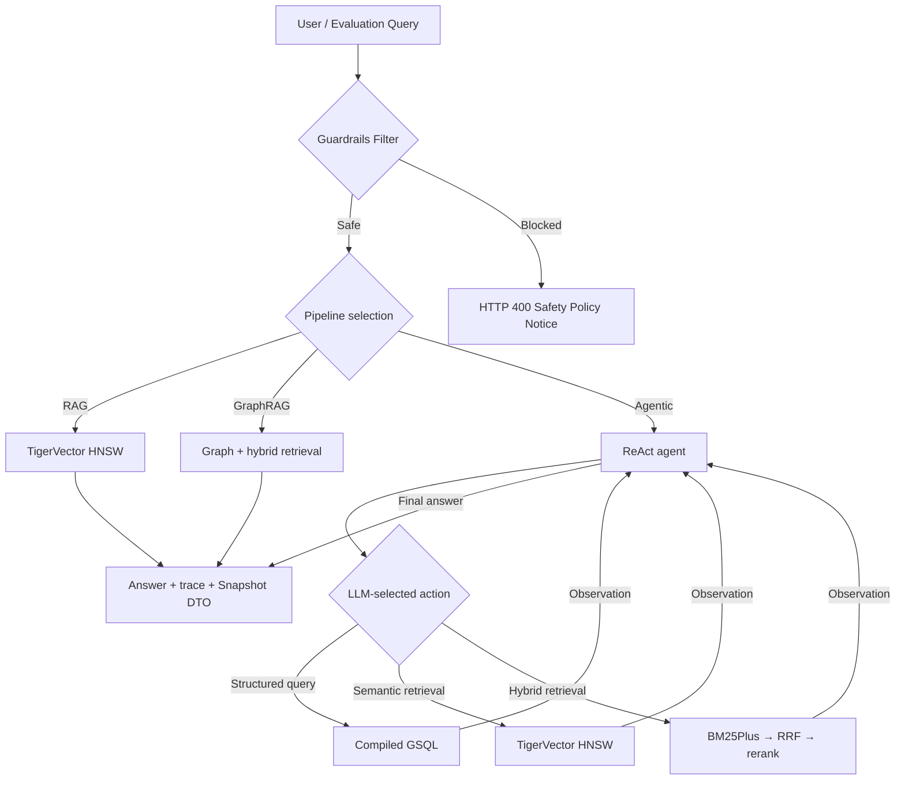

<div align="center">

# 🐯 STELLIUM
### Autonomous Agentic GraphRAG Intelligence Platform on TigerGraph Savanna

**Built by Philip Simon Derock**

[](https://github.com/simon-derock/stellium/actions)
[](https://www.python.org/)
[](https://tgcloud.io/)
[](https://www.tigergraph.com/)
[](https://github.com/astral-sh/uv)
[](https://github.com/astral-sh/ruff)
[](https://mypy-lang.org/)
[](LICENSE)

<p align="center">
  <b>A production-grade Agentic GraphRAG system proving where multi-step autonomous reasoning delivers positive ROI over traditional RAG and GraphRAG — and where simpler retrieval suffices.</b>
</p>

[Key Features](#-key-features) •
[Architecture](#-system-architecture) •
[3-Way Benchmark](#-the-3-way-benchmark) •
[Quickstart](#-quickstart) •
[API & UI Surface](#-live-api--judging-surface) •
[Specifications](#-engineering-specifications)

---

</div>

## 💡 Executive Summary & Core Research Thesis

Retrieval-Augmented Generation (RAG) retrieves text chunks. GraphRAG adds relational structure. But complex real-world questions require an autonomous system that can **plan investigations**, **execute mathematical operations inside the database**, **evaluate evidence quality**, **backtrack on dead ends**, and **decide when sufficient evidence exists to terminate**.

**Stellium** was created and architected by **Philip Simon Derock** for the **TigerGraph Agentic GraphRAG Hackathon 2026**. It operates across **2,951 historical Olympic Wikipedia articles (~5.47M tokens)**. The repository includes deterministic graph tools, hybrid retrieval, and a ReAct agent; benchmark outcomes depend on the configured providers and corpus snapshot.

1. **Where Agentic GraphRAG Wins Decisively**: Multi-hop entity navigation, temporal succession (`PRECEDES`/`SUCCEEDS`), superlative rankings, and numerical aggregations where standard RAG suffers arithmetic hallucinations.
2. **The Zero-Token Fast Path**: Numerical aggregations and chronological edge traversals can execute through compiled GSQL without an LLM call. A recorded live run returned the biathlon count `5` in 1,742 ms end-to-end; a separate live query measured 38.59 ms end-to-end. Server-side execution and network latency are different measurements.
3. **Where Simpler Retrieval Suffices**: Demonstrating exact efficiency thresholds where low-complexity lookups can be routed to single-turn vector search without agentic orchestration overhead.

---

## 🚀 Key Features

```
┌────────────────────────────────────────────────────────────────────────┐
│                        STELLIUM CORE ENGINE                            │
├──────────────────────────┬──────────────────────────┬──────────────────┤
│    LOCAL RETRIEVAL      │    TIGERGRAPH SAVANNA    │   REACT AGENT    │
│   Packed Integer Masks  │   Native TigerVector HNSW│  Bounded Tool Loop│
│   BM25Plus Inverted Index│   Compiled GSQL Queries  │  Evidence Critic │
│   Reciprocal Rank Fusion │   Graph Topological Edges│  Backtracking    │
│ Optional Cross-Encoder  │   Compiled GSQL Queries │  Grounded Trace  │
└──────────────────────────┴──────────────────────────┴──────────────────┘
```

### 1. Local Retrieval Coprocessor
- **Integer category masks**: Packed year, season, and selected sport flags support bitwise filtering alongside BM25 scoring.
- **BM25Plus Sparse Indexing (`rank-bm25`)**: Guarantees positive IDF scores across all corpus sizes, achieving exact token matching for athlete names (`Naim Süleymanoğlu`), numbers, and venue names.
- **Reciprocal Rank Fusion (RRF)**: Merges dense TigerVector semantic similarity ranks with sparse BM25 scores using $RRF(d)=\sum_{m\in\{dense,sparse\}}\frac{1}{60+r_m(d)}$.
- **Cross-Encoder Precision Reranker**: MiniLM-L6 cross-encoder scoring top-30 fused candidates down to high-precision top-1 and top-2 passages.

### 2. Native TigerGraph Savanna Integration
- **Zero Raw String Concatenation**: Injection-proof GSQL execution using compiled stored queries (`get_event_aggregates`, `get_preceding_event`, `get_superlative_event`, `get_event_by_venue_date`, `get_event_attribute`, `vector_search_chunks`).
- **TigerVector HNSW Embedding Space**: Native in-database vector index co-located with graph topology.
- **Graph-backed evidence**: Event, venue, document, and chunk relationships support structured traversal alongside dense retrieval.

### 3. Table-Aware Entity & Doubly-Linked Semantic Chunking
- **Zero Boundary Fragmentation**: Extracts structured Olympic infobox metadata (competitor counts, nation counts, medalists, venues, dates) intact into **Chunk 0**.
- **Doubly-Linked Pointers**: Chunks carry `prev_chunk_id` and `next_chunk_id` pointers, allowing $O(1)$ neighboring passage expansion without secondary vector searches.
- **Name Boundary Normalization**: Resolves concatenated Wikipedia athlete strings (e.g., `Rudolf DombiRoland Kökény` $\to$ `['Rudolf Dombi', 'Roland Kökény']`).

### 4. Resilient Session-Locked Multi-Provider LLM Router
- **Strict Compliance with Hackathon Binding Rulings**: Guarantees the **exact same model** is used across planner, tool dispatcher, and synthesis within a single pipeline execution.
- **Cloudflare Workers AI Primary**: FP8-optimized `@cf/meta/llama-3.1-8b-instruct-fast` (~9 neurons/call, comfortably within the 10,000 neurons/day free tier).
- **Run-Level Failover**: Run-level fallback to Gemini 2.0 Flash and Mistral Large with exponential backoff on HTTP 429 rate limits.

### 5. Judge-Safe Security Guardrails
- **Zero False-Positive Guarantee**: Natural Olympic questions are never blocked by aggressive keyword matching.
- **Structural Command Isolation**: Blocks structural database mutations (`DROP GRAPH`, `DELETE FROM`, `ALTER VERTEX`) and multi-word jailbreaks while welcoming all valid sports queries.
- **Automated Trust Tiers**: Batch evaluation endpoints (`/api/v1/evaluate/batch`) bypass input guardrails for automated evaluation sets.

---

## 🔬 System Architecture


```mermaid
flowchart TD
    UserQuery["User / Evaluation Query"] --> Layer0{"Guardrails Filter"}
    Layer0 -->|"Safe"| Pipeline{"Pipeline selection"}
    Layer0 -->|"Blocked"| SecurityBlock["HTTP 400 Safety Policy Notice"]
    Pipeline -->|"RAG"| RAG["TigerVector HNSW"]
    Pipeline -->|"GraphRAG"| GraphRAG["Graph + hybrid retrieval"]
    Pipeline -->|"Agentic"| Agent["ReAct agent"]
    Agent --> Action{"LLM-selected action"}
    Action -->|"Structured query"| GSQL["Compiled GSQL"]
    Action -->|"Semantic retrieval"| Dense["TigerVector HNSW"]
    Action -->|"Hybrid retrieval"| Sparse["BM25Plus → RRF → rerank"]
    GSQL -->|"Observation"| Agent
    Dense -->|"Observation"| Agent
    Sparse -->|"Observation"| Agent
    Agent -->|"Final answer"| Output["Answer + trace + Snapshot DTO"]
    RAG --> Output
    GraphRAG --> Output
```

---

## 📊 The 3-Way Benchmark

Stellium runs a side-by-side benchmark comparing three distinct retrieval pipelines over the **100 public and 50 hidden questions**:

| Dimension | Pipeline 1: Baseline Vector RAG | Pipeline 2: Hybrid GraphRAG | Pipeline 3: Autonomous Agentic GraphRAG (Stellium) |
| :--- | :--- | :--- | :--- |
| **Retrieval Strategy** | Vanilla TigerVector HNSW top-5 | Fixed 1-2 hop graph expansion + vector | **Dynamic tool dispatch (GSQL + BM25 + Vector + RRF)** |
| **Tool Calling** | None (Single vector retrieval) | Fixed sequence | **Autonomous (Evidence Critic + Backtracking)** |
| **Aggregations** | LLM over retrieved passages | Graph plus retrieved passages | Compiled GSQL accumulators when the agent selects the matching tool |
| **Temporal Chains** | Passage retrieval | Graph expansion | `PRECEDES`/`SUCCEEDS` traversal when applicable |
| **Token Cost** | Measured per run | Measured per run | Deterministic tools consume 0 LLM tokens; LLM calls are reported per run |
| **Latency** | Measure with the evaluation runner | Measure with the evaluation runner | Live end-to-end GSQL example: 38.59 ms; includes network overhead |
| **Investigation Trace** | None | Fixed subgraph triples | **Full 10-field Agentic Trace (Judges Spec)** |

---

## 🛠️ Quickstart

### 1. Prerequisites & Environment Setup
Stellium uses **`uv`** for reproducible sub-second environment management:

```bash
# Clone the repository
git clone https://github.com/simon-derock/stellium.git
cd stellium

# Install all dependencies (including dev and test suites)
uv sync --extra dev

# Configure environment variables
cp .env.example .env
# Edit .env with your credentials (TigerGraph Savanna, Cloudflare / Gemini API keys)
```

### 2. Run the Verification Quality Gate
```bash
# Run the complete test suite
uv run pytest

# Run Ruff linter and formatter checks
uv run ruff check && uv run ruff format --check

# Run static type checking for application and tests
uv run mypy src/ tests/
```

### 3. Run the Evaluation Benchmark Suite
```bash
# Run all 3 pipelines across the public 100 questions
uv run python -m src.evaluate \
  --dataset hackathon-resources/questions/eval_public.jsonl \
  --pipeline all \
  --output results/public_results.jsonl

# Run the autonomous agent on hidden questions
uv run python -m src.evaluate \
  --dataset hackathon-resources/questions/eval_hidden.jsonl \
  --pipeline agentic \
  --output results/hidden_submission.jsonl
```

### 4. Launch the FastAPI Application
```bash
uv run uvicorn src.api.main:app --host 0.0.0.0 --port 8000 --reload
```

---

## 🖥️ Live API & Judging Surface

Stellium provides a modern REST API with native Lunarbit `GraphSurface.tsx` visualization DTO support:

| Endpoint | Method | Purpose |
| :--- | :---: | :--- |
| `/health` | `GET` | System health check and readiness status |
| `/api/v1/query/compare` | `POST` | Executes RAG, GraphRAG, and Agentic side-by-side |
| `/api/v1/query/rag` | `POST` | Runs the vector RAG pipeline |
| `/api/v1/query/graphrag` | `POST` | Runs the hybrid GraphRAG pipeline |
| `/api/v1/query/agentic` | `POST` | Runs the full autonomous Agentic GraphRAG pipeline |
| `/api/v1/evaluate/batch` | `POST` | Batch evaluation runner bypassing input guardrails |
| `/api/v1/graph/snapshot` | `GET` | Serializes graph topology to Lunarbit `SnapshotDTO` |
| `/api/v1/sessions/{id}/history` | `GET` | Reads session history when supported by the configured graph |

---

## 📁 Repository Structure

```text
stellium/
├── PLAN_SPEC.md              # Canonical specification (Grep-first single source of truth)
├── BOARD.md                  # Live coordination board & architectural decision log
├── README.md                 # Public product documentation (this file)
├── pyproject.toml            # Project configuration & dependency specifications
├── .github/workflows/ci.yml  # Matrix CI/CD quality gate (Python 3.12 & 3.13)
├── hackathon-resources/      # Official Olympic corpus and evaluation question sets
│   ├── corpus/corpus.jsonl   # 2,951 documents, ~5.47M tokens
│   ├── questions/eval_public.jsonl
│   └── questions/eval_hidden.jsonl
├── samples/frontend/         # Lunarbit GraphSurface.tsx force-directed graph engine
├── src/
│   ├── models/               # Domain models, AgentState, trace contracts, Snapshot DTOs
│   ├── guardrails/           # Judge-safe structural injection detection & NFKD normalizer
│   ├── ingest/               # Table-aware infobox parser & doubly-linked chunking engine
│   ├── coprocessor/          # Packed integer masks, BM25Plus, RRF, optional cross-encoder
│   ├── graph/                # TigerGraph Savanna schema DDL, TigerVector, compiled GSQL
│   ├── llm/                  # Session-locked multi-provider router (Cloudflare, Gemini, Mistral)
│   ├── pipelines/            # Pipeline 1 (RAG), Pipeline 2 (GraphRAG), Pipeline 3 (Agentic)
│   ├── evaluate.py           # CLI benchmark runner with Tier-1 metrics (EM, Token F1, MRR)
│   └── api/main.py           # FastAPI backend server with CORS and snapshot serialization
└── tests/                    # Unit, integration, resilience, contract, and security tests
```

---

## 📜 Engineering Specifications

### Retrieval and Reasoning Formulations

Dense and sparse rankings are fused by Reciprocal Rank Fusion. The rankers are TigerVector HNSW and BM25Plus, with $k=60$:

$$
RRF(d)=\sum_{m\in\mathcal{M}}\frac{1}{k+r_m(d)},\qquad
\mathcal{M}=\{Dense\ HNSW,Sparse\ BM25Plus\},\quad k=60.
$$

The sparse ranker uses BM25Plus with document-length normalization and an additive $\delta$ term. Here $avgdl$ is average document length:

$$
Score_{BM25+}(D,Q)=\sum_{q_i\in Q}IDF(q_i)
\left[\frac{f(q_i,D)(k_1+1)}{f(q_i,D)+k_1\left(1-b+b\frac{|D|}{avgdl}\right)}+\delta\right],
\quad k_1=1.5,\quad b=0.75,\quad \delta=1.0.
$$

Evaluation normalizes answer strings before exact match and computes token overlap for F1. Let $T_{\hat{y}}$ and $T_{y^*}$ be token multisets:

$$
EM=\mathbf{1}[norm(\hat{y})=norm(y^*)],\quad
P=\frac{|T_{\hat{y}}\cap T_{y^*}|}{|T_{\hat{y}}|},\quad
R=\frac{|T_{\hat{y}}\cap T_{y^*}|}{|T_{y^*}|},\quad
F_1=\frac{2PR}{P+R}.
$$

The bitemporal module resolves conflicts by source authority, then validity timestamps, and reports competing versions when unresolved. This conceptual score describes authority and recency:

$$
S(f)=\alpha\,Auth(s)+\beta\,e^{-\lambda(t_{now}-t_{valid\_from})}\,\mathbf{1}[superseded\_by(f)=\varnothing].
$$

The category mask uses integer bitwise operations. The intersection of requested year, season, and sport masks is:

$$
M(q)=M_{year}(y)\mathbin{\&}M_{season}(s)\mathbin{\&}M_{sport}(p).
$$

In code, a chunk is retained when its stored mask intersects the combined query mask; masks are packed integer fields, not a separate Roaring bitmap allocation.

### Complexity, Memory, and Runtime Profile

| Operation | Cost / profile | Scope and qualification |
| :--- | :--- | :--- |
| Neighbor chunk expansion | Expected `O(1)` map lookup per pointer | Uses `prev_chunk_id` / `next_chunk_id` in the in-memory coprocessor map |
| TigerVector retrieval | Expected `O(log N)` graph traversal | HNSW is approximate nearest neighbor; this is expected scaling, not a worst-case guarantee |
| RRF fusion | `O(K log K)` | Sorts at most the union of the input lists; current hybrid path takes up to 30 dense and 30 sparse candidates, so `K <= 60` |
| ReAct stream parsing | `O(N)` | Balanced-brace scan and line lexer over response length `N` |
| Local coprocessor memory | Under 150 MB RSS in the reported full-corpus run | 22,016 chunks; host/runtime and measurement method affect RSS |
| Category filtering | Integer bitwise operations | Avoids allocating candidate bit arrays; implementation scans BM25 scores when filtering |

Live Savanna profiling used compiled native GSQL query installations. One `get_event_aggregates` request measured **38.59 ms end-to-end**; this includes client/network overhead, while the recorded internal execution target/measurement was **below 5 ms**. Do not compare the internal engine number directly with end-to-end API latency.

### Token Economics and Recovery

The configured Cloudflare Workers AI model has a recorded approximate consumption of **9 neurons per inference**. At that rate, 450 model inferences would use about **4,050 neurons**, or **40.5%** of a 10,000-neuron daily allowance. This is a planning estimate: retries, prompt length, and output length affect actual consumption. Deterministic GSQL steps report zero LLM tokens.

The router locks a provider/model for each pipeline session. Transient HTTP 429/500/502/503/504/524 responses retry with backoff on that same model; provider failover starts a fresh run rather than mixing models mid-answer. The ReAct agent can select deterministic GSQL tools directly, avoiding planner/synthesis calls when its response and route permit. Bitemporal conflicts are resolved by authority first, then recency, with dual-version reports for ties or unresolved conflicts.

### API and Operational Notes

- The agent consumes LLM-generated ReAct tool actions; its response parser accepts structured text and JSON tool-call payloads.
- GSQL calls use compiled named queries with parameter dictionaries.
- Public and hidden benchmark commands are shown in Quickstart. The hidden-set command is intentionally `--pipeline agentic`; run all pipelines only when the submission protocol requests it.
- Python application code follows the repository's no-docstring convention and uses `#` comments.
- Commit messages follow `<type>(<scope>): <summary> [committed by master-agent-001]` for coordinator changes.

### Architecture at a Glance

```text
Question
  │
  ├── Guardrails ── blocked request → HTTP 400
  │
  └── Pipeline selection
       ├── RAG ─────────────── TigerVector HNSW ── grounded answer
       ├── GraphRAG ────────── graph + hybrid retrieval ── grounded answer
       └── Agentic ReAct ───── LLM chooses tools and next step
              ├── compiled GSQL aggregations / graph traversal
              ├── TigerVector HNSW
              └── BM25Plus → RRF → optional cross-encoder
                       └── evidence → answer and trace
```

**Creator and Lead Architect:** Philip Simon Derock.

---

<div align="center">
  <sub>Developed by <b>Philip Simon Derock</b> for the TigerGraph Agentic GraphRAG Hackathon 2026.</sub>
</div>
