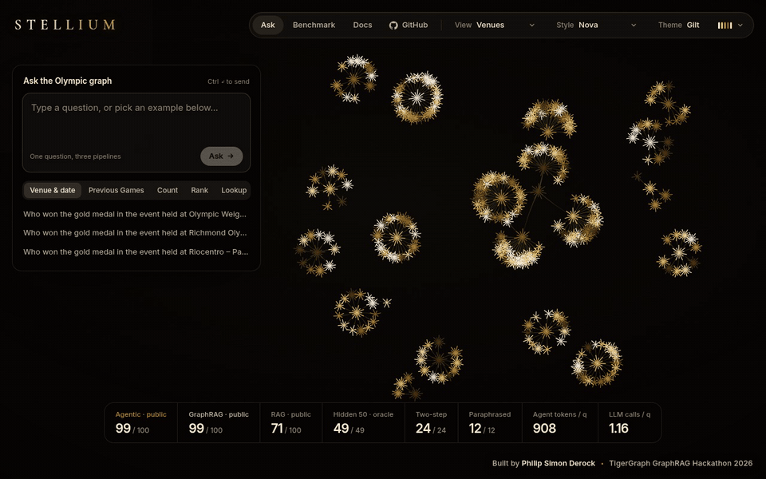
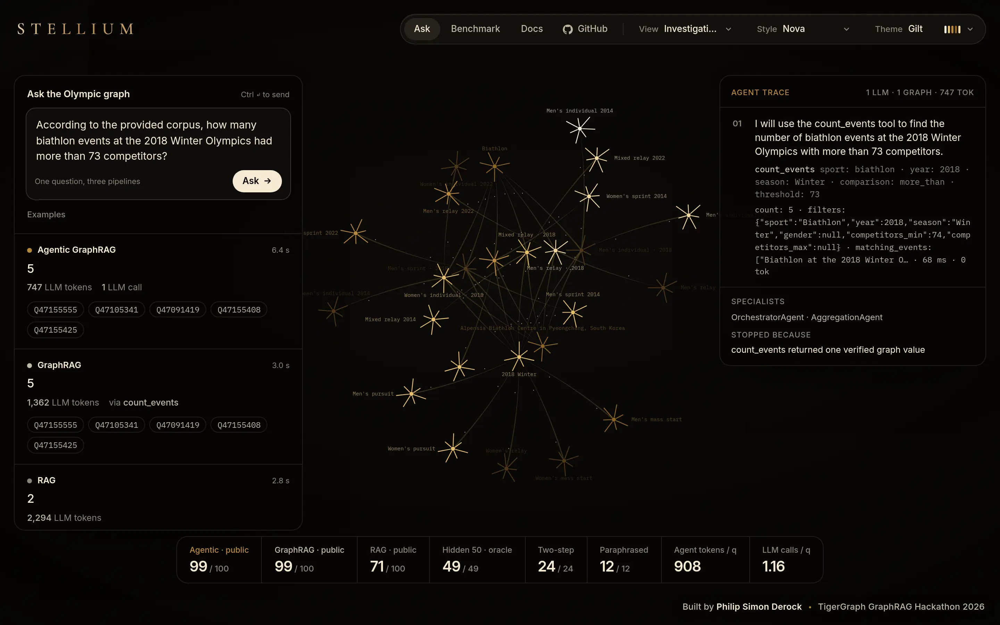
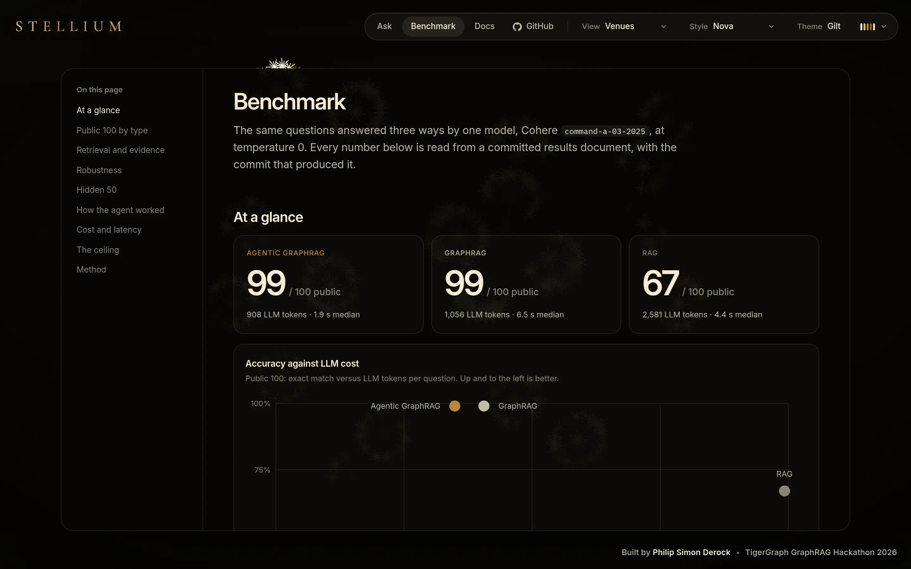
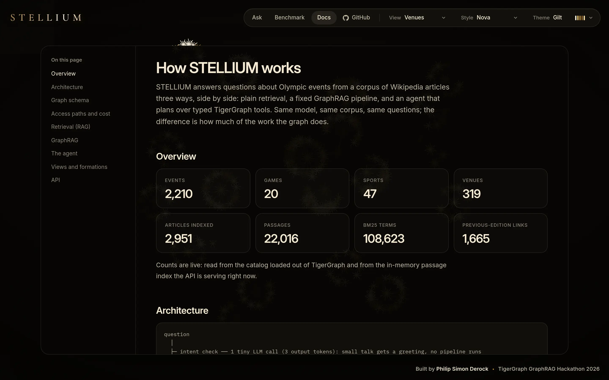
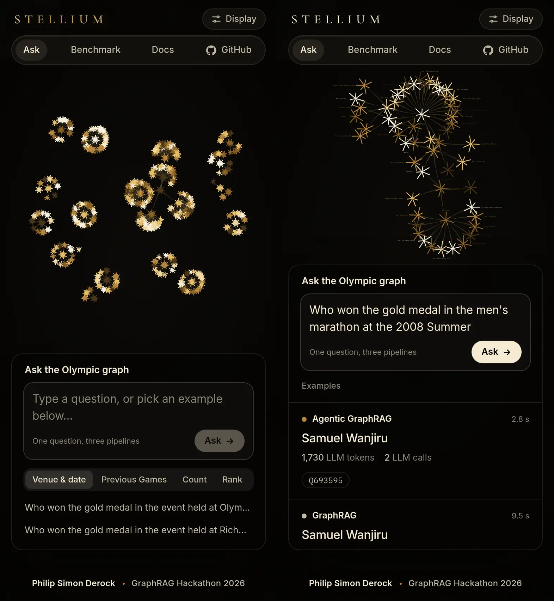
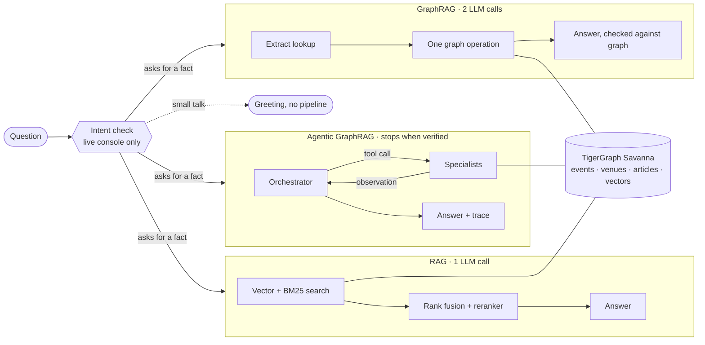

<div align="center">

# STELLIUM

**Agentic GraphRAG on TigerGraph, with a measured answer to when an agent is worth it.**

[](https://github.com/simon-derock/stellium/actions)


TigerGraph Agentic GraphRAG Hackathon 2026 · Built by Philip Simon Derock

**[Live demo](https://stellium.philipsimonderock.com)** · [Hidden-50 outputs](submission/hidden.json) · [Benchmark audit](docs/benchmark-audits/public-final-20261002.md) · [How it works](https://stellium.philipsimonderock.com/?tab=docs)

</div>

---

## At a glance

| | |
|---|---|
| **Accuracy** | 99/100 Agentic GraphRAG · 99/100 GraphRAG · 71/100 RAG on the public questions; the one miss is undecidable from the corpus |
| **Hidden 50** | Graph pipelines agree with an independent corpus oracle on 49 of 49 decidable questions |
| **Robustness** | Agent: 24/24 two-step questions (GraphRAG 19, RAG 18), 12/12 reworded, 12/12 unanswerable declined, 12/12 off-template |
| **Cost** | 908 LLM tokens per agentic answer, about $0.30 per 100 questions |
| **Evidence** | Every graph-pipeline answer is stated in a source article it cites |
| **Stack** | TigerGraph Savanna (graph + native vector search) · Cohere Command A · Cohere Rerank 3.5 |

---



<sub>Recorded in real time on the live console. Agentic GraphRAG answers in one LLM call with one graph query; RAG, reading five passages, undercounts.</sub>



| Benchmark: every published number, with charts and provenance | Docs: schema, access paths, the agent, every view |
|---|---|
|  |  |

<p align="center"></p>

Hidden-set outputs for all three pipelines (answers, tokens, latency, citations, agent traces): [`submission/hidden.json`](submission/hidden.json) · [`submission/hidden.csv`](submission/hidden.csv)

---

## Submission details

| | |
|---|---|
| **Model** | Cohere `command-a-03-2025`, temperature 0, for every LLM call in every pipeline, the planner included |
| **Embeddings and reranking** | Cohere `embed-v4.0` (1024 dimensions) and Cohere `rerank-v3.5`, one call per search; neither counts as LLM tokens |
| **Vector database** | TigerGraph native vector search (HNSW) in the same Savanna workspace as the graph; no external vector store |
| **Graph backend** | TigerGraph Savanna 4.2.5, graph `OlympicsGraph`: 2,210 events, 2,951 articles, 22,016 passages |
| **Pipelines** | RAG (hybrid retrieval, 1 LLM call) · GraphRAG (one typed graph operation, 2 calls) · Agentic GraphRAG (ReAct over seven specialists) |
| **Agentic steps** | 2.31 tool steps and 1.16 LLM calls per question on average (median 2 steps, at most 4); 84 of 100 public questions answered with one LLM call |
| **Token counting** | LLM tokens as billed by Cohere; graph queries, retrieval and reranking count zero |
| **Hidden 50** | [`submission/hidden.json`](submission/hidden.json) and [`.csv`](submission/hidden.csv): answers, tokens, latency, citations and agent traces for all three pipelines |
| **Live demo** | [stellium.philipsimonderock.com](https://stellium.philipsimonderock.com): ask anything, watch the three pipelines answer side by side |

---

## Results

One model, Cohere `command-a-03-2025`, for every LLM call in every pipeline. Token counts are LLM tokens only; graph queries and retrieval count zero.

| Pipeline | Accuracy | 95% CI | Tokens / answer | LLM calls | Latency p50 | Cost / 100 q |
|---|---:|---:|---:|---:|---:|---:|
| Agentic GraphRAG | **99%** | 94.5–99.8% | **908** | 1.16 | **1.9 s** | **$0.30** |
| GraphRAG | **99%** | 94.5–99.8% | 1,056 | 2 | 6.5 s | $0.31 |
| RAG | 71% | 61–79% | 2,543 | 1 | 1.8 s | $0.64 |

<sub>Agent on commit f75fb5c, GraphRAG on 468fedf, RAG on 2fca5c8 with Cohere Rerank. Neither graph pipeline reranked a single public question, so the reranker change leaves their rows unchanged. Latency includes client-side request pacing. Wilson 95% intervals.</sub>

### By question type

| Type | n | Agentic | GraphRAG | RAG |
|---|---:|---:|---:|---:|
| Count: how many events meet a condition | 21 | 21 | 21 | 4 |
| Lookup: one attribute of one event | 19 | 19 | 19 | 19 |
| Multi-hop: venue and date to winner | 28 | 27 | 27 | 24 |
| Ranking: event with the most competitors | 10 | 10 | 10 | 2 |
| Temporal: winner at the previous Games | 22 | 22 | 22 | 22 |

### Evidence and retrieval

| Pipeline | Gold among answers | Grounded | Hit@1 | MRR | nDCG@5 | Context recall |
|---|---:|---:|---:|---:|---:|---:|
| Agentic GraphRAG | 100% | 100% | 0.990 | 0.995 | 0.827 | 100% |
| GraphRAG | 100% | 100% | 0.990 | 0.995 | 0.827 | 100% |
| RAG | 71% | 100% | 0.930 | 0.965 | 0.893 | 97% |

| Measure | Meaning |
|---|---|
| Gold among answers | The gold answer is in what the pipeline returned, so honest tie reports count |
| Grounded | Every claimed value appears in an article the pipeline cited |
| Context recall | The gold answer is stated somewhere in the retrieved articles |

The one graph-pipeline miss, `pub-099`, is undecidable: the women's 30 km cross-country and the men's biathlon relay share the venue and the date the question names, and both articles say so. Both pipelines return both winners instead of guessing. A ranking tie that the corpus does settle (one article restates its count in prose) is now broken on that evidence.

Full method, commits, and caveats: [public benchmark audit](docs/benchmark-audits/public-final-20261002.md) · [Cohere Rerank re-run](docs/benchmark-audits/cohere-rerank-20261003.md)

---

## When does a question need an agent?

The hackathon's headline question, answered per question shape: the right choice is the **cheapest pipeline among those with the top accuracy**. The same table, computed live from the published results, is on the [Benchmark page](https://stellium.philipsimonderock.com/?tab=benchmark).

| Question shape | Agentic | GraphRAG | RAG | Right choice |
|---|---:|---:|---:|---|
| One attribute of one event | 19/19 · 855 tok | 19/19 · 941 | 19/19 · 2,513 | **Agentic**, 9% fewer tokens than GraphRAG |
| Winner at the previous Games | 22/22 · 1,341 | 22/22 · 1,023 | 22/22 · 2,547 | GraphRAG: one fixed lookup suffices, so the agent is overkill |
| Venue and date to the winner | 27/28 · 786 | 27/28 · 919 | 24/28 · 2,522 | **Agentic**, 14% fewer tokens |
| Count events over a threshold | 21/21 · 747 | 21/21 · 1,418 | 4/21 · 2,580 | **Agentic**, 47% fewer tokens |
| Event with the most competitors | 10/10 · 733 | 10/10 · 968 | 2/10 · 2,572 | **Agentic**, 24% fewer tokens |
| Any of the above, reworded | 12/12 · 983 | 12/12 · 1,082 | 5/12 · 2,411 | **Agentic**, 9% fewer tokens |
| Two steps: rank, then read an attribute | **24/24** · 1,737 | 19/24 · 1,170 | 18/24 · 2,657 | **Agentic, decisive**: the only pipeline at 24/24 |
| Outside the templates (films, officeholders) | 12/12 · 2,334 | 11/12 · 1,374 | 12/12 · 2,120 | RAG: reranked passages are enough, so the agent is overkill |
| Nothing in the corpus answers it | 12/12 · 6,034 | 12/12 · 1,730 | 11/12 · 2,623 | GraphRAG declines at under a third of the agent's tokens; the agent is overkill |

**Verdict: the agent is the right choice on 6 of 9 question shapes, decisive on one, and overkill on three.** It is decisive where a question chains two graph steps, since it recognises the event it found as a step and reads the attribute next. It is usually cheaper even where it only ties, because it stops on the first verified graph value instead of reading passages. It is overkill where one fixed lookup suffices, where nothing answers, and outside the templates.

> **Finding.** On the five official templates the agent matches a well-built GraphRAG (99/100 each) at 14% fewer tokens, so an agent need not cost more than a fixed pipeline. Where a question needs two graph steps, it is the only pipeline at 100%.

---

## Architecture

**Figure 1. STELLIUM architecture: one question, three pipelines, one TigerGraph workspace.** The live console adds a three-token intent check in front, so small talk never starts a pipeline; benchmark runs skip it.


```mermaid
flowchart LR
    Q([Question]) --> I{{Intent check<br/>live console only}}
    I -->|asks for a fact| RAG & GR & AG
    I -.->|small talk| W([Greeting, no pipeline])

    subgraph RAG [RAG · 1 LLM call]
        R1[Vector + BM25 search] --> R2[Rank fusion + reranker] --> R3[Answer]
    end

    subgraph GR [GraphRAG · 2 LLM calls]
        G1[Extract lookup] --> G2[One graph operation] --> G3[Answer, checked against graph]
    end

    subgraph AG [Agentic GraphRAG · stops when verified]
        O[Orchestrator] -->|tool call| T[Specialists]
        T -->|observation| O
        O --> A[Answer + trace]
    end

    R1 & G2 & T --- TG[(TigerGraph Savanna<br/>events · venues · articles · vectors)]
```

| | RAG | GraphRAG | Agentic GraphRAG |
|---|---|---|---|
| **Plan** | none | fixed: extract, query, answer | adaptive, one step at a time |
| **Graph use** | vector index | one typed operation | any specialist, in any order |
| **On failure** | answers anyway | answers anyway | re-plans or reports the ambiguity |
| **Evidence** | top five passages | graph value + cited article | graph value checked against the source line |

### Agent specialists

| Specialist | Job | LLM cost |
|---|---|---|
| Orchestrator | Chooses the next step from the question, evidence, and gaps | 1 call per step |
| Entity linking | Maps free text to graph events, sports, venues, and dates | 0 |
| Graph traversal | Venue-and-date multi-hop, previous editions, event attributes | 0 |
| Aggregation | Counts with exact bounds; rankings with tie detection | 0 |
| Evidence evaluation | Confirms each value against the cited article | 0 |
| Document retrieval | Hybrid passage search (TigerGraph vectors + BM25, reranked) when the graph has no answer | 0 |
| Query generation | Guarded read-only GSQL for questions no tool covers | 0 |

---

## Engineering

| Area | What was built |
|---|---|
| Entity linking | Order-insensitive matching over all 2,210 graph events; "+100 kg" never matches "100 kg" |
| Honesty | Unsupported answers rejected, ties reported, run stopped if the graph is unavailable |
| Same-model rule | One locked model per run, with no silent provider fallback |
| Reproducibility | Each run writes a manifest: commit, model, dataset and corpus SHA-256, settings |
| Quality gate | pytest, ruff, mypy strict, vulture, bandit, and pip-audit on every push; 85%+ coverage |
| Cost control | Query-embedding cache, batched prefetch, one rerank call per search, early-stopping agent |
| Public safety | Daily and per-visitor question caps, admin-only batch endpoint, allowlisted read-only GSQL, same-origin API with a strict CSP, no internal errors shown |

### What the data taught us

| Finding | Fix |
|---|---|
| LLM-written GSQL reached 76% | Typed graph tools reach 98% |
| TigerGraph `ACCUM` lists drop `ORDER BY` order | Rankings read stored counts directly |
| 26 events had a wrong or missing Games year | Article title made authoritative; live graph reconciled |
| One infobox lists 41,000,000 competitors | Prose value used only when it confirms a zero-padded count |

---

## Quickstart

```bash
uv sync --extra dev
cp .env.example .env      # TigerGraph and Cohere credentials

uv run pytest             # full test suite, no network

uv run python -m src.evaluate --provider cohere --pipeline all \
  --dataset hackathon-resources/questions/eval_public.jsonl \
  --output results/public.jsonl --resume

uv run python scripts/summarize_results.py results/public.jsonl \
  --dataset hackathon-resources/questions/eval_public.jsonl

uv run uvicorn src.api.main:app --port 8000   # API

cd web && npm ci && npm run dev                # console at http://localhost:5173
```

Links: `?tab=benchmark` and `?tab=docs` open those pages; `?q=<question>` asks all three pipelines on load.

| Tool | Purpose |
|---|---|
| `scripts/export_submission.py` | Hidden-set JSON and CSV: answers, tokens, latency, citations, traces |
| `scripts/summarize_results.py` | Accuracy, retrieval, grounding, latency, and cost tables |
| `scripts/reconcile_graph_attributes.py` | Diff or repair live graph attributes against the parser |
| `scripts/oracle_check.py` | Independent corpus oracle for the hidden set (no pipeline imports it) |
| `scripts/build_robustness_sets.py` | Unanswerable and off-template sets, generated from the corpus |
| `--provider offline` | Mock graph with no network, for CI smoke runs |

---

## Repository

| Path | Contents |
|---|---|
| `src/pipelines/` | `rag.py`, `graphrag.py`, `agentic.py`, `toolkit.py` |
| `src/linking/` | Graph-loaded entity linker |
| `src/graph/` | TigerGraph client, schema, compiled queries |
| `src/coprocessor/` | BM25, rank fusion, Cohere Rerank client |
| `src/evaluate.py` | Benchmark runner and metrics |
| `src/api/` | FastAPI service, graph-view projections for the canvas |
| `web/` | React console: graph canvas, three-way answers, agent trace, benchmark and docs pages |
| `benchmarks/` | Paraphrased, two-step, unanswerable and off-template question sets |
| `docs/benchmark-audits/` | Every measured run, with caveats |
| `tests/` | Unit, contract, chaos, security, and API tests |

---

## Deploy

| Part | Where | How |
|---|---|---|
| API | Render (free web service) | `render.yaml` + `Dockerfile`; set TigerGraph and Cohere secrets in the dashboard |
| Console | Netlify | Base directory `web`; `web/netlify.toml` builds it and proxies `/api` to the API, so there is no CORS |
| Keep-alive | API + external cron | The API reads the graph every 5 minutes while it runs (`STELLIUM_GRAPH_KEEPALIVE_S`); an external cron (for example cron-job.org) calls `/health?deep=true` every 10 minutes so the API itself never sleeps |
| Limits | API | Live questions capped per day (`STELLIUM_DAILY_QUESTION_CAP`) and per visitor per hour (`STELLIUM_CLIENT_HOURLY_CAP`); batch evaluation needs `STELLIUM_ADMIN_TOKEN` |

---

## Limitations

| Limitation | Effect |
|---|---|
| One gold string per question | Honest tie reports score zero on exact match (2 public questions) |
| Client-side request pacing | Pipelines with more LLM calls look slower |
| Template-shaped benchmark | Passage search and generated GSQL are rarely exercised |
| Round 2 conflict handling | Schema and resolver exist, not yet wired into evidence evaluation |

---

## License

Code: [MIT](LICENSE). The corpus and question sets in `hackathon-resources/` were provided by the hackathon organisers; the corpus is derived from English Wikipedia and licensed [CC BY-SA 4.0](https://creativecommons.org/licenses/by-sa/4.0/).
