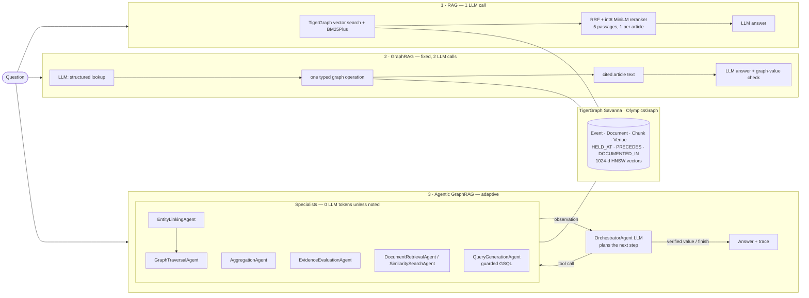

<div align="center">

# STELLIUM
### Agentic GraphRAG on TigerGraph Savanna, measured against RAG and GraphRAG

**Built by Philip Simon Derock** · TigerGraph Agentic GraphRAG Hackathon 2026

[](https://github.com/simon-derock/stellium/actions)
[](https://www.python.org/)
[](https://tgcloud.io/)
[](https://github.com/astral-sh/uv)
[](https://github.com/astral-sh/ruff)
[](https://mypy-lang.org/)

</div>

**The question:** when does a question need an agent, and when is that overkill? STELLIUM answers it with three pipelines on one TigerGraph graph, one LLM (Cohere `command-a-03-2025`) for every call, and per-question traces of accuracy, LLM tokens, latency, and the agent's decisions.

## Results

Public set, 100 questions, Cohere `command-a-03-2025` for every LLM call ([full audit](docs/benchmark-audits/public-final-20261002.md)):

| Pipeline | Exact match | LLM tokens / question | LLM calls / question | Latency / question |
|---|---:|---:|---:|---:|
| RAG | **67%** | 2,581 | 1 | 4.8 s |
| GraphRAG | **98%** | 1,094 | 2 | 6.2 s |
| Agentic GraphRAG | **98%** | **990** | 1.16 | 3.9–5.2 s |

Every non-numeric answer from both graph pipelines is stated in an article they cite (60/60; RAG 51/54), and both return the gold answer among their candidates on all 100 questions. Estimated cost per 100 questions at list price: RAG $0.65, GraphRAG $0.35, Agentic $0.32.

LLM tokens only (graph queries and retrieval count 0). Agentic latency is 5.2 s in the matched three-pipeline run and 3.9 s on its own; every latency includes the Cohere trial key's 3.25 s request pacing.

| Question type | n | RAG | GraphRAG | Agentic GraphRAG |
|---|---:|---:|---:|---:|
| Count ("how many events…") | 21 | 2/21 | 21/21 · 1,450 tok | 21/21 · **812 tok** |
| Lookup (one event's attribute) | 19 | 19/19 | 19/19 · 970 tok | 19/19 · 1,037 tok |
| Multi-hop (venue + date → winner) | 28 | 26/28 | 27/28 · 962 tok | 27/28 · 861 tok |
| Ranking (most competitors) | 10 | 3/10 | 9/10 · 1,031 tok | 9/10 · 911 tok |
| Temporal (previous Games) | 22 | 17/22 | 22/22 · 1,055 tok | 22/22 · 1,319 tok |

**When does a question need an agent?**

- **Single-passage facts don't.** RAG answers every lookup and most multi-hop questions; it fails counts and rankings (5/31) because five passages cannot cover the 10–40 events those need.
- **Structured questions need the graph, not an agent.** A fixed GraphRAG pipeline with entity linking and typed graph operations reaches 98%. The agent matches that accuracy; it is not more accurate here.
- **The agent pays for itself in cost and recovery.** It stops on the first verified graph value (86/100 questions in one LLM call), so it spends fewer tokens than GraphRAG's fixed two calls, and when a step fails or is ambiguous it re-plans (10 strategy changes) instead of passing a bad lookup to the answer step. It costs more where it explores before committing (temporal questions: 1,319 vs 1,055 tokens).
- **Both graph pipelines miss only genuine ambiguities:** a 41–41 competitor tie and two events sharing one venue and date. They return every candidate, gold included, instead of guessing.

## Architecture


```mermaid
flowchart LR
    Q([Question]) --> RAG & GR & AG

    subgraph RAG [1 · RAG — 1 LLM call]
        R1[TigerGraph vector search + BM25Plus] --> R2[RRF + int8 MiniLM reranker<br/>5 passages, 1 per article] --> R3[LLM answer]
    end

    subgraph GR [2 · GraphRAG — fixed, 2 LLM calls]
        G1[LLM: structured lookup] --> G2[one typed graph operation] --> G3[cited article text] --> G4[LLM answer + graph-value check]
    end

    subgraph AG [3 · Agentic GraphRAG — adaptive]
        O[OrchestratorAgent LLM<br/>plans the next step] -->|tool call| T
        T -->|observation| O
        O -->|verified value / finish| A[Answer + trace]
        subgraph T [Specialists — 0 LLM tokens unless noted]
            EL[EntityLinkingAgent] --> GT[GraphTraversalAgent]
            AGG[AggregationAgent]
            EV[EvidenceEvaluationAgent]
            DR[DocumentRetrievalAgent / SimilaritySearchAgent]
            QG[QueryGenerationAgent<br/>guarded GSQL]
        end
    end

    subgraph TG [TigerGraph Savanna · OlympicsGraph]
        V[(Event · Document · Chunk · Venue<br/>HELD_AT · PRECEDES · DOCUMENTED_IN<br/>1024-d HNSW vectors)]
    end
    R1 & G2 & T --- TG
```

### How each pipeline answers

| | RAG | GraphRAG | Agentic GraphRAG |
|---|---|---|---|
| LLM calls | 1 | 2 (extract, answer) | 1 planning call per step; stops on a verified value |
| Graph use | vector index only | one typed operation chosen from the extraction | any specialist, in any order, as evidence demands |
| Adapts to failure | no | no | re-plans on errors, empty results, and ambiguity |
| Evidence | top 5 passages | graph value + cited article text | graph value checked against the cited article line |

**Specialists.** Entity linking resolves free text to graph entities without an LLM: order-insensitive token matching against every Event title, sport, venue, and date loaded from TigerGraph, so "500 metres speed skating" finds "Speed skating – Women's 500 metres" and "+100 kg" never matches "100 kg". Graph tools then read exact values from TigerGraph (counts with code-computed bounds, rankings with ties reported, `PRECEDES` traversal, venue/date multi-hop), and the evidence evaluator confirms each value against the source article's text.

**Stopping and honesty.** The agent stops as soon as one verified value answers the question, rejects answers that no observation supports, reports every candidate when the evidence cannot separate them (a 41–41 competitor tie; two events at one venue on one day), and stops instead of guessing when TigerGraph is unavailable.

## What we found in the data

- **The graph can answer almost everything; generated queries could not.** With correct arguments, the typed tools answer 98/100 public questions against the live graph. An earlier design that had the LLM write GSQL scored 76% on the same model; in a separate Cloudflare probe, 13 of 27 generated queries failed.
- **A TigerGraph query pitfall.** `get_superlative_event` sorts with ORDER BY, but its ACCUM lists are filled in parallel and lose that order; the multi-row output cannot be used for ranking. Rankings now read the stored counts for the linked pool.
- **Corpus quality, fixed with provenance.** 26 events had a missing or wrong Games year in their infobox (e.g. Sailing 1988 Women's 470 stored as 1984); the article title is authoritative and `scripts/reconcile_graph_attributes.py` corrected the live graph. One infobox lists 41,000,000 competitors where the prose says 41; the parser accepts the prose value only when it independently confirms a zero-padded count.

## Evaluation method

- **Same model everywhere**, LLM tokens only (graph queries and retrieval count 0), wall-clock latency per question.
- **Exact match** compares answer content (case, accents, punctuation, and separators ignored, so "Men’s épée" equals "Men's epee" and "Dani King, Laura Trott, Joanna Rowsell" equals the gold "Dani KingLaura TrottJoanna Rowsell"). The old punctuation-sensitive score is kept as `em_strict`.
- Every run writes a manifest with the commit, model, dataset and corpus SHA-256, and settings. Raw rows stay out of git; the hidden-set export in `submission/` is committed.
- Latency includes the trial key's 3.25 s request pacing; `provider_latency_ms` in agent traces excludes it.

## Reproduce

```bash
uv sync --extra dev
cp .env.example .env        # TigerGraph, Cohere chat + embedding credentials

uv run pytest && uv run ruff check && uv run mypy src tests      # quality gate

# Public benchmark, all three pipelines (resumable)
uv run python -m src.evaluate --provider cohere --pipeline all \
  --dataset hackathon-resources/questions/eval_public.jsonl \
  --output results/public.jsonl --resume

# Hidden set, all three pipelines, then the submission export
uv run python -m src.evaluate --provider cohere --pipeline all \
  --dataset hackathon-resources/questions/eval_hidden.jsonl \
  --output results/hidden.jsonl --resume
uv run python scripts/export_submission.py --results results/hidden.jsonl --out submission/hidden

uv run uvicorn src.api.main:app --port 8000      # API + dashboard
```

`--provider offline` runs the CLI against the mock graph with no network (CI smoke only).

## Repository

```text
src/
  linking/        graph-loaded entity linker (events, sports, venues, dates)
  pipelines/      rag.py · graphrag.py · agentic.py · toolkit.py (typed graph tools)
  graph/          TigerGraph client, DDL, compiled queries, mock connection
  coprocessor/    BM25Plus, RRF, int8 ONNX reranker
  ingest/         corpus parser, chunker, batch loader
  llm/ · credentials.py · embeddings.py · guardrails/ · evaluate.py · api/
scripts/          reconcile_graph_attributes.py · export_submission.py · retrieval audits
docs/             benchmark audits and architecture notes
tests/            unit, contract, chaos, security, and API tests (mock graph, no network)
```

## Limitations

- Exact match against a single gold string penalises honest tie reporting (2 public questions, 1 known hidden question with two events on the same venue and date).
- Latency includes the Cohere trial key's 3.25 s request pacing; pipelines with more LLM calls are penalised proportionally.
- The question set is template-shaped, so typed graph tools cover it; open-ended questions fall back to passage search and guarded generated GSQL, which this benchmark barely exercises.
- Round 2 work (conflicting and superseded facts) has schema and resolver groundwork (`CONFLICTS_WITH`, bitemporal attributes, `src/graph/bitemporal.py`) but is not yet wired into the agent's evidence evaluation.
