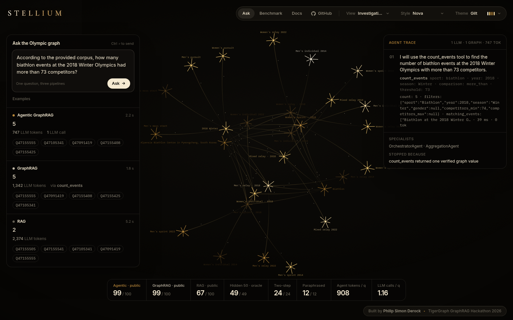
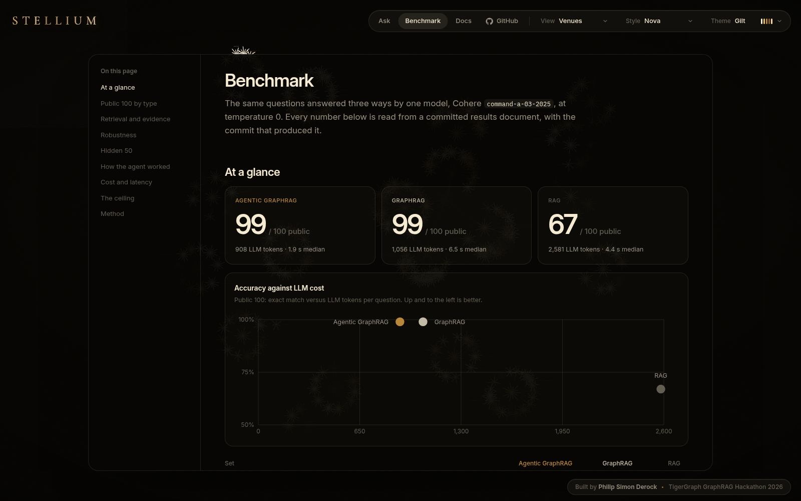
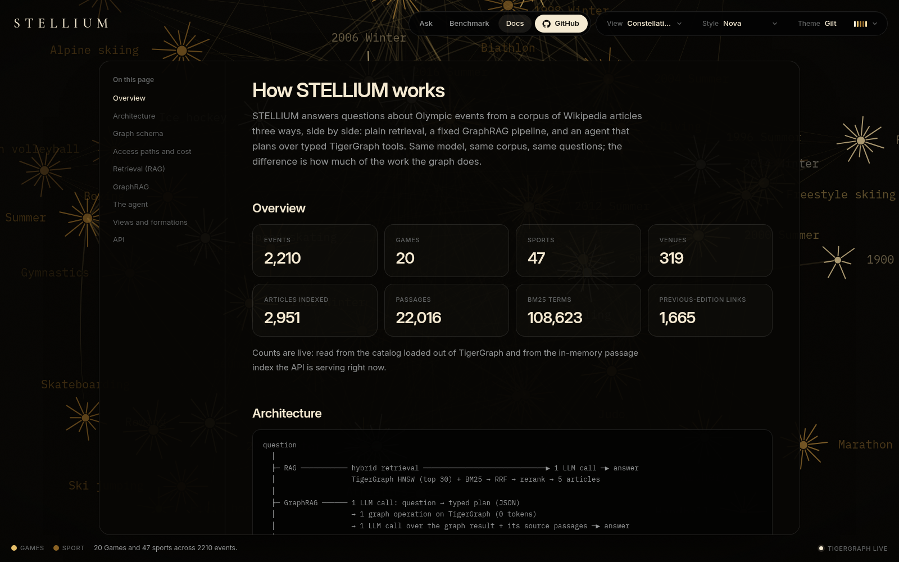

<div align="center">

# STELLIUM

**Agentic GraphRAG on TigerGraph, with a measured answer to when an agent is worth it.**

[](https://github.com/simon-derock/stellium/actions)


TigerGraph Agentic GraphRAG Hackathon 2026 · Built by Philip Simon Derock

</div>

---

## At a glance

| | |
|---|---|
| **Accuracy** | 99/100 Agentic GraphRAG · 99/100 GraphRAG · 67/100 RAG on the public questions; the one miss is undecidable from the corpus |
| **Hidden 50** | Graph pipelines agree with an independent corpus oracle on 49 of 49 decidable questions |
| **Robustness** | Agent: 24/24 two-step questions (GraphRAG 19, RAG 15), 12/12 reworded, 12/12 unanswerable declined, 10/12 off-template |
| **Cost** | 908 LLM tokens per agentic answer, about $0.30 per 100 questions |
| **Evidence** | Every graph-pipeline answer is stated in a source article it cites |
| **Stack** | TigerGraph Savanna (graph + native vector search) · Cohere Command A · local int8 reranker |

---



| Benchmark: every published number, with charts and provenance | Docs: schema, access paths, the agent, every view |
|---|---|
|  |  |

Hidden-set outputs for all three pipelines (answers, tokens, latency, citations, agent traces): [`submission/hidden.json`](submission/hidden.json) · [`submission/hidden.csv`](submission/hidden.csv)

---

## Results

One model, Cohere `command-a-03-2025`, for every LLM call in every pipeline. Token counts are LLM tokens only; graph queries and retrieval count zero.

| Pipeline | Accuracy | 95% CI | Tokens / answer | LLM calls | Latency p50 | Cost / 100 q |
|---|---:|---:|---:|---:|---:|---:|
| Agentic GraphRAG | **99%** | 94.5–99.8% | **908** | 1.16 | **1.9 s** | **$0.30** |
| GraphRAG | **99%** | 94.5–99.8% | 1,056 | 2 | 6.5 s | $0.31 |
| RAG | 67% | 57–75% | 2,581 | 1 | 4.4 s | $0.65 |

<sub>Agent re-run on commit f75fb5c, GraphRAG on 468fedf, RAG from 4923d3a (its code is unchanged). Latency includes client-side request pacing, which was lighter on the agent's re-run. Wilson 95% intervals.</sub>

### By question type

| Type | n | Agentic | GraphRAG | RAG |
|---|---:|---:|---:|---:|
| Count: how many events meet a condition | 21 | 21 | 21 | 2 |
| Lookup: one attribute of one event | 19 | 19 | 19 | 19 |
| Multi-hop: venue and date to winner | 28 | 27 | 27 | 26 |
| Ranking: event with the most competitors | 10 | 10 | 10 | 3 |
| Temporal: winner at the previous Games | 22 | 22 | 22 | 17 |

### Evidence and retrieval

| Pipeline | Gold among answers | Grounded | Hit@1 | MRR | nDCG@5 | Context recall |
|---|---:|---:|---:|---:|---:|---:|
| Agentic GraphRAG | 100% | 100% | 0.990 | 0.995 | 0.827 | 100% |
| GraphRAG | 100% | 100% | 0.990 | 0.995 | 0.827 | 100% |
| RAG | 67% | 94% | 0.800 | 0.869 | 0.843 | 83% |

| Measure | Meaning |
|---|---|
| Gold among answers | The gold answer is in what the pipeline returned, so honest tie reports count |
| Grounded | Every claimed value appears in an article the pipeline cited |
| Context recall | The gold answer is stated somewhere in the retrieved articles |

The one graph-pipeline miss, `pub-099`, is undecidable: the women's 30 km cross-country and the men's biathlon relay share the venue and the date the question names, and both articles say so. Both pipelines return both winners instead of guessing. A ranking tie that the corpus does settle (one article restates its count in prose) is now broken on that evidence.

Full method, commits, and caveats: [public benchmark audit](docs/benchmark-audits/public-final-20261002.md)

---

## When does a question need an agent?

| Question shape | Best choice | Why |
|---|---|---|
| Fact stated in one passage | RAG | Lookups and most venue-and-date questions resolve from the top passages |
| Count or ranking across many events | GraphRAG | Five passages hold about a third of the events; one graph query holds all |
| Two steps chained (rank, then read the winner's attribute) | Agentic | 24/24, against 19/24 for GraphRAG's single fixed operation |
| Ambiguous names or a failed first lookup | Agentic | Re-plans after an error or a tie |
| Outside the five templates (films, officeholders) | Agentic | 10/12, against 8 for RAG and 7 for GraphRAG; it falls back to passages when no graph tool fits |
| Nothing in the corpus answers it | Any | All three decline on 12/12; the agent never moves a venue's day to another year to find something |
| Any structured question where cost matters | Agentic | Stops on the first verified value of the kind asked for |

> **Finding.** On the five official templates the agent matches a well-built GraphRAG (99/100 each) at 14% fewer tokens. Where a question needs two graph steps, it is the only pipeline at 100%: it recognises the event it found as a step, not the answer, and reads the attribute next.

---

## How it works


```mermaid
flowchart LR
    Q([Question]) --> RAG & GR & AG

    subgraph RAG [RAG · 1 LLM call]
        R1[Vector + BM25 search] --> R2[Rank fusion + reranker] --> R3[Answer]
    end

    subgraph GR [GraphRAG · 2 LLM calls]
        G1[Extract lookup] --> G2[One graph operation] --> G3[Answer, checked against graph]
    end

    subgraph AG [Agentic GraphRAG · stops when verified]
        O[Orchestrator] -->|tool call| T[Specialists]
        T -->|observation| O
        O --> A[Answer + trace]
    end

    R1 & G2 & T --- TG[(TigerGraph Savanna<br/>events · venues · articles · vectors)]
```

| | RAG | GraphRAG | Agentic GraphRAG |
|---|---|---|---|
| **Plan** | none | fixed: extract, query, answer | adaptive, one step at a time |
| **Graph use** | vector index | one typed operation | any specialist, in any order |
| **On failure** | answers anyway | answers anyway | re-plans or reports the ambiguity |
| **Evidence** | top five passages | graph value + cited article | graph value checked against the source line |

### Agent specialists

| Specialist | Job | LLM cost |
|---|---|---|
| Orchestrator | Chooses the next step from the question, evidence, and gaps | 1 call per step |
| Entity linking | Maps free text to graph events, sports, venues, and dates | 0 |
| Graph traversal | Venue-and-date multi-hop, previous editions, event attributes | 0 |
| Aggregation | Counts with exact bounds; rankings with tie detection | 0 |
| Evidence evaluation | Confirms each value against the cited article | 0 |
| Document retrieval | Hybrid passage search (TigerGraph vectors + BM25, reranked) when the graph has no answer | 0 |
| Query generation | Guarded read-only GSQL for questions no tool covers | 0 |

---

## Engineering

| Area | What was built |
|---|---|
| Entity linking | Order-insensitive matching over all 2,210 graph events; "+100 kg" never matches "100 kg" |
| Honesty | Unsupported answers rejected, ties reported, run stopped if the graph is unavailable |
| Same-model rule | One locked model per run, with no silent provider fallback |
| Reproducibility | Each run writes a manifest: commit, model, dataset and corpus SHA-256, settings |
| Quality gate | pytest, ruff, mypy strict, vulture, bandit, and pip-audit on every push; 85%+ coverage |
| Cost control | Query-embedding cache, batched prefetch, local reranker, early-stopping agent |

### What the data taught us

| Finding | Fix |
|---|---|
| LLM-written GSQL reached 76% | Typed graph tools reach 98% |
| TigerGraph `ACCUM` lists drop `ORDER BY` order | Rankings read stored counts directly |
| 26 events had a wrong or missing Games year | Article title made authoritative; live graph reconciled |
| One infobox lists 41,000,000 competitors | Prose value used only when it confirms a zero-padded count |

---

## Quickstart

```bash
uv sync --extra dev
cp .env.example .env      # TigerGraph and Cohere credentials

uv run pytest             # full test suite, no network

uv run python -m src.evaluate --provider cohere --pipeline all \
  --dataset hackathon-resources/questions/eval_public.jsonl \
  --output results/public.jsonl --resume

uv run python scripts/summarize_results.py results/public.jsonl \
  --dataset hackathon-resources/questions/eval_public.jsonl

uv run uvicorn src.api.main:app --port 8000   # API

cd web && npm ci && npm run dev                # console at http://localhost:5173
```

Links: `?tab=benchmark` and `?tab=docs` open those pages; `?q=<question>` asks all three pipelines on load.

| Tool | Purpose |
|---|---|
| `scripts/export_submission.py` | Hidden-set JSON and CSV: answers, tokens, latency, citations, traces |
| `scripts/summarize_results.py` | Accuracy, retrieval, grounding, latency, and cost tables |
| `scripts/reconcile_graph_attributes.py` | Diff or repair live graph attributes against the parser |
| `scripts/oracle_check.py` | Independent corpus oracle for the hidden set (no pipeline imports it) |
| `scripts/build_robustness_sets.py` | Unanswerable and off-template sets, generated from the corpus |
| `--provider offline` | Mock graph with no network, for CI smoke runs |

---

## Repository

| Path | Contents |
|---|---|
| `src/pipelines/` | `rag.py`, `graphrag.py`, `agentic.py`, `toolkit.py` |
| `src/linking/` | Graph-loaded entity linker |
| `src/graph/` | TigerGraph client, schema, compiled queries |
| `src/coprocessor/` | BM25, rank fusion, int8 reranker |
| `src/evaluate.py` | Benchmark runner and metrics |
| `src/api/` | FastAPI service, graph-view projections for the canvas |
| `web/` | React console: graph canvas, three-way answers, agent trace, benchmark and docs pages |
| `benchmarks/` | Paraphrased, two-step, unanswerable and off-template question sets |
| `docs/benchmark-audits/` | Every measured run, with caveats |
| `tests/` | Unit, contract, chaos, security, and API tests |

---

## Deploy

| Part | Where | How |
|---|---|---|
| API | Render (free web service) | `render.yaml` + `Dockerfile`; set TigerGraph and Cohere secrets in the dashboard |
| Console | Netlify | Base directory `web`; `web/netlify.toml` builds it and proxies `/api` to the API, so there is no CORS |
| Keep-alive | Any cron | `GET /health?deep=true` every 10 minutes keeps the API warm and the graph workspace awake |

---

## Limitations

| Limitation | Effect |
|---|---|
| One gold string per question | Honest tie reports score zero on exact match (2 public questions) |
| Client-side request pacing | Pipelines with more LLM calls look slower |
| Template-shaped benchmark | Passage search and generated GSQL are rarely exercised |
| Round 2 conflict handling | Schema and resolver exist, not yet wired into evidence evaluation |
